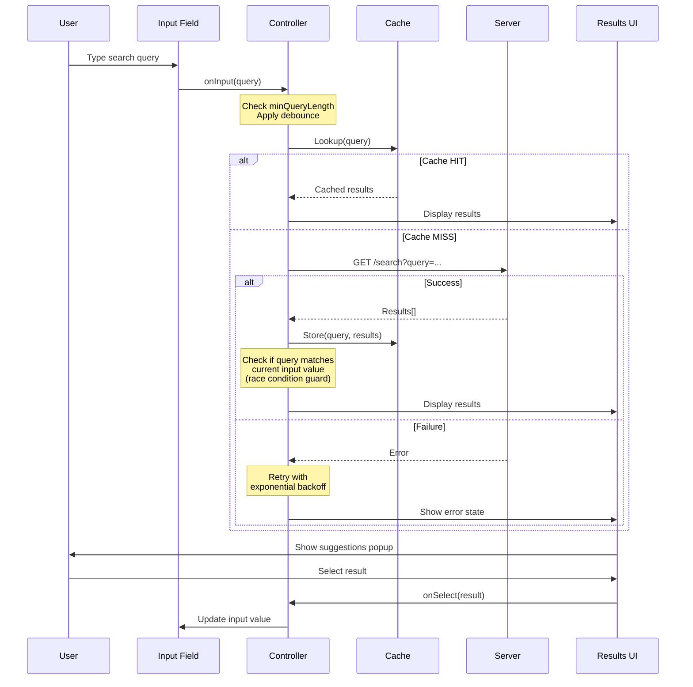

# Autocomplete — Front End System Design

> **Source**: [GreatFrontEnd — Autocomplete](https://www.greatfrontend.com/questions/system-design/autocomplete)  
> **Difficulty**: Medium  
> **Recommended Duration**: 30 mins  
> **Category**: UI Component  
> **Framework**: RADIO  

---

## TL;DR

Thiết kế một **Autocomplete UI component** cho phép user nhập search term vào text box, hiển thị danh sách kết quả gợi ý trong popup, và user có thể chọn một kết quả. Component phải **generic** (dùng được cho nhiều website khác nhau), hỗ trợ **customizable rendering** cho cả input field và search results. Các điểm quan trọng nhất: **caching strategy**, **debouncing**, **race condition handling**, **accessibility**, và **keyboard interaction**.

---

## 1. Requirements Exploration (R)

### Câu hỏi cần hỏi interviewer

| Câu hỏi | Trả lời kỳ vọng |
|----------|-----------------|
| Loại kết quả nào cần hỗ trợ? | Text, image, media (image + text) — nhưng không thể lường trước hết → cần **generic rendering** |
| Thiết bị nào cần hỗ trợ? | Tất cả: laptop, tablet, mobile |
| Có cần fuzzy search không? | Không cho phiên bản đầu, có thể explore sau |
| Input field và search results có cần customizable không? | Có — đây là requirement chính |

### Functional Requirements
- Nhập text vào input → trigger search
- Hiển thị danh sách kết quả dạng popup
- User có thể chọn kết quả
- Component generic, tái sử dụng được

### Non-functional Requirements
- Performance: debouncing, caching
- Accessibility: keyboard navigation, screen reader support
- Responsive: hoạt động trên mọi kích thước màn hình

---

## 2. Architecture (A)

```
┌─────────────────────────────────────────────────┐
│                    Server                        │
│              (Black box — API)                   │
└──────────────────────┬──────────────────────────┘
                       │ HTTP
┌──────────────────────▼──────────────────────────┐
│                  Controller                      │
│  (Brain — orchestrates everything)               │
│  • Passes user input ↔ results between parts     │
│  • Checks cache before fetching from server      │
│  • Manages debounce, race conditions             │
├──────────┬───────────────────────┬──────────────┤
│          │                       │              │
│   ┌──────▼──────┐    ┌──────────▼──────────┐   │
│   │    Cache     │    │   Results UI        │   │
│   │  (in-memory) │    │   (Popup list)      │   │
│   │  query→results│   │  • Show results     │   │
│   └─────────────┘    │  • Handle selection  │   │
│                       └─────────────────────┘   │
│   ┌─────────────────────────┐                   │
│   │    Input Field UI       │                   │
│   │  • User types here      │                   │
│   │  • Passes input to      │                   │
│   │    controller            │                   │
│   └─────────────────────────┘                   │
└─────────────────────────────────────────────────┘
```

### Vai trò từng component

| Component | Trách nhiệm |
|-----------|-------------|
| **Input Field UI** | Nhận user input, truyền cho Controller |
| **Results UI (Popup)** | Nhận kết quả từ Controller, hiển thị cho user, thông báo khi user chọn item |
| **Cache** | Lưu kết quả các query trước đó để Controller kiểm tra trước khi gọi server |
| **Controller** | "Bộ não" — tương tự Controller trong MVC. Điều phối mọi thứ: truyền input/results giữa các component, quyết định fetch từ server hay cache |

---

## 3. Data Model (D)

| Source | Entity | Belongs To | Fields |
|--------|--------|------------|--------|
| Props/options | `Config` | Controller | `apiUrl`, `debounceMs`, `minQueryLength`, `numResults`, `cacheStrategy`, ... |
| Client state | `SearchState` | Controller | `currentQuery`, `isLoading`, `error` |
| Cache | `CacheEntry` | Cache | `query` → `results[]`, `timestamp` |
| Server response | `Result` | Results UI | `id`, `type`, `text`, `subtitle?`, `image?` |

---

## 4. Interface Definition / API (I)

### Client Component API

#### Basic API

| Option | Mô tả |
|--------|--------|
| `numResults` | Số kết quả hiển thị trong popup |
| `apiUrl` | URL endpoint để gọi khi query |
| `onInput`, `onFocus`, `onBlur`, `onChange`, `onSelect` | Event listeners cho logging/tracking |
| **Customized rendering** | 3 cách tiếp cận (xem bên dưới) |

**3 cách customize rendering** (từ dễ → khó, ít linh hoạt → linh hoạt nhất):

1. **Theming options object**: Dễ nhất nhưng ít flexible — truyền `{ textSize: '12px', textColor: 'red' }`
2. **Classnames**: Cho phép dev truyền CSS class names riêng cho từng sub-component
3. **Render function/callback**: Inversion of Control — dev tự viết hàm render, component gọi hàm đó với data. Flexible nhất nhưng tốn effort nhất (giống render props trong React)

#### Advanced API

| Option | Mô tả |
|--------|--------|
| `minQueryLength` | Số ký tự tối thiểu trước khi trigger search (thường ≥ 3) |
| `debounceMs` | Thời gian debounce (e.g. 300ms) — chỉ gọi API sau khi user ngừng gõ |
| `timeoutMs` | Thời gian chờ response trước khi báo timeout/error |
| `initialResults` | Kết quả ban đầu hiển thị khi focus (trước khi user gõ) |
| `resultsSource` | `'network-only'` / `'network-and-cache'` / `'cache-only'` |
| `mergeFn` | Hàm merge kết quả từ server và cache |
| `cacheDuration` | Time-to-live cho mỗi cache entry |

### Server API

| Param | Mô tả |
|-------|--------|
| `query` | Search query string |
| `limit` | Số kết quả mỗi page |
| `pagination` | Page number (cho infinite scroll) |

---

## 5. Optimizations and Deep Dive (O)

### 5.1 Network

#### Race Conditions — Xử lý concurrent requests

Khi user gõ nhanh, nhiều request pending cùng lúc. Response trả về **không theo thứ tự** gửi → phải đảm bảo chỉ hiển thị kết quả của query **mới nhất**.

**2 cách xử lý:**

| Cách | Mô tả | Đánh giá |
|------|--------|----------|
| Timestamp | Gắn timestamp vào mỗi request, chỉ hiển thị kết quả của request mới nhất | Đơn giản nhưng bỏ phí data |
| **Map query → results** | Lưu response vào map theo query string, hiển thị kết quả ứng với giá trị hiện tại trong input | **Tốt hơn** — tận dụng được cho cache |

> **Không nên** abort request (via `AbortController`) hay discard response vì server đã xử lý rồi → lưu lại response vào cache còn có ích cho trường hợp user backspace (e.g. gõ nhầm "footr" → xóa thành "foot" → kết quả "foot" đã có sẵn trong cache).

#### Failed Requests & Retries

- Tự động retry khi request fail
- Dùng **exponential backoff** để tránh overload server (e.g. 1s → 2s → 4s → 8s)

#### Offline Usage

- Đọc từ cache nếu có
- Không fire request (tiết kiệm CPU)
- Hiển thị thông báo "no network"

---

### 5.2 Cache — Phần quan trọng nhất

#### 3 cách thiết kế cache structure

**Option 1: Hash Map (query → results)**

```javascript
const cache = {
  fa:   [{ type: 'org', text: 'Facebook' }, { type: 'text', text: 'face' }],
  fac:  [{ type: 'org', text: 'Facebook' }, { type: 'text', text: 'facebook messenger' }],
  face: [{ type: 'org', text: 'Facebook' }, { type: 'text', text: 'facebook stock' }],
};
```

- ✅ Lookup O(1), đơn giản
- ❌ **Duplicate data** nhiều (Facebook lặp lại ở mỗi entry) → tốn memory

**Option 2: Flat List of Results**

```javascript
const results = [
  { type: 'org', text: 'Facebook' },
  { type: 'text', text: 'face' },
  { type: 'text', text: 'facebook messenger' },
  { type: 'text', text: 'facebook stock' },
];
```

- ✅ Không duplicate
- ❌ Phải filter client-side → **block UI thread** trên dataset lớn / thiết bị chậm
- ❌ Mất ranking order

**Option 3: Normalized Map (kiểu database)**

```javascript
const results = {
  1: { id: 1, type: 'org', text: 'Facebook' },
  2: { id: 2, type: 'text', text: 'face' },
  3: { id: 3, type: 'text', text: 'facebook messenger' },
  4: { id: 4, type: 'text', text: 'facebook stock' },
};

const cache = {
  fa:   [1, 2],
  fac:  [1, 3],
  face: [1, 4],
};
```

- ✅ Lookup nhanh (O(1) cho cache + O(1) cho mỗi result)
- ✅ Không duplicate data
- ❌ Cần pre-processing map ID → result object trước khi hiển thị (nhưng negligible nếu ít items)

#### Chọn option nào?

| Trường hợp | Chọn | Lý do |
|-------------|------|-------|
| **Short-lived page** (e.g. Google Search) | Option 1 | User không search đủ nhiều để memory thành vấn đề. Cache bị clear khi click kết quả |
| **Long-lived SPA** (e.g. Facebook) | Option 3 | Tiết kiệm memory, dữ liệu normalized, dễ update |

#### Initial Results

Khi user focus vào input (chưa gõ gì), hiển thị kết quả mặc định:
- **Google**: trending queries, historical searches
- **Facebook**: historical searches, friends, pages, groups
- **Stock exchanges**: trending stocks, historical searches

→ Lưu initial results trong cache với key là `""` (empty string).

#### Caching Strategy — Khi nào evict?

| Application | Cache Duration | Lý do |
|-------------|---------------|-------|
| Google Search | Dài (hàng giờ) | Kết quả ít thay đổi |
| Facebook | Trung bình (~30 phút) | Kết quả cập nhật moderate |
| Stock/Crypto Exchange | Không cache hoặc rất ngắn | Giá thay đổi liên tục |

Config options: `resultsSource` (network-only / network-and-cache / cache-only) + `cacheDuration` (TTL).

---

### 5.3 Performance

| Kỹ thuật | Chi tiết |
|----------|---------|
| **Client-side caching** | Hiển thị kết quả từ cache ngay lập tức cho query đã gọi trước đó |
| **Debouncing/Throttling** | Giới hạn số request gửi đi, giảm server load |
| **Memory management** | Purge cache khi browser idle hoặc khi vượt threshold (memory/entry count) |
| **Virtualized lists** | Chỉ render DOM nodes visible trong viewport — dùng "windowing" technique. Recycle DOM nodes thay vì tạo mới. Cần thiết khi có hàng trăm/ngàn kết quả |

---

### 5.4 User Experience

| Aspect | Best Practice |
|--------|--------------|
| **Autofocus** | Thêm `autofocus` nếu search là mục đích chính (e.g. Google homepage) |
| **Loading state** | Hiện spinner khi đang gọi API |
| **Error state** | Hiện error message + nút retry |
| **No network** | Hiện thông báo mất kết nối |
| **Long strings** | Truncate bằng ellipsis hoặc wrap, không để overflow |
| **Mobile** | Target đủ lớn để tap; tắt `autocapitalize`, `autocomplete`, `autocorrect`, `spellcheck` để browser suggestions không can thiệp |
| **Keyboard shortcut** | Global shortcut key (thường là `/`) để focus vào input — Facebook, X, YouTube đều dùng |
| **Typos / Fuzzy search** | Dùng edit distance (Levenshtein) nếu filter client-side; gửi query as-is nếu server-side |
| **Positioning** | Popup thường hiện dưới input. Nếu input ở cuối viewport → hiện popup phía trên |

---

### 5.5 Accessibility

#### Screen Readers

| Attribute | Mục đích |
|-----------|---------|
| Semantic HTML | Dùng `<ul>`, `<li>` hoặc `role="listbox"` + `role="option"` |
| `aria-label` | Label cho `<input>` (thường không có visible label) |
| `role="combobox"` | Cho `<input>` |
| `aria-haspopup` | Báo hiệu element có thể trigger popup |
| `aria-expanded` | Báo popup đang mở hay đóng |
| `aria-live` | Khi kết quả mới xuất hiện → screen reader thông báo |
| `aria-autocomplete` | `"list"` (gợi ý dạng list) hoặc `"both"` (inline + list) |

#### Keyboard Interaction

| Key | Hành động |
|-----|-----------|
| **Enter** | Thực hiện search (miễn phí nếu `<input>` trong `<form>`) |
| **↑ / ↓** | Navigate qua các options, wrap around khi đến cuối/đầu |
| **Escape** | Đóng popup kết quả |

> Tham khảo: [WAI-ARIA Combobox Practices](https://www.w3.org/WAI/ARIA/apg/patterns/combobox/)

---

### 5.6 So sánh HTML Attributes — Google vs Facebook vs X

| Attribute | Google | Facebook | X |
|-----------|--------|----------|---|
| Element | `<textarea>` | `<input>` | `<input>` |
| Within `<form>` | Yes | No | Yes |
| `type` | "text" | "search" | "text" |
| `autocomplete` | "off" | "off" | "off" |
| `autofocus` | Present | Absent | Present |
| `role` | "combobox" | Absent | "combobox" |
| `spellcheck` | "false" | "false" | "false" |
| `aria-autocomplete` | "both" | "list" | "list" |
| `aria-expanded` | Present | Present | Present |
| `aria-label` | "Search" | "Search Facebook" | "Search query" |
| `dir` | Absent | "ltr"/"rtl" | "auto" |

→ Không có chuẩn thống nhất cho ARIA properties — mỗi công ty implement khác nhau.

---

## 6. Diagram — Autocomplete Workflow



---

## 7. Summary

| Khía cạnh | Key Takeaways |
|-----------|---------------|
| **Architecture** | 4 components: Input UI, Results UI, Cache, Controller (brain) |
| **Cache** | Normalized map (Option 3) cho SPA dài; Hash map đơn giản (Option 1) cho page ngắn. Luôn có cache eviction strategy |
| **Race Conditions** | Lưu response vào map theo query → chỉ hiển thị kết quả ứng với input hiện tại. **Không** abort request |
| **Performance** | Debounce (300ms), client-side cache, virtualized lists cho dataset lớn, memory purging |
| **UX** | Loading/error/offline states, fuzzy search, smart popup positioning, global keyboard shortcut |
| **Accessibility** | `role="combobox"`, `aria-expanded`, `aria-autocomplete`, `aria-live`, full keyboard navigation |
| **API Design** | Generic + flexible: support theming, classnames, và render callbacks. Advanced: debounce duration, cache strategy, min query length |

---

## Cross-References

| Topic | Related Notes | Connection |
|-------|---------------|------------|
| RADIO Framework | [GreatFrontEnd FE System Design](./greatfrontend-fe-system-design.md) | Bài này apply RADIO framework chi tiết cho Autocomplete |
| Caching strategies | [ByteByteGo System Design](./bytebytego-system-design.md) | So sánh client-side cache (normalized map) với server-side caching patterns |
| API design (REST) | [System Design Interview Vol.1](./system-design-interview-vol1.md) | Server API design (`query`, `limit`, `pagination`) follows REST conventions |

---

## References

- [GreatFrontEnd — Autocomplete](https://www.greatfrontend.com/questions/system-design/autocomplete)
- [The Life of a Typeahead Query (Facebook Engineering)](https://engineering.fb.com/2010/05/17/web/the-life-of-a-typeahead-query/)
- [Building an accessible autocomplete control](https://adamsilver.io/blog/building-an-accessible-autocomplete-control/)
- [WAI-ARIA Combobox Pattern](https://www.w3.org/WAI/ARIA/apg/patterns/combobox/)
- [List Virtualization — web.dev](https://web.dev/virtualize-long-lists/)
