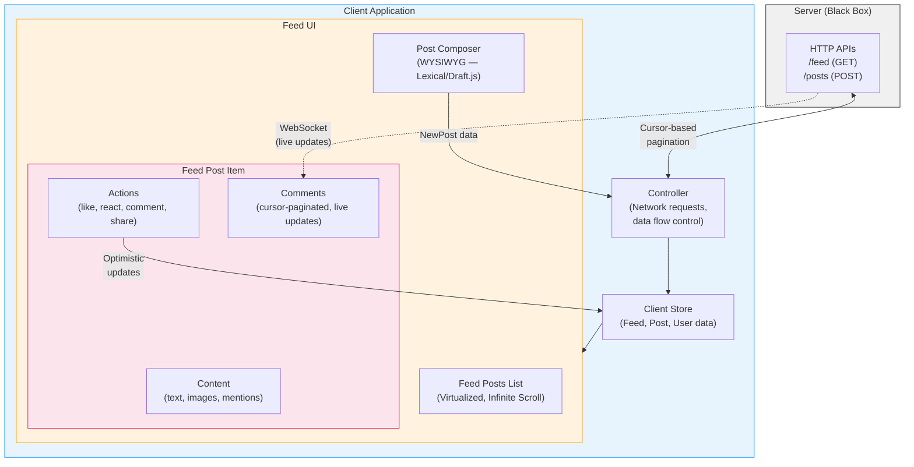

# GreatFrontEnd — News Feed (e.g. Facebook) — Front End System Design

> **Author**: Yangshun Tay (Ex-Meta Staff Engineer)  
> **Source**: [News Feed (e.g. Facebook) | Front End System Design](https://www.greatfrontend.com/questions/system-design/news-feed-facebook)  
> **Framework**: RADIO  
> **Difficulty**: Medium  
> **Recommended Duration**: 30 mins  

---

## TL;DR

Thiết kế front end cho **News Feed** (Facebook/Twitter/Reddit) là một câu hỏi system design kinh điển. Bài viết đi qua toàn bộ RADIO framework: từ requirements exploration (browse feed, like/react, create post), architecture (Server → Controller → Client Store → Feed UI), data model (Feed, Post, User, NewPost entities), interface definition (cursor-based pagination cho infinite scroll), đến deep dive optimizations (virtualized lists, code splitting, optimistic updates, lazy loading, accessibility). Điểm nhấn quan trọng nhất: **cursor-based pagination** vượt trội hơn offset-based cho news feed, **virtualized lists** để xử lý DOM size, và **data-driven dependencies** (Relay + GraphQL) để chỉ load code cho post format cần thiết.

---

## 1. Requirements Exploration

### Core Features

| Feature | Mô tả |
|---------|--------|
| Browse news feed | Xem danh sách posts từ user và friends |
| Like / React | Tương tác với feed posts |
| Create / Publish posts | Tạo và đăng posts mới |

### Scope Clarifications

| Câu hỏi | Trả lời |
|----------|---------|
| Post types? | Chủ yếu text và image. Các loại khác discuss nếu còn thời gian |
| Pagination UX? | **Infinite scrolling** — thêm posts khi user scroll đến cuối feed |
| Mobile support? | Không ưu tiên, nhưng mobile-friendly là tốt |
| Commenting / Sharing? | Ngoài core scope, discuss thêm nếu có thời gian |

---

## 2. Architecture / High-level Design

```
┌──────────────────────────────────────────────┐
│                  Server                       │
│         (HTTP APIs — black box)               │
└──────────────────┬───────────────────────────┘
                   │ HTTP
┌──────────────────▼───────────────────────────┐
│               Controller                      │
│  (Controls data flow, makes network requests) │
└──────────────────┬───────────────────────────┘
                   │
┌──────────────────▼───────────────────────────┐
│             Client Store                      │
│   (Server-originated data for the feed UI)    │
└──────────────────┬───────────────────────────┘
                   │
┌──────────────────▼───────────────────────────┐
│               Feed UI                         │
│  ┌─────────────────────────────────────────┐  │
│  │         Post Composer                   │  │
│  │  (WYSIWYG editor — tạo posts mới)      │  │
│  ├─────────────────────────────────────────┤  │
│  │         Feed Posts (list)               │  │
│  │  (Post data + like/react/share buttons) │  │
│  └─────────────────────────────────────────┘  │
└──────────────────────────────────────────────┘
```

### Component Responsibilities

| Component | Responsibility |
|-----------|---------------|
| **Server** | Cung cấp HTTP APIs để fetch feed posts và create new posts |
| **Controller** | Điều khiển data flow trong app, thực hiện network requests tới server |
| **Client Store** | Lưu trữ data cần thiết cho toàn app (chủ yếu server-originated data) |
| **Feed UI** | Chứa danh sách feed posts và UI tạo post mới |
| **Feed Posts** | Hiển thị data cho từng post + buttons tương tác (like/react/share) |
| **Post Composer** | WYSIWYG editor để user tạo posts mới |

### Rendering Approach

| Strategy | Mô tả | Phù hợp cho |
|----------|--------|-------------|
| **SSR** (Server-side rendering) | Render HTML trên server | Content tĩnh, cần SEO (blogs, e-commerce) |
| **CSR** (Client-side rendering) | Render bằng JavaScript trong browser | Content tương tác (dashboards, chat apps) |
| **Hybrid** (SSR + CSR) | SSR cho initial load → hydrate → CSR cho subsequent | **News feed** — nhanh initial load + interactive |

Facebook sử dụng **hybrid approach**: SSR cho initial load nhanh, sau đó hydrate page để attach event listeners. Subsequent content (load thêm posts khi scroll) và page navigation dùng CSR.

> Modern frameworks hỗ trợ: **Next.js** (React), **Nuxt** (Vue).

---

## 3. Data Model

| Entity | Source | Belongs To | Fields |
|--------|--------|------------|--------|
| `Feed` | Server | Feed UI | `posts` (list of Posts), `pagination` (metadata) |
| `Post` | Server | Feed Post | `id`, `created_time`, `content`, `author` (User), `reactions`, `image_url` |
| `User` | Server | Client Store | `id`, `name`, `profile_photo_url` |
| `NewPost` | Client (user input) | Post Composer | `message`, `image` |

### Normalized Store (Advanced)

Facebook (Relay) và Twitter (Redux) đều sử dụng **normalized client-side store**:

| Đặc điểm | Mô tả |
|-----------|--------|
| Cấu trúc | Giống database — mỗi data type lưu trong table riêng |
| Unique ID | Mỗi item có unique ID |
| References | Dùng ID (foreign key) thay vì nested objects |

**Lợi ích:**

- **Reduced duplicated data**: Single source of truth — nếu nhiều posts cùng author, không lưu duplicate author data
- **Easy updates**: Khi user đổi tên, chỉ cần update 1 chỗ → toàn bộ UI phản ánh ngay

**Trong interview**: Không nhất thiết cần normalized store cho news feed vì ít duplicated data và ít use case update. Tuy nhiên trong thực tế, Facebook/Twitter dùng normalized store vì có nhiều features khác cần.

> **Ref**: [Making Instagram.com faster: Part 3 — cache first](https://instagram-engineering.com/making-instagram-com-faster-part-3-cache-first-6f3f130b9669)

---

## 4. Interface Definition (API)

### API Overview

| Source | Destination | API Type | Functionality |
|--------|-------------|----------|---------------|
| Server | Controller | HTTP | Fetch feed posts |
| Controller | Server | HTTP | Create new post |
| Controller | Feed UI | JavaScript | Pass feed posts data, Reactions |
| Post Composer | Controller | JavaScript | Pass new post data |

### Fetch Feed Posts API

| Field | Value |
|-------|-------|
| HTTP Method | `GET` |
| Path | `/feed` |
| Description | Fetches the feed results for a user |

---

### Pagination: Offset-based vs Cursor-based

#### Offset-based Pagination

**Parameters:**

| Parameter | Type | Description |
|-----------|------|-------------|
| `size` | number | Số items mỗi page |
| `page` | number | Page number cần fetch |

**Response example:**

```json
{
  "pagination": {
    "size": 5,
    "page": 2,
    "total_pages": 4,
    "total": 20
  },
  "results": [...]
}
```

**SQL tương ứng:**

```sql
SELECT * FROM posts LIMIT 5 OFFSET 0;  -- Page 1
SELECT * FROM posts LIMIT 5 OFFSET 5;  -- Page 2
```

**Ưu điểm:**

- User có thể jump tới specific page
- Dễ thấy tổng số pages
- Dễ implement (`OFFSET = (page - 1) * size`)
- Hoạt động với mọi database system

**Nhược điểm:**

| Vấn đề | Giải thích |
|---------|-----------|
| **Inaccurate page results** | Khi data thay đổi thường xuyên, page window bị lệch → user thấy **duplicate posts** |
| **Page size không thể thay đổi** | Đổi page size giữa chừng sẽ bỏ sót hoặc trùng items |
| **Performance giảm** | Offset lớn (e.g. `OFFSET 1000000`) → DB vẫn phải đọc toàn bộ `count + offset` rows rồi discard |

**Duplicate posts problem minh hoạ:**

```
Initial:   A, B, C, D, E, F, G, H, I, J
           ^^^^^^^^^^^^^ Page 1 = A–E

5 new posts added:
           K, L, M, N, O, A, B, C, D, E, F, G, H, I, J
                          ^^^^^^^^^^^^^ Page 2 = A–E (DUPLICATE!)
```

#### Cursor-based Pagination

**Parameters:**

| Parameter | Type | Description |
|-----------|------|-------------|
| `size` | number | Số results mỗi page |
| `cursor` | string | Identifier cho last item đã fetch |

**Response example:**

```json
{
  "pagination": {
    "size": 10,
    "next_cursor": "=dXNlcjpVMEc5V0ZYTlo"
  },
  "results": [
    {
      "id": "123",
      "author": { "id": "456", "name": "John Doe" },
      "content": "Hello world",
      "image": "https://www.example.com/feed-images.jpg",
      "reactions": { "likes": 20, "haha": 15 },
      "created_time": 1620639583
    }
  ]
}
```

**SQL tương ứng:**

```sql
SELECT * FROM table WHERE id > cursor LIMIT 5;
```

**Ưu điểm:**

- Hiệu quả và nhanh hơn trên large datasets
- Tránh được vấn đề inaccurate page window — new posts không ảnh hưởng offset (cursor là fixed)
- Phù hợp cho real-time data

**Nhược điểm:**

- Không thể jump tới specific page
- Phức tạp hơn khi implement

#### So sánh & Kết luận

| Tiêu chí | Offset-based | Cursor-based |
|----------|-------------|-------------|
| Jump to specific page | ✅ | ❌ |
| Accurate with dynamic data | ❌ | ✅ |
| Performance on large datasets | ❌ | ✅ |
| Changeable page size | ❌ | ✅ |
| Implementation complexity | Simple | Moderate |
| **Phù hợp cho news feed?** | ❌ | ✅ |

> **Kết luận**: Với infinite scrolling news feed (posts thêm liên tục, append cuối feed, table size lớn nhanh), **cursor-based pagination** là lựa chọn rõ ràng vượt trội.

> **Ref**: [Evolving API Pagination at Slack](https://slack.engineering/evolving-api-pagination-at-slack/)

---

### Post Creation API

| Field | Value |
|-------|-------|
| HTTP Method | `POST` |
| Path | `/posts` |
| Description | Creates a new post |
| Parameters | `{ body: '...', media: '...' }` |

**Response:**

```json
{
  "id": "124",
  "author": { "id": "456", "name": "John Doe" },
  "content": "Hello world",
  "image": {
    "src": "https://www.example.com/feed-images.jpg",
    "alt": "An image alt"
  },
  "reactions": { "likes": 20, "haha": 15 },
  "created_time": 1620639583
}
```

Client store cần **prepend** new post vào đầu feed list.

---

## 5. Optimizations and Deep Dive

### 5.1 General Optimizations

#### Code Splitting

| Level | Mô tả |
|-------|--------|
| **Page-level** | Mỗi page chỉ load JS/CSS cần thiết (ít relevant cho single-page news feed) |
| **Lazy loading** | Load non-critical resources khi cần hoặc sau initial render |

**Facebook's 3-tier JavaScript loading:**

| Tier | Mô tả |
|------|--------|
| **Tier 1** | Basic layout cho first paint (above-the-fold content + UI skeletons) |
| **Tier 2** | JS để fully render tất cả above-the-fold content. Sau Tier 2, không còn visual changes do code loading |
| **Tier 3** | Resources chỉ cần sau display (logging code, subscriptions cho live-updating data) |

#### Keyboard Shortcuts

Facebook có news feed-specific shortcuts (nhấn `Shift + ?` trên facebook.com). Giúp users navigate giữa posts và thực hiện common actions nhanh hơn.

#### Error States

Hiển thị rõ ràng error states khi network requests fail hoặc mất kết nối.

---

### 5.2 Feed List Optimizations

#### Infinite Scrolling

**Cách hoạt động**: Fetch next set of posts khi user scroll đến cuối feed.

**Optimization**: Load next posts **trước khi** user đến bottom → loại bỏ hoàn toàn thời gian chờ.

- Trigger distance: ~1 viewport height
- Dynamic distance dựa trên network speed + scroll speed

**2 cách implement:**

| Cách | Mô tả | Ưu/nhược |
|------|--------|----------|
| **`scroll` event listener** | Throttled scroll event + `getBoundingClientRect()` check marker element | Cách truyền thống |
| **Intersection Observer API** | Browser native API, monitor khi marker element vào/ra viewport | ✅ **Preferred** — không block main thread, browser tối ưu tốt hơn |

```javascript
const observer = new IntersectionObserver((entries) => {
  if (entries[0].isIntersecting) {
    loadMorePosts();
  }
});
observer.observe(markerElement);
```

#### Virtualized Lists

Với infinite scroll, tất cả loaded items nằm trên 1 page → DOM size tăng nhanh → performance issues.

**Giải pháp**: Chỉ render posts trong viewport. Off-screen posts được thay bằng empty `<div>` với `style="height: Xpx"` + `hidden` attribute.

**Lợi ích:**

| Aspect | Cải thiện |
|--------|-----------|
| **Browser painting** | Ít DOM nodes → ít layout computations |
| **Virtual DOM reconciliation** (React) | Post đơn giản hơn → React diff dễ hơn |
| **Memory usage** | Giảm browser memory footprint |

> Cả Facebook và Twitter đều sử dụng virtualized lists.

#### Loading Indicators

Dùng **shimmer loading effect** thay vì spinner — trông giống nội dung posts, đẹp hơn và giảm layout thrash.

#### Dynamic Loading Count

- **Initial load**: Không biết window height → overfetch (conservative)
- **Subsequent fetches**: Biết window height → customize số posts fetch dựa trên browser window height

Cursor-based pagination cho phép thay đổi `size` parameter giữa các lần gọi.

#### Preserving Feed Scroll Position

Khi user navigate away rồi quay lại feed:
1. Cache feed list data trong client store cùng scroll position
2. Đọc data từ client store → render ngay, không cần server round-trip
3. Restore scroll position trước đó

#### Stale Feeds

- Nếu feed đã mở quá lâu (vài giờ) → prompt user refresh hoặc tự refetch
- Khi refetch → remove current feed khỏi memory để giải phóng
- Facebook force refresh và scroll lên top nếu tab bỏ mở lâu

---

### 5.3 Feed Post Optimizations

#### Data-driven Dependencies (Relay + GraphQL)

**Vấn đề**: Facebook hỗ trợ **50+ post formats** khác nhau. Load JS cho tất cả formats upfront = performance issues.

**Giải pháp**: Relay's `@match` và `@module` GraphQL directives — fetch component code **cùng lúc** với data tương ứng:

```graphql
... on Post {
  ... on TextPost {
    @module('TextComponent.js')
    contents
  }
  ... on ImagePost {
    @module('ImageComponent.js')
    image_data {
      alt
      dimensions
    }
  }
}
```

→ Chỉ load code cho post format đang hiển thị, không cần extra network round-trip.

#### Rendering Mentions / Hashtags

3 cách lưu trữ message chứa mentions/hashtags:

| Format | Ưu điểm | Nhược điểm |
|--------|---------|-----------|
| **HTML** | Đơn giản nhất | XSS vulnerability, coupling display với data, không reusable cho iOS/Android |
| **Custom syntax** (e.g. `[[#1234: HBO Max]]`) | Lightweight, robust | Khó mở rộng cho nhiều rich text entity types |
| **Rich text format** (Draft.js / Lexical) | Extensible, không cần custom parsing, dễ thêm entity types | Payload lớn hơn, cần nhiều disk space hơn |

**Ví dụ Draft.js format:**

```json
{
  "content": [
    { "type": "HASHTAG", "content": "#AboutLastNight" },
    { "type": "TEXT", "content": " is here... Dropping 2/10 on " },
    { "type": "MENTION", "content": "HBO Max", "entityID": 1234 },
    { "type": "TEXT", "content": "!" }
  ]
}
```

> Meta đã release **Lexical** (2022) thay thế Draft.js, đang dùng trên facebook.com.

#### Rendering Images

| Technique | Mô tả |
|-----------|--------|
| **CDN** | Host và serve images qua CDN cho loading nhanh |
| **Modern formats** | Dùng WebP cho compression tốt hơn |
| **Alt text** | Facebook dùng ML/CV để auto-generate `alt` text cho uploaded images |
| **`srcset`** | Load image size phù hợp với viewport |
| **Adaptive loading** | WiFi → prefetch offscreen images; Poor connection → low-res placeholder, click to load hi-res |

#### Lazy Load Non-initial Code

Các thành phần không cần khi initial render:
- Reactions popover
- Dropdown menu (ellipsis icon)

Load khi: browser idle (lower priority) hoặc on-demand (hover/click). Đây là **Tier 3 dependencies**.

#### Optimistic Updates

Technique: Client **ngay lập tức** reflect updated state sau user interaction, giả định server request sẽ succeed. Nếu fail → revert UI + hiển thị error.

**Áp dụng cho news feed**: Immediately show reaction + updated count khi user like/react.

> Built-in trong modern query libraries: **Relay**, **SWR**, **React Query**.

#### Timestamp Rendering

**Multilingual timestamps:**

| Approach | Ưu điểm | Nhược điểm |
|----------|---------|-----------|
| Server trả raw timestamp, client render | Flexible | Client cần chứa grammar rules cho mỗi ngôn ngữ |
| Server trả translated timestamp | Không cần ship translation code | Client không thể manipulate timestamp |
| **`Intl` API** (recommended) | Browser native, không cần extra code | — |

```javascript
new Intl.DateTimeFormat('zh-CN', {
  dateStyle: 'full',
  timeStyle: 'long',
}).format(date);
// → "2021年12月20日星期一 GMT+8 11:23:16"

new Intl.RelativeTimeFormat('zh-CN').format(-1, 'day');
// → "1天前"
```

**Stale relative timestamps**: Dùng timer để update timestamps gần đây (< 1 giờ) — "3 phút trước" → "10 phút trước".

#### Icon Rendering

| Approach | Pros | Cons |
|----------|------|------|
| Separate image | Đơn giản | Nhiều HTTP requests |
| Spritesheet | 1 HTTP request cho tất cả icons | Phức tạp setup |
| Icon fonts | Scalable, crisp | Phải download toàn bộ font, FOUC |
| SVG | Scalable, crisp, cacheable | Flickering khi download, 1 request/image |
| **Inlined SVG** | Scalable, crisp | Không cacheable |

> Facebook và Twitter dùng **inlined SVGs** — đây là trend hiện tại.

#### Post Truncation

- Truncate posts dài + "See more" button
- Abbreviate counts lớn: ✅ "John, Mary and **103K** others" — ❌ "John, Mary and 103,312 others"

#### Feed Comments

Áp dụng tương tự các nguyên tắc trên:
- **Cursor-based pagination** cho comment list
- Draft/edit comments tương tự draft/edit posts
- **Lazy load** emoji/sticker pickers
- **Optimistic updates**: immediately append new comment, immediately show new reactions

#### Live Comment Updates

| Method | Mô tả | Đặc điểm |
|--------|--------|----------|
| **Short polling** | Client gửi requests theo fixed intervals | Đơn giản, nhưng high network traffic |
| **Long polling** | Keep connection open đến khi có data mới | Đơn giản hơn WebSocket, nhưng latency cao |
| **SSE** (Server-Sent Events) | Server push updates qua single HTTP connection | Efficient cho one-way updates |
| **WebSockets** | Full-duplex communication, bi-directional | ✅ Low latency, high interactivity |
| **HTTP/2 Server Push** | Server push updates không cần client request | Ít phổ biến |

> Facebook dùng **WebSockets** cho live updates.

**Optimizations cho live updates:**

- **Subscribe/unsubscribe** dựa trên post visibility — không fetch updates cho off-screen posts
- **Debounce/throttle** cho viral posts (celebrities, politicians) — update rate quá cao cho user đọc, chỉ cần fetch updated counts

---

### 5.4 Feed Composer Optimizations

#### Rich Text Editing

`<input>` và `<textarea>` chỉ hỗ trợ plain text. Cần `contenteditable` cho WYSIWYG editing.

**Không nên** dùng `contenteditable="true"` trực tiếp trong production — nhiều issues. Dùng battle-tested libraries:

| Library | Maintainer | Status |
|---------|-----------|--------|
| **Lexical** | Meta | ✅ Active (successor to Draft.js) |
| Draft.js | Meta | ❌ Deprecated |
| TipTap | Community | ✅ Active |
| Slate | Community | ✅ Active |

#### Lazy Load Dependencies

Non-crucial features nên lazy load on-demand:

- Image uploader
- GIF picker
- Emoji picker
- Sticker picker
- Background images

---

### 5.5 Accessibility

| Area | Implementation |
|------|---------------|
| **Feed list** | `role="feed"` trên feed HTML element |
| **Feed posts** | `role="article"` + `aria-labelledby="<id>"` (id của author name element) |
| **Post content** | `tabindex="0"` cho focusable elements + appropriate `aria-role` |
| **Reaction buttons** | Button hiện khi focus (cho keyboard users) để mở reactions menu |
| **Icon buttons** | `aria-label` cho icon-only buttons (e.g. Twitter) |

---

## 6. Tổng hợp Kiến trúc — Mermaid Diagram



---

## 7. Key Takeaways — Interview Cheat Sheet

```
┌─────────────────────────────────────────────────────────────────┐
│              NEWS FEED — FRONT END SYSTEM DESIGN                │
├──────────┬──────────────────────────────────────────────────────┤
│ R (15%)  │ • Browse feed, like/react, create posts             │
│          │ • Infinite scrolling, text + image posts             │
│          │ • Mobile-friendly nice-to-have                       │
├──────────┼──────────────────────────────────────────────────────┤
│ A (20%)  │ • Server → Controller → Client Store → Feed UI      │
│          │ • Hybrid rendering (SSR initial + CSR subsequent)    │
│          │ • Feed UI = Post Composer + Feed Posts List          │
├──────────┼──────────────────────────────────────────────────────┤
│ D (10%)  │ • Feed (posts[], pagination), Post, User, NewPost   │
│          │ • Normalized store optional (Relay/Redux)            │
│          │ • Server data vs client-only state                   │
├──────────┼──────────────────────────────────────────────────────┤
│ I (15%)  │ • GET /feed — cursor-based pagination               │
│          │ • POST /posts — create new post                     │
│          │ • Cursor > Offset (dynamic data, no duplicates)     │
├──────────┼──────────────────────────────────────────────────────┤
│ O (40%)  │ • Virtualized lists (Facebook/Twitter both use)     │
│          │ • Intersection Observer cho infinite scroll          │
│          │ • Code splitting (3-tier JS loading)                │
│          │ • Data-driven dependencies (Relay @module)          │
│          │ • Optimistic updates (like/react)                   │
│          │ • WebSockets cho live comment updates               │
│          │ • Lazy load: reactions, emoji, sticker pickers      │
│          │ • Accessibility: role="feed", role="article"        │
│          │ • Shimmer loading > spinner                         │
│          │ • Rich text: Lexical/Draft.js format                │
│          │ • Intl API cho multilingual timestamps              │
│          │ • Inlined SVGs cho icons (trend hiện tại)           │
└──────────┴──────────────────────────────────────────────────────┘
```

---

## Cross-References

| Topic | Related Notes | Connection |
|-------|---------------|------------|
| RADIO Framework & general FE system design | [GreatFrontEnd FE System Design](./greatfrontend-fe-system-design.md) | Bài này áp dụng RADIO framework vào case study cụ thể (News Feed) |
| Back-end news feed design (fan-out, DB schema) | [System Design Interview Vol.1](./system-design-interview-vol1.md) | FE focus client-side pagination/rendering; BE focus distributed systems, fan-out strategies |
| Pagination patterns, caching, CDN | [ByteByteGo System Design](./bytebytego-system-design.md) | Cursor-based pagination, CDN cho images, caching strategies |

---

## References

- [News Feed (e.g. Facebook) — GreatFrontEnd](https://www.greatfrontend.com/questions/system-design/news-feed-facebook)
- [Rebuilding our tech stack for the new Facebook.com](https://engineering.fb.com/2020/05/08/web/facebook-redesign/)
- [Making Facebook.com accessible to as many people as possible](https://engineering.fb.com/2020/07/30/web/facebook-com-accessibility/)
- [Dissecting Twitter's Redux Store](https://medium.com/statuscode/dissecting-twitters-redux-store-d7280b62c6b1)
- [Making Instagram.com faster: Part 3 — cache first](https://instagram-engineering.com/making-instagram-com-faster-part-3-cache-first-6f3f130b9669)
- [Evolving API Pagination at Slack](https://slack.engineering/evolving-api-pagination-at-slack/)
- [Intersection Observer API — MDN](https://developer.mozilla.org/en-US/docs/Web/API/Intersection_Observer_API)
- [Relay — Data-driven Dependencies](https://relay.dev/docs/glossary/#match)
- [Lexical — Meta's Rich Text Editor](https://lexical.dev/)
