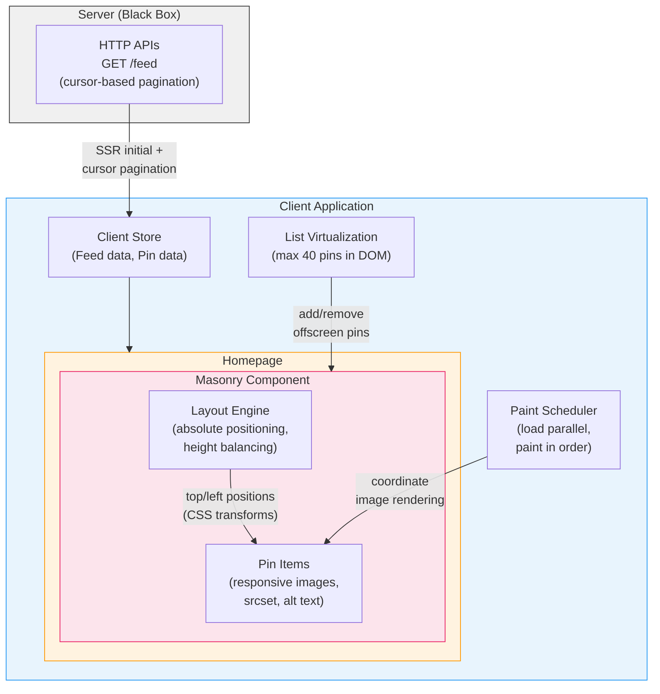

# GreatFrontEnd — Pinterest — Front End System Design

> **Author**: Yangshun Tay (Ex-Meta Staff Engineer)  
> **Source**: [Pinterest | Front End System Design](https://www.greatfrontend.com/questions/system-design/pinterest)  
> **Framework**: RADIO  
> **Difficulty**: Hard  
> **Recommended Duration**: 30 mins  

---

## TL;DR

Design the front end for the **Pinterest homepage**, focusing on the **masonry layout** — a grid-based layout where items have varying heights, creating a "brick wall" effect. This guide walks through the RADIO framework: requirements (masonry feed, infinite scroll, image-only pins), architecture (SSR + SPA hybrid, Server → Client Store → Homepage → Masonry Component), data model (Feed, Pin with image dimensions + dominant color + responsive images), interface (cursor-based pagination `GET /feed`), and deep dive into masonry layout implementation (**absolute positioning** over row-of-columns for keyboard accessibility), **height balancing** algorithm, responsive images (`srcset`), progressive JPEGs, image preloading (`<link rel="preload">`), **paint scheduling** (load in parallel, paint in order via React Suspense), list virtualization (max 40 pins in DOM), and reflow/repaint optimization (CSS transforms instead of top/left).

---

## 1. Requirements Exploration

### Core Features

- Masonry layout of feed items (pins).
- More items should be loaded as the user scrolls down (infinite scrolling).

### Scope Clarifications

| Question | Answer |
|----------|--------|
| Pin ordering? | Pins at the front of results should appear higher on the page |
| Pin types? | **Images** only. Exclude videos and GIFs |
| Devices? | Primarily **desktop**, but should be usable on mobile and tablet |

---

## 2. Glossary

"Feed items" and "pins" are used interchangeably below. A pin contains basic metadata such as the image, subtitle, etc.

---

## 3. Architecture / High-level Design

### SSR or CSR?

Pinterest uses a **hybrid approach**: SSR for the landing page and critical content (SEO, fast initial load), CSR for interactivity as users browse pins.

In practice, Pinterest uses **SSR with hydration**: the initial pins markup and data are included in the initial HTML, but **without any positioning data** — layout is calculated on the client.

### SPA or MPA?

**SPA** is essential for feed + pin details routes:
- Pin details open in a **modal** overlay on top of the feed
- Dismissing the modal lets the user continue scrolling from where they left off
- MPA would destroy the DOM + in-memory data → scroll position is lost when pressing Back

> Facebook, Instagram, and Pinterest all use this pattern.

### Component Responsibilities

```
┌──────────────────────────────────────────────┐
│                  Server                       │
│         (HTTP APIs — black box)               │
└──────────────────┬───────────────────────────┘
                   │ HTTP
┌──────────────────▼───────────────────────────┐
│             Client Store                      │
│   (Feed data, pin data, data fetching)        │
└──────────────────┬───────────────────────────┘
                   │
┌──────────────────▼───────────────────────────┐
│              Homepage                         │
│  ┌─────────────────────────────────────────┐  │
│  │     Masonry Component                   │  │
│  │  (Takes list of pins, displays in       │  │
│  │   masonry layout)                       │  │
│  └─────────────────────────────────────────┘  │
└──────────────────────────────────────────────┘
```

| Component | Responsibility |
|-----------|---------------|
| **Server** | Provides HTTP APIs to fetch feed pins and subsequent pages |
| **Client Store** | Stores data needed across the whole application (list of pins). Combines controller + store since scope is limited |
| **Homepage** | Displays the list of pins |
| **Masonry Component** | UI component that takes in a list of pins and displays them in a masonry layout |

> **Note**: The controller and client store are combined here since data fetching requirements for the feed are fairly limited. In practice, a separation would be beneficial.

---

## 4. Data Model

| Entity | Source | Belongs To | Fields |
|--------|--------|------------|--------|
| `Feed` | Server | Homepage | `pins` (list of `Pin`s), `pagination` (metadata) |
| `Pin` | Server | Homepage | `id`, `created_time`, `image_url`, `alt_text`, ...see below |

All server-originated data can be stored in the client store and queried by components as needed. A normalized store allows efficient lookup via pin ID. New pins from subsequent pages are joined into the list with the `cursor` updated.

### Pinterest-specific Data

Due to masonry layout requirements, `Pin`s include additional metadata:

| Field | Purpose |
|-------|---------|
| **Image dimensions (height & width)** | Calculate layout without loading the image first |
| **Ordering** | Where to place the pin in the layout |
| **Responsive image dimensions** | List of image URLs + sizes for responsive masonry |
| **Pin state** | Whether the image is loaded, painted/displayed, or errored |
| **Dominant color (hex)** | Background color for the placeholder while the image loads |

---

## 5. Interface Definition (API)

### Feed API

| Field | Value |
|-------|-------|
| HTTP Method | `GET` |
| Path | `/feed` |
| Description | Fetches a list of pins |

#### Parameters

| Parameter | Type | Description |
|-----------|------|-------------|
| `size` | number | Number of results per page |
| `cursor` | string | Identifier for the last item fetched |

#### Sample Response

```json
{
  "pagination": {
    "size": 20,
    "next_cursor": "=dXNlcjpVMEc5V0ZYTlo"
  },
  "pins": [
    {
      "id": 123,
      "created_at": "Sun, 01 Oct 2023 17:59:58 +0000",
      "alt_text": "Pixel art turnip",
      "dominant_color": "#ffd4ec",
      "image_url": "https://www.greatcdn.com/img/941b3f3d917f598577b4399b636a5c26.jpg"
    }
  ]
}
```

In practice, Pinterest always returns 25 pins without a `size` parameter. See the full payload at: `https://www.pinterest.com/resource/UserHomefeedResource/get`

#### Responsive Images Payload (Real Pinterest)

```json
{
  "id": "809944314208458040",
  "alt_text": "Year End Sale Font Bundle",
  "images": {
    "170x": { "width": 170, "height": 113, "url": "https://i.pinimg.com/170x/..." },
    "236x": { "width": 236, "height": 157, "url": "https://i.pinimg.com/236x/..." },
    "474x": { "width": 474, "height": 316, "url": "https://i.pinimg.com/474x/..." },
    "736x": { "width": 736, "height": 491, "url": "https://i.pinimg.com/736x/..." },
    "orig": { "width": 1160, "height": 774, "url": "https://i.pinimg.com/originals/..." }
  }
}
```

This produces an `` with `srcset`:

```html

```

#### Pagination Approach

Cursor-based pagination — for the same reasons as [News Feed system design](./greatfrontend-news-feed-facebook.md).

---

## 6. Optimizations and Deep Dive

### Overview — Pinterest Feed Flow

Conventional feed flow:
1. **Load data** → 2. **Render** (`` tag) → 3. **Image loading + Painting**

Pinterest differs because:
- **Multi-column layout**: More complex than a single-column news feed. Traditional CSS layouts using flex and grid aren't well-suited for masonry.
- **Multiple images on-screen**: Many images present at once — painting out-of-order would be a poor experience.

**Most important aspects to dive into:**
1. Resource loading (feed + media)
2. Masonry layout implementation
3. Performance
4. Paint scheduling (advanced)

**Optimizations for fast initial load:**
1. SSR — the initial HTML already contains the markup + `` tags. No client-side request needed for the first page.
2. Preload images via `<link rel="preload">`

---

### 6.1 Feed Loading

#### Infinite Scrolling

Two ways to trigger loading:
1. ❌ Load when the user reaches the **bottom** — user must wait → poor UX
2. ✅ Load when the user is **near** the bottom — next page + images are already loaded → displayed immediately

> Implementation details covered in [News Feed — Infinite Scrolling](./greatfrontend-news-feed-facebook.md#infinite-scrolling)

#### Dynamic Page Size

Pinterest uses a page size of 24 regardless of device — this can be improved:

| Device | Columns | Possible `size` |
|--------|---------|-----------------|
| Large/tall display | 6+ | 40+ |
| Laptop | 4-5 | 20-40 |
| Tablet | 3 | 10-20 |
| Mobile | 2 | 10-20 |

A plausible heuristic is to fetch around **2-3 screens** worth of pins each time.

---

### 6.2 Media Loading

#### `` Tag Attributes

Pinterest uses the following attributes:

| Attribute | Value | Purpose |
|-----------|-------|---------|
| `alt` | Text description | Accessibility, fallback when image fails to load |
| `fetchpriority` | `"auto"` | Hint of relative priority for fetching |
| `loading` | `"auto"` | Browser load strategy (possible value: `"lazy"`) |
| `src` | Image URL | Default image source |
| `srcset` | Multiple URLs | Responsive — browser chooses the appropriate image |

#### Responsive Images

`srcset` allows the browser to choose the most appropriate image source based on screen size and resolution. Pinterest's API returns images at multiple sizes (170x, 236x, 474x, 736x, orig).

> Alternative: `<picture>` tag. The differences are subtle — see ["Picture Tags vs Img Tags"](https://medium.com/@truszko1/picture-tags-vs-img-tags-their-uses-and-misuses-4b4a7881a8e1).

#### Image Preloading

Images in the initial load are preloaded via `<link rel="preload">`:

```html
<link
  rel="preload"
  href="https://i.pinimg.com/236x/83/84/3a/..."
  imagesrcset="
    https://i.pinimg.com/236x/... 1x,
    https://i.pinimg.com/474x/... 2x,
    https://i.pinimg.com/736x/... 3x,
    https://i.pinimg.com/originals/... 4x"
  as="image" />
<!-- Preload ~10 images total -->
```

> [Read more on web.dev](https://web.dev/articles/preload-responsive-images)

#### Progressive JPEGs

Pinterest serves images as **Progressive JPEGs** instead of Baseline JPEGs:
- **Baseline**: Loads top-to-bottom, line by line, pixel-perfect
- **Progressive**: Entire image appears immediately (blurry), progressively sharpens → better UX

#### Media Formats

Pinterest uses **JPEG** rather than WebP because:
- Wider browser support (IE11, older versions of Safari)
- Progressive JPEGs already provide a great loading experience
- Pinterest's audience is the average consumer — browser support is crucial

---

### 6.3 Layout and Rendering

#### Masonry Layout Implementation

A masonry layout is notoriously difficult to implement. Two popular approaches:

**Approach 1: Row of columns** (using `display: flex`)

```html
<div class="container">
  <div class="column">
    <div class="item">1</div>
    <div class="item">2</div>
    <div class="item">3</div>
    <div class="item">4</div>
  </div>
  <div class="column">
    <div class="item">5</div>
    <div class="item">6</div>
    <!-- ... -->
  </div>
</div>
```

| Pros | Cons |
|------|------|
| Easy to implement (flex CSS) | ❌ **DOM order is column-first** — keyboard users must tab through an entire column before reaching the next |
| Height changes auto-update | ❌ **Deal-breaker for accessibility** |

**Approach 2: Absolute positioning** (what Pinterest uses)

```html
<div class="container">
  <div class="item" style="height: 250px; top: 0px; left: 0px;">1</div>
  <div class="item" style="height: 300px; top: 0px; left: 80px;">2</div>
  <div class="item" style="height: 110px; top: 0px; left: 160px;">3</div>
  <div class="item" style="height: 200px; top: 260px; left: 0px;">4</div>
  <!-- ... -->
</div>
```

| Pros | Cons |
|------|------|
| ✅ DOM order = tab order (accessibility) | Must calculate positions manually |
| ✅ Flat markup (no nesting) | Need to recalculate on resize |
| ✅ Virtualization is easier to implement | Item height changes require manual position updates |
| ✅ Absolute-positioned items rarely trigger reflow | — |

> In practice, Pinterest uses **CSS transforms** (`transform: translateY(...) translateX(...)`) instead of `top/left` — GPU-accelerated and more performant.

#### Ordering Items Within Columns

**Round Robin**: Place pins sequentially into each column, wrapping around.

| Column | Pins |
|--------|------|
| 1 | 1st, 4th, 7th, ... |
| 2 | 2nd, 5th, 8th, ... |
| 3 | 3rd, 6th, 9th, ... |

- ✅ O(N), easy to implement (modulo)
- ❌ Doesn't factor in height — columns can end up very unbalanced

**Height Balancing** (preferred): Place each pin in the **shortest column**.

```javascript
const NUM_COLS = 3;
const GAP = 10;
const COL_WIDTH = 70;

function arrangeHeightBalanced(pins) {
  const columnHeights = Array(NUM_COLS).fill(0);

  return pins.map((pin) => {
    let shortestCol = 0;
    for (let i = 1; i < NUM_COLS; i++) {
      if (columnHeights[i] < columnHeights[shortestCol]) {
        shortestCol = i;
      }
    }

    const left = shortestCol * COL_WIDTH + Math.max(shortestCol, 0) * GAP;
    const top = GAP + columnHeights[shortestCol];
    columnHeights[shortestCol] = top + pin.height;

    return { ...pin, left, top, width: COL_WIDTH };
  });
}
```

- ✅ Produces balanced columns — more visually pleasing
- O(N * columns), but columns is a constant — negligible difference

The `columnHeights` state should be preserved within the Masonry component so that when the next page of pins loads, the column heights are immediately known.

**Server computations**: Pinterest uses SSR but does **not** calculate positions on the server (the server doesn't know the viewport dimensions). Technically possible but a micro-optimization that is hard to reuse for subsequent loads.

#### Responsiveness and Resizing

- Resizing may change the number of columns → **all positions must be recalculated**
- Use a `resize` event listener with **debounce** (Pinterest uses debounce)
- Pinterest: fixed width with predefined breakpoints, **scrolls to top** when column count changes

#### Pinterest's Open Source Masonry Component

[Gestalt Masonry](https://gestalt.pinterest.systems/web/masonry) — a React component:

- Accepts a list of items and does not fetch data. Fires a callback when the user scrolls past a threshold.
- Multiple layout strategies:
  - **Default**: Constant column width (as described above)
  - **Uniform row**: Rows of uniform height (table-like)
  - **Full-width**: Flexible column widths, no breakpoints
- Virtualization can be enabled/disabled
- [Source code](https://github.com/pinterest/gestalt/blob/master/packages/gestalt/src/Masonry.js) | [How it works](https://github.com/pinterest/gestalt/blob/master/packages/gestalt/src/Masonry/README.md)

#### Boundary Dimensions for Images

- **Very tall images**: Can take up the entire column, making the page look odd
- **Very wide images**: Will have a very small height, appearing barely visible (1000px wide × 20px tall → 2px high in a 100px column)

Solution: Enforce **max and min heights** for images. Use `object-fit: cover` so the user can still see part of the image.

---

### 6.4 Advanced: Paint Scheduling

A more complex flow:

1. **Load data** → Fetch feed from server
2. **Calculate layout** → Determine pin positions
3. **Image loading** → Browser downloads images (can use `new Image()` in JS without adding `` tags to the DOM)
4. **Paint scheduling** → Add `` tag to the DOM to paint

Steps 2 and 3 can run in **parallel**. Step 4 requires both to be complete.

#### Painting Approaches

| Approach | Description | Verdict |
|----------|-------------|---------|
| **Simple default** | Render all `` tags; images appear as loaded | ❌ Random paint order on slow connections |
| **Load + paint sequentially** | Load one image, paint it, repeat | ❌ Waterfall — slowest approach |
| **Load in parallel, paint all at once** | Wait for all images to load → paint | ❌ Blocked by the slowest image |
| **Load in parallel, paint in order** | Images only shown if all preceding images have loaded | ✅ **Ideal approach** |

Approach #4 can be achieved using React **`Suspense`** to coordinate rendering and `SuspenseList` for revealing items in order.

> Preload background images for off-screen items so they're ready when the user scrolls.

---

### 6.5 Performance

#### List Virtualization

Render only elements **visible in the viewport**. With `absolute`-positioned layout:
- The container knows its exact height (tallest column) → sets `height` style value
- Removing offscreen DOM nodes does not affect other items' positions
- Container height is maintained → no scroll position changes

**Pinterest limits:**
- Desktop: max **40 pins** in the DOM at once
- Mobile: **10-20 pins**

Observations from the Pinterest homepage:
1. Container starts at ~5386px height with only ~7 pins in the DOM
2. Scrolling down adds more pins to the bottom
3. Scrolling further removes pins from the top. Maximum ~12 pins at once
4. Container height increases to ~10228px when the next page loads
5. Scrolling up removes bottom pins and reinserts top pins

#### Reflows and Repaints

- **Reflow**: Browser recalculates the geometry and position of elements when DOM/styles change
- **Repaint**: Browser draws visible content to the screen (occurs after reflow)

Techniques to reduce reflow/repaint:
- **Batching DOM changes** — make multiple changes in a single operation
- **CSS transforms** — do not trigger reflow
- **Avoid forced synchronous layout**
- **Virtual scrolling** — fewer elements on the page
- **Debouncing/throttling** — reduce frequency of expensive operations

Applied to Pinterest:
- Paint images in order
- Multiple images loading within a short period cause only one reflow/repaint (React Suspense)
- Debounce masonry recalculation on resize
- List virtualization

#### Automatic Refresh

If a tab is left open for too long (>30 minutes) → all loaded items are cleared → entire feed is refetched:
- Keeps memory usage low
- Users are unlikely to care about stale pins they've already scrolled past
- Clears DOM state → improves React reconciliation

#### Progressive Web App (PWA)

Pinterest has invested significantly in their PWA experience:
- [A Pinterest Progressive Web App Performance Case Study](https://medium.com/dev-channel/a-pinterest-progressive-web-app-performance-case-study-3bd6ed2e6154)
- [A one year PWA retrospective](https://medium.com/pinterest-engineering/a-one-year-pwa-retrospective-f4a2f4129e05)

---

### 6.6 Network

Many images → many simultaneous network requests. HTTP/2+ allows multiple requests over a single connection.

Pinterest uses a single CDN domain (`pinimg.com`) and supports **HTTP/3**, so the page doesn't run into the max parallel connections issue.

---

### 6.7 User Experience

#### Loading States

On slow networks, images take time to load — show a placeholder:
- Instead of a generic gray box → use the image's **dominant color** as the background

#### Error Handling

| Approach | Description |
|----------|-------------|
| **Ignore** | Simplest approach. Feeds are somewhat random, so users won't notice a missing pin |
| **Retry + insert later** | Retry loading → if successful, insert at the bottom or as part of the next page |
| **Show error message** | Display a message in the allocated space (may not have enough room) |

---

### 6.8 Internationalization (i18n)

Not much to discuss since the focus is on layout. For **RTL languages**, the masonry layout algorithm simply needs to start from the **right** instead of the left.

---

### 6.9 Accessibility (a11y)

#### Screen Readers

- `alt` attribute for ``s
- `role="list"` on the feed container
- `role="listitem"` on feed items

#### Keyboard Support

- Tab order must match browsing order → **absolute positioning** enables this
- When the user is far down the page, pressing **Tab** should focus on a pin within the viewport rather than the pin at the top of the feed

---

### 6.10 Other Interactions

Outside the primary scope but worth mentioning:
- **Viewing pin details**: Opens in a modal overlay; dismissing restores scroll position
- **Saving a pin**: Leverage optimistic updates
- **Pin creation**: Uploading images and filling in essential information
- **Extra actions on hover**: Lazy load code when needed or when the page is idle

> Covered in detail in [News Feed system design](./greatfrontend-news-feed-facebook.md)

---

## 7. Architecture — Mermaid Diagram



---

## 8. Key Takeaways — Interview Cheat Sheet

```
┌─────────────────────────────────────────────────────────────────┐
│             PINTEREST — FRONT END SYSTEM DESIGN                  │
├──────────┬──────────────────────────────────────────────────────┤
│ R (15%)  │ • Masonry feed, infinite scroll, images only         │
│          │ • Pin ordering respects feed position                │
│          │ • Desktop primary, mobile/tablet support             │
├──────────┼──────────────────────────────────────────────────────┤
│ A (20%)  │ • SSR + hydration (hybrid), SPA for feed/pin routes │
│          │ • Server → Client Store → Homepage → Masonry         │
│          │ • Controller merged into Client Store                │
├──────────┼──────────────────────────────────────────────────────┤
│ D (10%)  │ • Feed (pins[], pagination), Pin (id, images,       │
│          │   dimensions, dominant_color, alt_text)              │
│          │ • Responsive image dimensions in API response        │
│          │ • Pin state: loaded, painted, errored                │
├──────────┼──────────────────────────────────────────────────────┤
│ I (15%)  │ • GET /feed — cursor-based pagination                │
│          │ • Response includes image dimensions + dominant color │
│          │ • srcset for responsive images                       │
├──────────┼──────────────────────────────────────────────────────┤
│ O (40%)  │ • Absolute positioning > row-of-columns (a11y)      │
│          │ • Height balancing algorithm for column ordering     │
│          │ • CSS transforms (GPU-accelerated) for positioning   │
│          │ • Progressive JPEGs for better loading UX            │
│          │ • <link rel="preload"> for initial images            │
│          │ • Paint scheduling: load parallel, paint in order    │
│          │ • React Suspense for coordinated rendering           │
│          │ • List virtualization (max 40 pins desktop)          │
│          │ • Debounce resize → recalculate layout               │
│          │ • Dominant color placeholders while loading          │
│          │ • Auto refresh stale feed (>30 min idle)             │
│          │ • HTTP/3, single CDN domain (pinimg.com)             │
│          │ • Min/max heights for boundary images                │
└──────────┴──────────────────────────────────────────────────────┘
```

---

## Cross-References

| Topic | Related Notes | Connection |
|-------|---------------|------------|
| RADIO Framework & general FE system design | [GreatFrontEnd FE System Design](./greatfrontend-fe-system-design.md) | This article applies RADIO to the Pinterest case study |
| News Feed (Facebook) — shared patterns | [News Feed System Design](./greatfrontend-news-feed-facebook.md) | Cursor pagination, infinite scroll, virtualized lists, optimistic updates |
| Back-end system design | [ByteByteGo System Design](./bytebytego-system-design.md) | CDN, caching strategies, HTTP/2-3 |

---

## References

- [Pinterest — GreatFrontEnd](https://www.greatfrontend.com/questions/system-design/pinterest)
- [Gestalt Masonry Component](https://gestalt.pinterest.systems/web/masonry)
- [Gestalt Masonry Source Code](https://github.com/pinterest/gestalt/blob/master/packages/gestalt/src/Masonry.js)
- [How Masonry Works](https://github.com/pinterest/gestalt/blob/master/packages/gestalt/src/Masonry/README.md)
- [A Pinterest Progressive Web App Performance Case Study](https://medium.com/dev-channel/a-pinterest-progressive-web-app-performance-case-study-3bd6ed2e6154)
- [A one year PWA retrospective](https://medium.com/pinterest-engineering/a-one-year-pwa-retrospective-f4a2f4129e05)
- [Improving GIF performance on Pinterest](https://medium.com/pinterest-engineering/improving-gif-performance-on-pinterest-8dad74bf92f1)
- [Preload Responsive Images — web.dev](https://web.dev/articles/preload-responsive-images)
- [Picture Tags vs Img Tags](https://medium.com/@truszko1/picture-tags-vs-img-tags-their-uses-and-misuses-4b4a7881a8e1)
- [React Suspense](https://react.dev/reference/react/Suspense)
- [WebP Format — Google](https://developers.google.com/speed/webp)
- [Progressive JPEG Images](https://www.hostinger.com/tutorials/website/improving-website-performance-using-progressive-jpeg-images)
