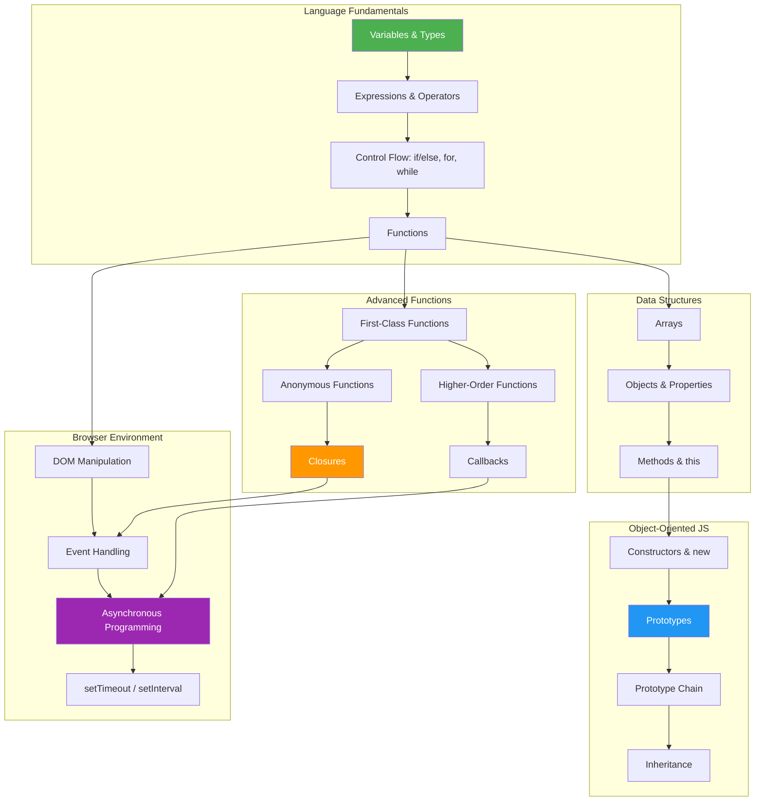

# Head First JavaScript Programming

> **Authors:** Eric T. Freeman & Elisabeth Robson
> **Publisher:** O'Reilly Media (Head First Series)
> **Year:** 2014 (First Edition)
> **ISBN:** 978-1-449-34013-1
> **Pages:** 704
> **Source:** [PDF](../../sources/books/eric-t-freeman-elisabeth-robson-head-first-javaScript-programming-a-brain-friendly-guide-o-reilly-media-2014.pdf)

## Overview

A brain-friendly, visually rich guide to learning JavaScript fundamentals. The book uses the Head First learning methodology — conversational tone, visual explanations, puzzles, exercises, and real-world projects — to teach JavaScript from beginner to intermediate level. It covers the language in the browser context, building up to prototypal inheritance and closures through a progressive, project-based approach.

**Target audience:** Beginners with basic HTML/CSS knowledge who want to learn JavaScript programming properly.

---

## Chapter-by-Chapter Notes

### Chapter 1: A Quick Dip into JavaScript — Getting Your Feet Wet

**Core concepts:**
- JavaScript adds **behavior** to web pages (HTML = structure, CSS = style, JS = behavior)
- The browser loads, parses, and executes JavaScript as it encounters it
- JavaScript runs in the browser with near-native compiled speed (JIT compilation)

**The `<script>` element:**
- Inline in `<head>` — easy to find, but blocks page rendering
- Inline in `<body>` — better, page loads before scripts
- External file linked from `<head>` — maintainable, but still blocks
- **Best practice:** External file linked from bottom of `<body>` — best of both worlds

```html
<!-- Best practice placement -->
<body>
  <!-- page content -->
  <script src="code.js"></script>
</body>
```

**Language basics introduced:**
- Variables and `var` declarations
- Types: numbers, strings, booleans
- Expressions (numeric, string, boolean)
- `while` loops
- `if/else` conditionals
- `console.log()` for debugging (prefer over `alert()`)

**Variable naming conventions:**
- Use meaningful names (`currentPressure`, not `$` or `_m`)
- Use camelCase for multi-word names
- Avoid starting with `$` or `_` unless you have good reason
- Avoid JavaScript reserved keywords
- Always use `var` when declaring

---

### Chapter 2: Writing Real Code — Going Further

**Project: Simple Battleship game**

**Development process taught:**
1. High-level design first
2. Write pseudocode
3. Translate pseudocode to JavaScript
4. Test and QA iteratively

**Key concepts:**
- `prompt()` for user input — returns a string
- `parseInt()` to convert string input to numbers
- `Math.random()` — returns float between 0 (inclusive) and 1 (exclusive)
- Random integer formula: `Math.floor(Math.random() * n)` → gives 0 to n-1
- Boolean operators: `||` (OR), `&&` (AND)
- Simplifying redundant conditionals with `||`

```javascript
// Instead of repeating if/else for each location:
if (guess == location1 || guess == location2 || guess == location3) {
    hits = hits + 1;
}
```

**Lesson:** Code should avoid redundancy. If you find yourself copy-pasting logic, there's likely a better way.

---

### Chapter 3: Introducing Functions — Getting Functional

**Functions are the gateway from scripter to programmer.**

**Function anatomy:**
```javascript
function bark(name, weight) {   // keyword, name, parameters
    if (weight > 20) {          // body
        console.log(name + " says WOOF WOOF");
    } else {
        console.log(name + " says woof woof");
    }
}

bark("rover", 23);  // call with arguments
```

**Key concepts:**
- **Parameters** = variables in the function definition
- **Arguments** = values passed when calling the function
- JavaScript is **pass-by-value** — the function gets a copy of the value
- Functions can **return values** using `return`
- Functions give you: code reuse, single place for changes, readability

**Scope:**
- **Global variables** — declared outside any function, accessible everywhere
- **Local variables** — declared inside a function with `var`, only accessible within
- Local variables have **short lives** — created when function is called, destroyed when it returns
- If you forget `var`, the variable becomes global (a common bug!)
- Local variables **shadow** global variables of the same name

```javascript
var x = 10;           // global
function test() {
    var x = 20;       // local — shadows the global
    console.log(x);   // 20
}
test();
console.log(x);       // 10 — global unchanged
```

---

### Chapter 4: Putting Some Order in Your Data — Arrays

**Arrays store ordered collections of values.**

```javascript
var scores = [60, 50, 60, 58, 54];
scores[0];          // 60 (zero-indexed)
scores.length;      // 5
scores[scores.length - 1];  // 54 (last element trick)
```

**Iteration patterns:**

```javascript
// while loop
var i = 0;
while (i < scores.length) {
    console.log(scores[i]);
    i = i + 1;
}

// for loop (preferred for arrays)
for (var i = 0; i < scores.length; i++) {
    console.log(scores[i]);
}
```

**Key operations:**
- `array.length` — number of elements
- `array.push(value)` — add to end
- `array.pop()` — remove from end
- `array.indexOf(value)` — find index or -1 if not found
- Post-increment: `i++` (shorthand for `i = i + 1`)
- Post-decrement: `i--`
- Empty array: `var a = [];`

**Array facts:**
- Can hold mixed types (but usually you shouldn't)
- Accessing out-of-bounds index returns `undefined`
- Practically unlimited size (limited by memory)

---

### Chapter 5: Understanding Objects — A Trip to Objectville

**Objects combine state (properties) and behavior (methods).**

```javascript
var fiat = {
    make: "Fiat",
    model: "500",
    year: 1957,
    started: false,
    start: function() {
        this.started = true;
    },
    drive: function() {
        if (this.started) {
            alert("Zoom zoom!");
        } else {
            alert("Start the engine first.");
        }
    }
};
```

**The `this` keyword:**
- Inside a method, `this` refers to the object whose method was called
- Must use `this.propertyName` to access object properties from methods
- Without `this`, JavaScript looks for a local/global variable (and fails)
- `this` is set at **call time**, not definition time

**Property access:**
- Dot notation: `car.color`
- Bracket notation: `car["color"]` — allows expressions: `car["co" + "lor"]`

**Iterating object properties:**
```javascript
for (var prop in car) {
    console.log(prop + ": " + car[prop]);
}
```

**Encapsulation:** Use methods to change state rather than directly modifying properties — keeps logic in one place and allows for complex operations behind a simple interface.

**Object references:**
- Variables hold a **reference** to the object, not the object itself
- Passing an object to a function passes the reference (changes inside affect the original)
- Comparing objects compares references, not content

---

### Chapter 6: Interacting with Your Web Page — Getting to Know the DOM

**The DOM (Document Object Model) is a tree representation of your HTML page.**

```
document → html → head + body → elements...
```

**Key DOM methods:**
```javascript
var element = document.getElementById("myId");  // returns element or null
element.innerHTML = "New content";               // change content
element.setAttribute("class", "highlight");      // set attribute
element.getAttribute("src");                     // get attribute
```

**Critical pattern: Wait for page load**
```javascript
window.onload = init;
function init() {
    // DOM is ready, safe to manipulate
}
```

- Always check `getElementById` result for `null` before using
- The term "event handler" and "callback" are interchangeable in this context
- Changing the DOM changes what the user sees immediately

---

### Chapter 7: Types, Equality, Conversion — Serious Types

**JavaScript type system quirks you must know:**

**Special values:**
- `undefined` — variable declared but no value assigned; also returned for missing properties
- `null` — intentionally represents "no value" for objects
- `NaN` — "Not a Number" — result of invalid math; `typeof NaN === "number"`; `NaN !== NaN`
- `Infinity` — result of dividing by zero (except `0/0` which is `NaN`)

**Equality operators:**

| Operator | Name | Behavior |
|----------|------|----------|
| `==` | Equality | Converts types before comparing |
| `===` | Strict equality | No conversion; must match type AND value |
| `!=` | Inequality | Converts types |
| `!==` | Strict inequality | No conversion |

**`==` conversion rules:**
1. **Number vs String** → string converted to number
2. **Boolean vs anything** → boolean converted to number (true=1, false=0)
3. **null vs undefined** → always equal to each other
4. **Objects** → compared by reference, not content

```javascript
99 == "99"      // true (string → number)
1 == true       // true (true → 1)
"" == 0         // true (empty string → 0)
null == undefined  // true
"99" === 99     // false (different types)
```

**Best practice:** Use `===` by default. Use `==` only when you intentionally want type coercion.

**Type conversion with operators:**
- `+` with a string → concatenation: `3 + "4"` → `"34"`
- `-`, `*`, `/` → arithmetic: `"10" - 5` → `5`
- Left-to-right: `1 + 2 + " pizzas"` → `"3 pizzas"`

**Truthy and Falsy:**
- **Falsy:** `undefined`, `null`, `0`, `""`, `NaN`, `false`
- **Everything else is truthy** (including `"0"`, `"false"`, empty arrays, empty objects)

**Strings as objects:**
- Strings have methods: `.length`, `.charAt()`, `.indexOf()`, `.substring()`, `.split()`, `.toUpperCase()`, `.toLowerCase()`, `.trim()`

---

### Chapter 8: Building an App — Bringing It All Together

**Project: Full Battleship game with MVC architecture**

**Architecture pattern — Model-View-Controller (MVC):**

| Component | Responsibility |
|-----------|---------------|
| **Model** | Game state (ships, hits, sunk count). Logic for hit detection |
| **View** | Display updates (DOM manipulation for hits/misses/messages) |
| **Controller** | Processes user input, coordinates model and view |

**Key implementation patterns:**
- **Data structure design:** Ships as array of objects with `locations` and `hits` arrays
- **`indexOf()`** for searching arrays (cleaner than manual loops)
- **Chaining:** `ship.locations.indexOf(guess)` instead of temporary variables
- **Helper methods:** `isSunk()` separates concerns from `fire()`
- **Avoid hardcoding:** Use properties like `numShips`, `boardSize`, `shipLength` instead of magic numbers

```javascript
var model = {
    boardSize: 7,
    numShips: 3,
    shipLength: 3,
    shipsSunk: 0,
    ships: [
        { locations: ["06", "16", "26"], hits: ["", "", ""] },
        // ...
    ],
    fire: function(guess) {
        for (var i = 0; i < this.numShips; i++) {
            var ship = this.ships[i];
            var index = ship.locations.indexOf(guess);
            if (index >= 0) {
                ship.hits[index] = "hit";
                view.displayHit(guess);
                if (this.isSunk(ship)) {
                    this.shipsSunk++;
                }
                return true;
            }
        }
        view.displayMiss(guess);
        return false;
    },
    isSunk: function(ship) { /* check all hits */ }
};
```

---

### Chapter 9: Asynchronous Coding — Handling Events

**JavaScript is event-driven, not top-to-bottom.**

**Event types:**
- **DOM events:** click, mouseover, mouseout, mousemove, resize, load
- **Timer events:** setTimeout, setInterval
- **API events:** geolocation, network requests

**Event handler patterns:**
```javascript
// DOM events — assign handler to property
element.onclick = handleClick;
window.onload = init;
element.onmousemove = showCoords;

// Timer events — pass handler to function
setTimeout(handler, 5000);          // once after delay
setInterval(handler, 1000);         // repeating
setTimeout(handler, 2000, arg);     // pass arg to handler
```

**Event object:**
- DOM event handlers receive an `event` object
- `event.type` — the event type ("click", "load", etc.)
- `event.target` — the DOM element that triggered the event
- Mouse events: `event.clientX`, `event.clientY`, `event.pageX`, `event.pageY`

**Event queue:**
- Events are queued when they happen faster than handlers can process
- Handlers execute one at a time, in order
- Complex handlers block the queue — keep them fast

**Key insight:** Most JavaScript is written to **react** to events, not execute linearly. This is **asynchronous programming**.

---

### Chapter 10: First-Class Functions — Liberated Functions

**Functions are first-class citizens in JavaScript — they are values.**

**Three capabilities of first-class functions:**
1. **Assign to variables:** `var f = function(x) { return x + 1; };`
2. **Pass to functions:** `setTimeout(myHandler, 5000);`
3. **Return from functions:** `function maker() { return function() {...}; }`

**Function declarations vs function expressions:**

```javascript
// Declaration — hoisted, available before its line
function add(a, b) { return a + b; }

// Expression — NOT hoisted, available only after assignment
var add = function(a, b) { return a + b; };
```

**Passing functions to functions (higher-order functions):**
```javascript
function processPassengers(passengers, testFunction) {
    for (var i = 0; i < passengers.length; i++) {
        if (testFunction(passengers[i])) {
            return false;  // failed test
        }
    }
    return true;
}

// Usage
processPassengers(list, checkNoFlyList);
processPassengers(list, checkNotPaid);
```

**Returning functions from functions:**
```javascript
function createDrinkOrder(passenger) {
    if (passenger.ticket === "firstclass") {
        return function() { alert("Cocktail or wine?"); };
    } else {
        return function() { alert("Cola or water?"); };
    }
}
// Check ticket type once, use returned function many times
var getDrink = createDrinkOrder(passenger);
getDrink();  // no need to re-evaluate ticket type
```

**Array `sort()` with comparison functions:**
```javascript
function compareNumbers(a, b) {
    if (a > b) return 1;
    if (a === b) return 0;
    return -1;
}
// Or simply: function compareNumbers(a, b) { return a - b; }

numbers.sort(compareNumbers);
```

---

### Chapter 11: Anonymous Functions, Scope, and Closures — Serious Functions

**Anonymous functions:** Functions without names, used as expressions.

```javascript
window.onload = function() { /* ... */ };
setTimeout(function() { alert("Time's up!"); }, 3000);
```

**IIFE (Immediately Invoked Function Expression):**
```javascript
(function(food) {
    if (food === "cookies") alert("More please!");
})("cookies");
```

**Lexical scope:** A function's scope is determined by where it's **defined**, not where it's **called**.

**Nested functions and scope chain:**
```javascript
function outer() {
    var x = 10;
    function inner() {
        console.log(x);  // accesses outer's x via scope chain
    }
    inner();
}
```

**Closures — the most powerful concept:**

A closure is a function bundled together with its **lexical environment** (the variables in scope when it was created).

```javascript
function makeCounter() {
    var count = 0;
    return function() {
        count++;
        return count;
    };
}

var counter = makeCounter();
counter();  // 1
counter();  // 2
counter();  // 3
// count is "closed over" — persists between calls
```

**Key closure facts:**
- The closure captures the **actual variable**, not a copy
- Free variables (not local, not parameters) are resolved via the closure's environment
- Closures are created every time a function is created
- Common uses: event handlers, callbacks, data privacy, function factories

```javascript
// Closure with event handler
function makeHandler(message) {
    return function() {
        alert(message);  // message is closed over
    };
}
button.onclick = makeHandler("You clicked!");
```

---

### Chapter 12: Creating Objects — Advanced Object Construction

**The problem with object literals at scale:** Inconsistency, code duplication, no guarantees about structure.

**Constructors — factory functions for objects:**
```javascript
function Dog(name, breed, weight) {
    this.name = name;
    this.breed = breed;
    this.weight = weight;
    this.bark = function() {
        if (this.weight > 25) {
            console.log(this.name + " says Woof!");
        } else {
            console.log(this.name + " says Yip!");
        }
    };
}

var fido = new Dog("Fido", "Mixed", 38);
var spot = new Dog("Spot", "Chihuahua", 10);
```

**How `new` works:**
1. Creates a new empty object
2. Sets `this` to point to the new object
3. Executes the constructor body (adding properties to `this`)
4. Returns the new object

**Convention:** Constructor names start with uppercase (`Dog`, `Car`, `Robot`).

**`instanceof` operator:**
```javascript
fido instanceof Dog;     // true
fido instanceof Object;  // true (everything inherits from Object)
```

**Problem:** Each instance gets its own copy of every method → memory waste.

---

### Chapter 13: Using Prototypes — Extra-Strength Objects

**The prototype solution to method duplication.**

**Prototypal inheritance:** Objects inherit from other objects (not classes).

```javascript
// Constructor — only instance-specific properties
function Dog(name, breed, weight) {
    this.name = name;
    this.breed = breed;
    this.weight = weight;
}

// Shared methods go on the prototype
Dog.prototype.species = "Canine";
Dog.prototype.bark = function() {
    if (this.weight > 25) {
        console.log(this.name + " says Woof!");
    } else {
        console.log(this.name + " says Yip!");
    }
};
Dog.prototype.run = function() { console.log("Run!"); };
Dog.prototype.wag = function() { console.log("Wag!"); };
```

**How property lookup works:**
1. Check the instance itself
2. If not found → check the prototype
3. If not found → check prototype's prototype (chain continues to `Object`)

**Overriding prototype properties:**
```javascript
spot.bark = function() { console.log("WOOF!"); };
// spot.bark() uses instance method; fido.bark() still uses prototype
```

**Prototype chain:**
```
Instance → Constructor.prototype → Object.prototype → null
```

**Setting up inheritance chains:**
```javascript
function SpaceRobot(name, year, owner, planet) {
    this.name = name;
    this.year = year;
    this.owner = owner;
    this.homePlanet = planet;
}
SpaceRobot.prototype = new Robot();  // inherit from Robot
SpaceRobot.prototype.pilot = function() { /* ... */ };
```

**Dynamic prototypes:** Adding properties to a prototype **after** creating instances still works — all instances immediately see the new properties.

**`hasOwnProperty()`:** Check if a property belongs to the instance (not inherited).

**Built-in object extension:**
```javascript
String.prototype.palindrome = function() {
    var r = this.split("").reverse().join("");
    return (r === this.valueOf());
};
"kayak".palindrome();  // true
```

**The Grand Unified Theory:** In JavaScript, **everything is an object** — functions, arrays, Date, Math, RegEx, and all custom objects. Primitives (string, number, boolean) can be treated as objects when needed (auto-boxing).

---

### Appendix: Top Ten Leftovers

1. **jQuery** — DOM manipulation library (simplifies cross-browser issues)
2. **Advanced DOM** — `getElementsByTagName`, `getElementsByClassName`, `createElement`, `appendChild`
3. **The Window Object** — global scope object, `window.location`, `window.navigator`
4. **Arguments object** — `arguments` array-like object available in all functions
5. **Exception handling** — `try/catch/finally`, `throw new Error("message")`
6. **`addEventListener`** — modern event handling (multiple handlers per event)
7. **Regular Expressions** — pattern matching with `/pattern/flags`
8. **Recursion** — functions calling themselves (base case + recursive case)
9. **JSON** — `JSON.stringify()` and `JSON.parse()` for data interchange
10. **Server-side JavaScript** — Node.js for running JS outside the browser

---

## Key Takeaways

1. **JavaScript is event-driven** — most code reacts to events, not running top-to-bottom
2. **Functions are first-class** — they can be assigned, passed, returned, creating powerful patterns
3. **Closures** capture their lexical environment — enables data privacy, factories, callbacks
4. **Prototypal inheritance** is JavaScript's object model — objects inherit from objects, not classes
5. **`this`** is set at call time — it refers to the object whose method is being called
6. **`===` over `==`** — strict equality avoids type coercion surprises
7. **Truthy/falsy** behavior affects conditionals — know the six falsy values
8. **Separation of concerns** — MVC pattern, external JS files, functions doing one thing well
9. **Avoid global variables** — use local scope and closures to encapsulate
10. **Everything is an object** — even functions and arrays; understanding this unifies the language

---

## Relationship to Other Resources

- **Prerequisite:** Head First HTML and CSS
- **Complements:** [You Don't Know JS](./you-dont-know-js.md) (deeper dive into same topics)
- **Next steps:** Head First HTML5 Programming (Canvas, Geolocation, Web Workers)
- **Related:** [Clean Code](../../01-fundamentals/clean-code/clean-code.md) (code quality principles apply to JS too)

---

## Mermaid Diagram: JavaScript Core Concepts


