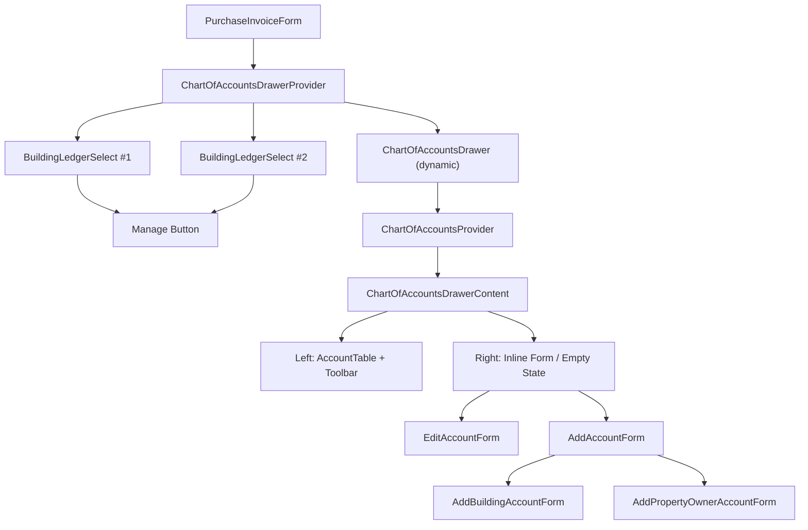
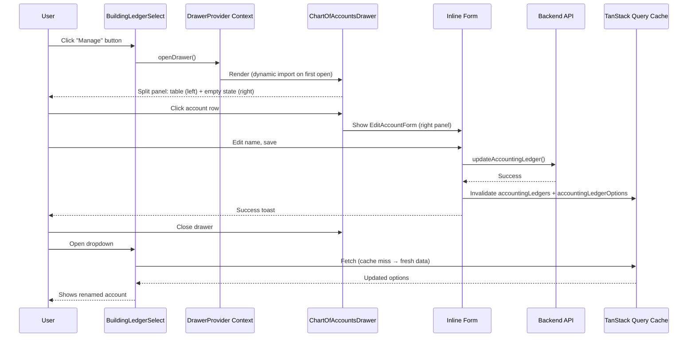
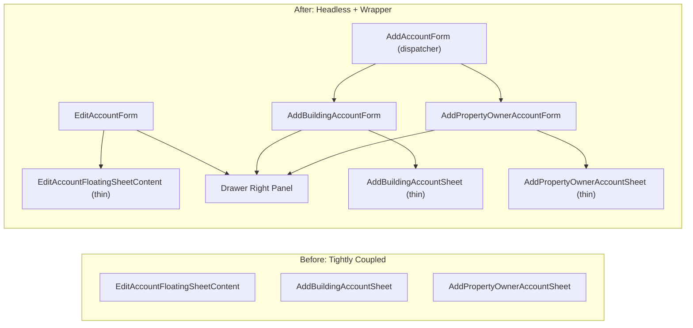

# Chart of Accounts Drawer — Inline Account Management from Ledger Select

## What

Adds a "Manage accounts" button to `BuildingLedgerSelect` that opens a bottom drawer with a split-panel view of the chart of accounts (6xx expenses). Users can search, edit, and add accounts inline without leaving the purchase invoice form.

## Why

When filling in purchase invoices, users frequently need to create or rename cost accounts (6xx). Currently this requires navigating away to the Chart of Accounts page, losing form context. This feature brings account management inline via a drawer, reducing context-switching and improving data entry speed.

## How it works

- **Drawer trigger**: A small icon button appears next to `BuildingLedgerSelect` when a `ChartOfAccountsDrawerProvider` is present in the component tree. No provider = no button (backward compatible).
- **Single drawer instance**: One `ChartOfAccountsDrawerProvider` per form owns the drawer. Multiple `BuildingLedgerSelect` instances share the same drawer — no duplication.
- **Split panel layout**: Left panel shows the account table (search + virtualized rows). Right panel shows the edit or add form inline (no nested sheets).
- **Class-locked to 6xx**: The drawer uses `ChartOfAccountsProvider` with `initialClass="6"` and `isClassTabsHidden=true`, hiding class tabs. Configurable from outside.
- **619 group support**: Adding accounts under the 619 group uses the property/owner picker flow (`AddPropertyOwnerAccountForm`). All other 6xx groups use the standard building account form.
- **Dynamic import**: The drawer component is loaded via `next/dynamic` with `ssr: false` — only fetched on first open.
- **Cache sync**: Create/update mutations now also invalidate `accountingLedgerOptions` so the popover dropdown reflects changes immediately.

## Architecture

### Component tree

### User flow

### Headless form extraction pattern

## Key files

| Area | Files | Notes |
|------|-------|-------|
| Headless forms | `chart-of-accounts/components/forms/` | Extracted from FloatingSheet wrappers |
| Drawer context | `chart-of-accounts/drawer/ChartOfAccountsDrawerProvider.tsx` | Open/close state + buildingId |
| Drawer UI | `chart-of-accounts/drawer/ChartOfAccountsDrawer.tsx` | CommonDrawer + split panel |
| Provider changes | `ChartOfAccountsProvider.tsx` | `initialClass` + `isClassTabsHidden` props |
| Toolbar changes | `Toolbar.tsx` | Hides class tabs when `isClassTabsHidden` |
| Select integration | `BuildingLedgerSelect.tsx` | Manage button via optional context |
| Cache fix | `useAccountingLedger.ts` | Invalidates ledger options on mutations |

## Manual test checklist

- [ ] Existing Chart of Accounts page works identically (no regressions)
- [ ] BuildingLedgerSelect without provider has no manage button
- [ ] BuildingLedgerSelect with provider shows manage button
- [ ] Clicking manage opens drawer filtered to 6xx accounts
- [ ] Search in drawer filters accounts
- [ ] Clicking an account row opens edit form in right panel
- [ ] Editing and saving updates the account, dropdown reflects changes
- [ ] Adding a new account under a 6xx group works (standard form)
- [ ] Adding a new account under 619 shows property/owner picker
- [ ] Closing drawer returns to the form without data loss
- [ ] Multiple BuildingLedgerSelects on the same form share one drawer
