# SNDQ DataTable — Architecture

Comprehensive architecture for a unified table component that replaces 7 fragmented table implementations with a single composable, TanStack-powered DataTable.

## TL;DR

Build a 4-layer DataTable system: semantic HTML primitives, a `useDataTable` hook wrapping TanStack Table v8 with SNDQ state management, a compound component feature shell, and domain-level column definitions. This consolidates CommonTable (~35 screens), CompactTable (~31 screens), EnrichTable (~20 screens), and others into one composable API that covers all 35 features demonstrated in the RawTable prototype.

## Table of Contents

1. [Problem Statement](#1-problem-statement)
2. [Research Findings](#2-research-findings)
3. [Chosen Architecture](#3-chosen-architecture)
4. [Layer 1: Table Primitives](#4-layer-1-table-primitives)
5. [Layer 2: useDataTable Hook](#5-layer-2-usedatatable-hook)
6. [Layer 3: DataTable Feature Shell](#6-layer-3-datatable-feature-shell)
7. [Layer 4: Domain Tables](#7-layer-4-domain-tables)
8. [Feature Coverage Matrix](#8-feature-coverage-matrix)
9. [Identified Gaps and Solutions](#9-identified-gaps-and-solutions)
10. [State Persistence Strategy](#10-state-persistence-strategy)
11. [Migration Path](#11-migration-path)
12. [References](#12-references)

---

## 1. Problem Statement

### Current fragmentation

The sndq-fe codebase contains **7 distinct table components** that evolved independently for different use cases:

| Component | Usage | Role |
|-----------|-------|------|
| CommonTable | ~35 screens | Primary entity list pages with filters, views, bulk actions |
| CompactTable | ~31 screens | Dense financial tables in sheets and tabs |
| EnrichTable | ~20 screens | Rich embedded tables on detail pages |
| InfiniteTable | ~90 screens | Virtualized scroll lists and picker drawers |
| TableV2 | ~2 screens | Form-embedded line item tables |
| DataTable | Prototype only | Semantic table for prototypes |
| Table (simple) | ~1 screen | Legacy shadcn wrappers |

Source: `sndq-prototype/lab/src/modules/prototype/flows/table-patterns/screens/0-showcase/index.tsx`

### Current state — fragmentation map

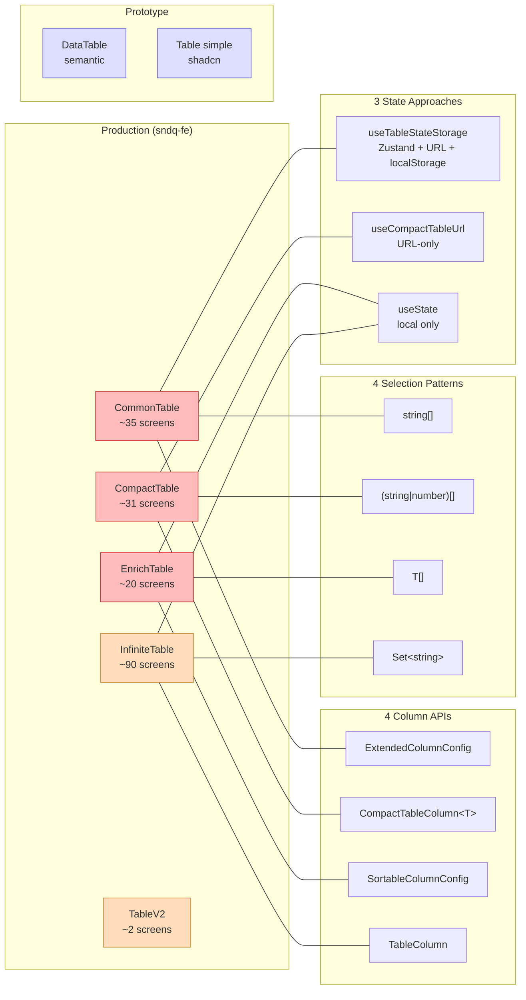

### Concrete problems

- **4 different column definition patterns**: `ExtendedColumnConfig`, `CompactTableColumn<T>`, `SortableColumnConfig`, `TableColumn`
- **4 different selection state patterns**: `string[]`, `(string|number)[]`, `T[]`, `Set<string>`
- **3 different state management approaches**: Zustand+URL (`useTableStateStorage`), URL-only (`useCompactTableUrl`), local `useState`
- **2 rendering paradigms**: div-based (no accessibility) vs semantic `<table>` (prototype only)
- **No shared virtualization path**: EnrichTable/CommonTable cannot handle 500+ rows
- **Inconsistent UX**: row heights, hover states, empty states, and loading patterns differ across components
- **22 per-table filter hooks** that each transform UI filter state to API params independently

### Design goal

One composable DataTable that every developer can understand and maintain, covering sorting, filtering, grouping (with sub-groups), selection (with bulk operations), pagination, column resizing/reordering/visibility, inline editing, toolbar controls, saved views, and virtualization.

---

## 2. Research Findings

Six table implementations were analyzed across the workspace. Each falls into one of three architectural layers:

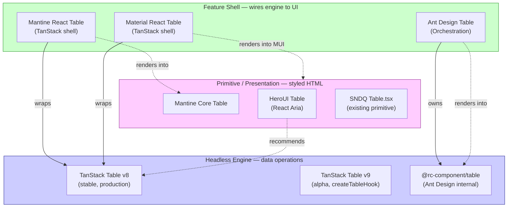

| Layer | Description | Examples |
|-------|-------------|----------|
| Primitive / Presentation | Styled HTML table elements, theming, visual variants | Mantine core `Table`, HeroUI `Table` |
| Headless Engine | Data operations: sorting, filtering, pagination, grouping, selection state | TanStack Table |
| Feature Shell | Wires engine to UI: toolbars, filter dropdowns, sort icons, selection checkboxes | mantine-react-table, material-react-table, Ant Design `Table` |

### Ant Design Table — Orchestration approach

- **Engine**: `@rc-component/table` (not TanStack). Ant Design owns rendering; rc-table owns the DOM.
- **Key pattern**: `transformColumns` pipeline — features are column injectors that mutate column definitions to add sort icons, filter dropdowns, and selection checkboxes into headers. Pipeline order: sorter -> filter -> selection -> title.
- **Data pipeline**: `rawData -> sortedData -> filteredData -> pageData`.
- **State**: Controlled/uncontrolled hybrid per feature. Unified `onChange(pagination, filters, sorter, { action })` callback.
- **Weakness**: Maintainers acknowledge that controlled state in `columns` prop creates 1000+ lines of read-then-write-back code. Planned migration to top-level `sorter` and `filter` props.
- **Lesson**: Do not put controlled state in column definitions.

### HeroUI Table — Render shell approach

- **Engine**: React Aria Components (RAC) for accessibility. No data logic.
- **Pattern**: Styled compound components (`Table.Content`, `Table.Header`, `Table.Row`, `Table.Cell`) wrapping RAC primitives. All data operations are external.
- **TanStack integration**: Official docs recommend TanStack Table as the data layer with a bridge pattern (`SortingState <-> SortDescriptor`).
- **No hooks exported**: Extension is purely composition.
- **Lesson**: Separate data operations from rendering completely. Use a bridge pattern when integrating headless with accessible UI.

### Mantine Core Table — Styled primitive approach

- **Architecture**: Pure presentational. No state, no data logic, no features.
- **Pattern**: `Table.Thead`, `Table.Tr`, `Table.Td` with theming (borders, striping, sticky headers). Config flows through context to `data-*` attributes on sub-elements.
- **Lesson**: The presentation layer primitive should be thin and styling-only.

### Mantine React Table (MRT) — Feature shell on TanStack

- **Engine**: `@tanstack/react-table` v8. Identical architecture to Material React Table (same author).
- **Hook pipeline**: `useMantineReactTable(options) -> useMRT_TableOptions(options) -> useMRT_TableInstance(options) -> useReactTable(...)`.
- **Feature organization**: Not modular packages. Features are `enable*` flags that conditionally attach TanStack row models and inject display columns (selection checkboxes, expand buttons, row actions).
- **Two-tier state**: Tier 1 (TanStack) manages sorting, filters, pagination, selection. Tier 2 (MRT) manages density, editing mode, fullscreen, filter visibility.
- **Component composition**: ~50 UI components, all receiving `table: MRT_TableInstance<TData>` via prop-drilling (no React Context).
- **Type system**: Single ~1,300-line `types.ts`. `MRT_ColumnDef` extends TanStack `ColumnDef` with PascalCase render keys.
- **Lesson**: Feature flags over modules. Display columns as code-generated ColumnDefs. Prop-drilling `table` through 50+ components is fragile — prefer context.

### Material React Table — Same pattern, different UI

- Identical hook pipeline and architectural DNA to MRT. MUI components replace Mantine components.
- **Lesson**: Confirms the MRT pattern is portable across design systems. The architecture works; only the rendering layer changes.

### TanStack Table v9 — `createTableHook` pattern

- The TanStack Table v9 alpha source is in the workspace at `design-system/tables/table/`.
- **Key innovation**: `createTableHook()` — configure features, row models, default options, and register reusable UI components once at the app level. Returns `useAppTable`, `createAppColumnHelper`, context hooks.
- **Component registries**: `tableComponents` (toolbar, pagination), `cellComponents` (TextCell, StatusCell), `headerComponents` (SortIndicator, ColumnFilter). Components use `useTableContext()`, `useCellContext()`, `useHeaderContext()` — zero prop drilling.
- **Lesson**: Register reusable cell/header components at the app level, reference by name. Context-aware components are cleaner than prop-drilling.
- **Decision**: v9 is alpha and unsuitable for production. We adopt v8 with lessons from v9's composition model.

---

## 3. Chosen Architecture

### Four-layer model

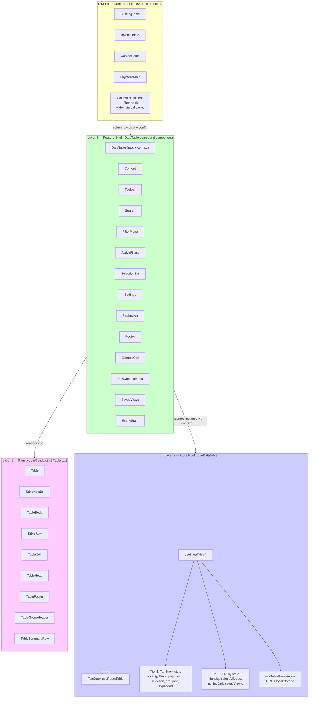

### Key decisions

| Decision | Choice | Rationale |
|----------|--------|-----------|
| TanStack version | v8 (stable) | v9 is alpha; production needs stability. `^8.21.2` already installed in ui-v2-dev. |
| Rendering | Semantic `<table>` | Accessibility improvement over current div-based tables |
| Component pattern | Compound composition | Solves the 7-table fragmentation — different screens compose different subsets |
| State hook | Single `useDataTable` | Unifies `useCommonTable` + `useCompactTableUrl` |
| Feature activation | `enable*` flags (MRT pattern) | Proven at scale, tree-shakeable intent |
| Context vs prop-drill | React Context for table instance | Cleaner than MRT's prop-drilling through 50+ components |
| Column definitions | TanStack `ColumnDef` with factory helpers | Single source of truth, typed, extensible |
| State persistence | Built into hook (URL + localStorage) | Absorbs 2 existing persistence hooks |
| Server-side mode | `config.serverSide.isManual*` flags | Production tables are server-driven |

### Why composition over configuration

The 7-table problem exists because different screens need different toolbar layouts, different footer content, and different selection bars. With composition:

- A CommonTable-style table uses `DataTable.Toolbar` + `DataTable.FilterMenu` + `DataTable.SavedViews` + `DataTable.SelectionBar`
- A CompactTable-style table omits toolbar and saved views, uses only `DataTable.Content` + `DataTable.Pagination`
- An InfiniteTable-style table replaces `DataTable.Pagination` with `DataTable.LoadMore`
- One component, infinite configurations

---

## 4. Layer 1: Table Primitives

### Existing foundation

`apps/ui-v2-dev/src/components/ui-v2/Table.tsx` already provides:

- `Table` — `<table>` wrapped in scroll container
- `TableHeader` — `<thead>` with `bg-sndq-surface-subtle`
- `TableBody` — `<tbody>`
- `TableRow` — `<tr>` with hover states and `data-selected` support
- `TableHead` — `<th>` with `sortDirection` + `onSort` props and chevron icons
- `TableCell` — `<td>` with alignment
- `TableCaption` — `<caption>`
- `compact` sizing variant on head and cell

### Extensions needed

| Component | Purpose |
|-----------|---------|
| `TableFooter` | `<tfoot>` with summary row styling, pagination area |
| `TableGroupHeader` | Collapsible group header row with chevron, label, count, action slots |
| `TableSummaryRow` | Aggregation row (item count, total amount) per group |
| `TableEmptyRow` | Centered empty state spanning all columns |
| Density context | Provider passing `compact | default` to all children without prop-drilling |

These remain purely presentational — no data logic, no TanStack dependency.

---

## 5. Layer 2: useDataTable Hook

### Core hook pipeline

Modeled after MRT's three-layer pattern, simplified for SNDQ:

```typescript
function useDataTable<TData, TFilters>(
  options: DataTableOptions<TData, TFilters>
): DataTableInstance<TData>
```

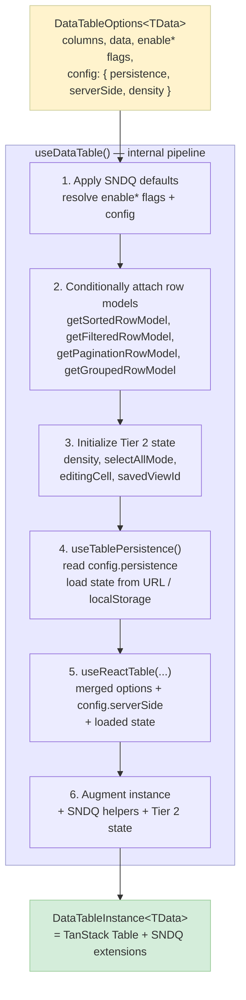

### Options API

```typescript
interface DataTableOptions<TData, TFilters> {
  // --- Primary (always needed, top-level) ---
  columns: ColumnDef<TData, any>[];
  data: TData[];
  getRowId?: (row: TData) => string;

  // --- Feature flags (enable* = toggle on/off) ---
  enableSorting?: boolean;
  enableFiltering?: boolean;
  enableGlobalFilter?: boolean;
  enableSelection?: boolean;
  enablePagination?: boolean;
  enableColumnVisibility?: boolean;
  enableColumnResizing?: boolean;
  enableColumnOrdering?: boolean;
  enableGrouping?: boolean;
  enableExpanding?: boolean;
  enableEditing?: boolean;

  // --- Config (grouped user-facing settings) ---
  config?: {
    density?: 'compact' | 'default';
    pageSizeOptions?: number[];

    persistence?: {
      key: string;
      strategy: 'url+localStorage' | 'url' | 'localStorage' | 'none';
      scope?: string;
      persistSearch?: boolean;
    };

    serverSide?: {
      isManualPagination?: boolean;
      isManualSorting?: boolean;
      isManualFiltering?: boolean;
      pageCount?: number;
      rowCount?: number;
    };
  };

  // --- Callbacks ---
  onStateChange?: (state: DataTableState<TFilters>) => void;

  // --- TanStack passthrough ---
  initialState?: Partial<TableState>;
  state?: Partial<TableState>;
}
```

**Naming conventions**:

| Prefix | Usage | Examples |
|--------|-------|---------|
| `enable` | Toggle a feature on/off | `enableSorting`, `enableFiltering` |
| `is` | Describes a mode or state | `isManualPagination`, `isManualSorting` |
| `persist` | Whether to persist something | `persistSearch` |
| No prefix | Static config values | `density`, `pageCount`, `scope`, `strategy` |

**Design rationale**: Primary props (`columns`, `data`) stay at the root for discoverability. Feature flags (`enable*`) stay at the root because they're the main API surface. Everything else groups under `config` — persistence, server-side mode, and display preferences are configuration concerns, not primary data.

### Two-tier state model

```mermaid
graph LR
    subgraph Tier1["Tier 1 — TanStack-managed"]
        sorting["sorting"]
        colFilters["columnFilters"]
        globalFilter["globalFilter"]
        pagination["pagination"]
        rowSelection["rowSelection"]
        colVis["columnVisibility"]
        colSize["columnSizing"]
        colOrder["columnOrder"]
        grouping["grouping"]
        expanded["expanded"]
    end

    subgraph Tier2["Tier 2 — SNDQ-managed"]
        density["density"]
        showFilters["showFilters"]
        showColConfig["showColumnConfig"]
        selectAllMode["selectAllMode"]
        editingCell["editingCell"]
        savedViewId["savedViewId"]
    end

    subgraph Persistent["Persisted (URL + localStorage)"]
        pSort["sorting ↔ ?sort=field:dir"]
        pFilter["filters ↔ ?filters=JSON"]
        pPage["pagination ↔ ?page&limit"]
        pCols["visibility ↔ ?fields=a,b,c"]
        pGroup["grouping ↔ ?groupBy=field"]
        pView["savedViewId ↔ ?viewId=x"]
    end

    subgraph Ephemeral["Ephemeral (not persisted)"]
        eSelect["rowSelection"]
        eEdit["editingCell"]
        eDensity["density"]
        eShowUI["showFilters, showColumnConfig"]
    end

    Tier1 -->|"persistent subset"| Persistent
    Tier2 -->|"persistent subset"| Persistent
    Tier1 -->|"ephemeral subset"| Ephemeral
    Tier2 -->|"ephemeral subset"| Ephemeral

    style Tier1 fill:#dde8ff,stroke:#88b
    style Tier2 fill:#ffe8dd,stroke:#b88
    style Persistent fill:#d4edda,stroke:#9c9
    style Ephemeral fill:#f8d7da,stroke:#c99
```

**Tier 1 — TanStack-managed** (standard `useReactTable` state):
- `sorting`, `columnFilters`, `globalFilter`, `pagination`, `rowSelection`, `columnVisibility`, `columnSizing`, `columnOrder`, `grouping`, `expanded`

**Tier 2 — SNDQ-managed** (local `useState`, merged into options):
- `density` — compact/default toggle
- `showFilters` — filter bar visibility
- `showColumnConfig` — settings panel visibility
- `selectAllMode` — "all N items across dataset selected" flag
- `editingCell` — `{ rowId, field, anchorRect }` for inline editing
- `savedViewId` — active saved view reference

### Custom extensions on the returned instance

```typescript
interface DataTableInstance<TData> extends Table<TData> {
  // SNDQ state
  density: 'compact' | 'default';
  setDensity: (d: 'compact' | 'default') => void;
  selectAllMode: boolean;
  setSelectAllMode: (v: boolean) => void;
  editingCell: EditingCell | null;
  setEditingCell: (cell: EditingCell | null) => void;

  // SNDQ helpers
  toggleGroupSelection: (groupRows: Row<TData>[]) => void;
  getSelectionCount: () => number;
  resetAllState: () => void;
}
```

---

## 6. Layer 3: DataTable Feature Shell

### Compound component — rendering flow

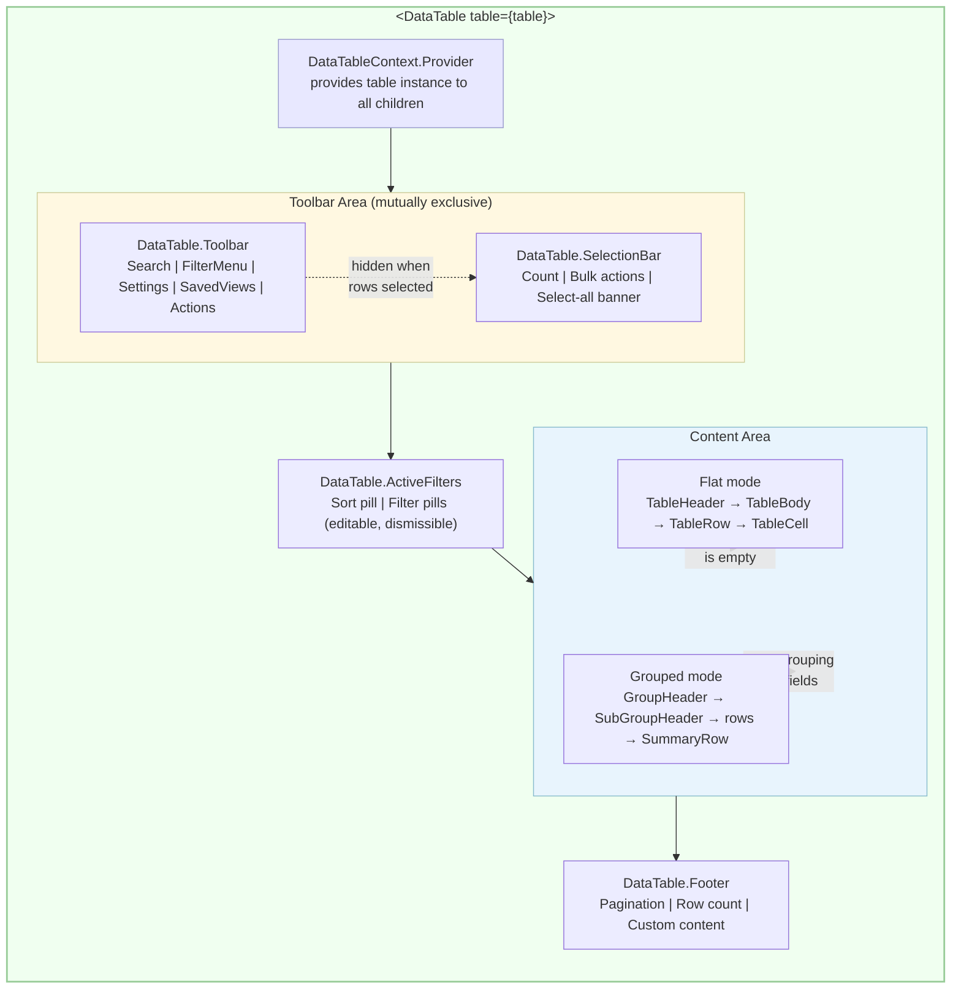

### Compound component catalog

All components share the table instance via `DataTableContext`. Each is independently composable.

| Component | Purpose | Props (key) |
|-----------|---------|-------------|
| `DataTable` | Root wrapper providing context | `table`, `children` |
| `DataTable.Content` | Renders the `<Table>` with headers, rows, groups | `renderGroupHeader?`, `renderGroupSummary?` |
| `DataTable.Toolbar` | Container for toolbar items | `children` (slots) |
| `DataTable.Search` | Expandable search input bound to `globalFilter` | `placeholder?`, `debounceMs?` |
| `DataTable.FilterMenu` | Linear/Notion-style filter property picker with sub-panels | `properties`, `filterValues`, `onToggleValue` |
| `DataTable.ActiveFilters` | Sort pill + filter pills bar with inline edit popovers | (reads from context) |
| `DataTable.SelectionBar` | Replaces toolbar when rows selected | `children` (bulk action slots) |
| `DataTable.Settings` | View settings panel (properties, group, sub-group, page size) | `groupableFields?` |
| `DataTable.ColumnConfig` | Property visibility and drag-reorder list | (reads from context) |
| `DataTable.SavedViews` | View tabs with CRUD (create, rename, duplicate, delete, switch) | `views`, `onSave`, `onSwitch`, `onDelete` |
| `DataTable.Pagination` | Page navigation controls | `showPageSize?` |
| `DataTable.Footer` | Bottom bar with row count and custom content | `children` |
| `DataTable.EditableCell` | Inline cell editing with popover editors | `field`, `editorType` |
| `DataTable.RowContextMenu` | Right-click context menu per row | `actions` |
| `DataTable.EmptyState` | Empty state display spanning all columns | `title?`, `description?` |

### Composition examples

**Full CommonTable replacement:**

```tsx
<DataTable table={table}>
  <DataTable.Toolbar>
    <DataTable.Search />
    <DataTable.FilterMenu properties={filterProps} />
    <DataTable.Settings groupableFields={['building', 'status']} />
    <DataTable.SavedViews views={views} onSave={handleSave} />
    <Button>Add contact</Button>
  </DataTable.Toolbar>

  <DataTable.SelectionBar>
    <span>{count} selected</span>
    <Button>Archive</Button>
    <Button>Send broadcast</Button>
  </DataTable.SelectionBar>

  <DataTable.ActiveFilters />
  <DataTable.Content />

  <DataTable.Footer>
    <DataTable.Pagination />
  </DataTable.Footer>
</DataTable>
```

**Compact financial table (CompactTable replacement):**

```tsx
<DataTable table={table}>
  <DataTable.Content />
  <DataTable.Footer>
    <DataTable.Pagination />
  </DataTable.Footer>
</DataTable>
```

**Embedded detail table (EnrichTable replacement):**

```tsx
<DataTable table={table}>
  <DataTable.Content />
  <DataTable.Footer>
    <span>{data.length} items</span>
  </DataTable.Footer>
</DataTable>
```

---

## 7. Layer 4: Domain Tables

### Column definition strategy

Use TanStack's `createColumnHelper<TData>()` with factory helpers for common SNDQ column types:

```typescript
const columnHelper = createColumnHelper<Building>();

const columns = [
  columnHelper.accessor('name', {
    header: 'Building',
    enableSorting: true,
    meta: { sortKey: 'name' },
    cell: ({ row }) => (
      <EntityCell
        title={row.original.name}
        subtitle={row.original.address}
        href={routerPaths.building.detail(row.original.id)}
      />
    ),
  }),
  columnHelper.accessor('balance', {
    header: 'Balance',
    cell: ({ getValue }) => <AmountCell value={getValue()} currency="EUR" />,
    meta: { align: 'right' },
  }),
  columnHelper.display({
    id: 'actions',
    cell: ({ row }) => <RowActionMenu actions={getRowActions(row.original)} />,
  }),
];
```

### Column factory for CompactTable typed columns

```typescript
const compactColumn = {
  currency: <T,>(key: string, opts) =>
    columnHelper.accessor(key, {
      cell: ({ getValue }) => <AmountCell value={getValue()} currency={opts.currency} />,
      meta: { align: 'right' },
      ...opts,
    }),
  date: <T,>(key: string, opts) =>
    columnHelper.accessor(key, {
      cell: ({ getValue }) => <DateCell value={getValue()} />,
      ...opts,
    }),
  avatarText: <T,>(key: string, opts) =>
    columnHelper.accessor(key, {
      cell: ({ row }) => (
        <EntityCell
          avatar={opts.avatar(row.original)}
          title={opts.value(row.original)}
          subtitle={opts.subtitle?.(row.original)}
        />
      ),
      ...opts,
    }),
};
```

### Migration mapping from existing column APIs

| Current API | Field | TanStack ColumnDef Equivalent |
|-------------|-------|-------------------------------|
| `ExtendedColumnConfig.key` | key | `id` or `accessorKey` |
| `.name` / `.header` / `.title` | header | `header` |
| `.render(item, index)` | cell renderer | `cell: ({ row, getValue }) => ...` |
| `.sortable` + `.sortKey` | sort config | `enableSorting` + `meta.sortKey` |
| `.width` | sizing | `size` / `minSize` / `maxSize` |
| `.align` | alignment | `meta.align` |
| `.isActive` / `.isDefault` | visibility | `enableHiding` + `columnVisibility` state |
| `.href` | link column | `meta.href` or cell with Link component |
| `CompactTableColumn.type` | typed renderer | Column factory helpers (see above) |

### Migration adapters

For gradual migration, provide adapter functions:

```typescript
function fromExtendedColumnConfig<T>(
  configs: ExtendedColumnConfig[]
): ColumnDef<T, any>[]

function fromCompactTableColumn<T>(
  columns: CompactTableColumn<T>[]
): ColumnDef<T, any>[]
```

These let teams migrate per-table without rewriting all column definitions at once.

---

## 8. Feature Coverage Matrix

Every feature from the RawTable prototype (`3-raw-table-v2/RawTable.tsx`, 2,491 lines), mapped to the architecture layer that handles it:

| # | Feature | Layer | TanStack Mapping |
|---|---------|-------|-----------------|
| 1 | Client-side sorting (single field, asc/desc) | L2 | `getSortedRowModel()`, `sorting` state |
| 2 | Sort picker toolbar (property list + direction) | L3 | `DataTable.Toolbar` sort controls |
| 3 | Sort pill display (active sort as dismissible pill) | L3 | `DataTable.ActiveFilters` |
| 4 | Client-side filtering (multi-value, per-property) | L2 | `getFilteredRowModel()`, `columnFilters` state |
| 5 | Linear-style filter menu (hover sub-panel) | L3 | `DataTable.FilterMenu` (custom UX) |
| 6 | Filter pill display (editable pills) | L3 | `DataTable.ActiveFilters` |
| 7 | Filter pill edit popover | L3 | `FilterPillPopover` in `DataTable.ActiveFilters` |
| 8 | Date filter presets (1d/3d/1w/1m/3m/6m/1y) | L2+L3 | Custom `filterFn` + `DataTable.FilterMenu` date mode |
| 9 | Global search (expandable input) | L2+L3 | `globalFilter` state + `DataTable.Search` |
| 10 | Row grouping (single level) | L2 | `getGroupedRowModel()`, `grouping` state |
| 11 | Sub-grouping (nested, two levels) | L2 | `grouping: ['field1', 'field2']` (TanStack supports array) |
| 12 | Collapsible groups (animated) | L1+L3 | `expanded` state + CSS grid transition |
| 13 | Group header with actions (select all, approve, export) | L3 | `DataTable.Content` `renderGroupHeader` slot |
| 14 | Group summary row (item count, total amount) | L1+L3 | `TableSummaryRow` + aggregation fn |
| 15 | Row selection (checkbox per row) | L2 | `rowSelection` state + `enableRowSelection` |
| 16 | Select all on page | L2 | `toggleAllPageRowsSelected()` |
| 17 | Select all across dataset (beyond page) | L2 | Custom `selectAllMode` in Tier 2 state |
| 18 | Group-level selection | L2 | Custom `toggleGroupSelection()` helper |
| 19 | Bulk action bar (replaces toolbar) | L3 | `DataTable.SelectionBar` |
| 20 | Bulk field update (change status/method for selected) | L4 | Domain callback, not table concern |
| 21 | Column visibility (show/hide) | L2 | `columnVisibility` state |
| 22 | Column reorder (drag and drop) | L2 | `columnOrder` state |
| 23 | Property-based column config (Notion-style) | L3 | `DataTable.Settings` > `DataTable.ColumnConfig` |
| 24 | Inline cell editing (click-to-edit with popover) | L2+L3 | `editingCell` in Tier 2 + `DataTable.EditableCell` |
| 25 | Cell edit types (text, currency, date, select) | L3 | Registered editor components |
| 26 | Context menu per row (right-click) | L3 | `DataTable.RowContextMenu` |
| 27 | Peek/detail panel (side panel) | L4 | App-level, outside DataTable |
| 28 | Row navigation in peek (prev/next) | L4 | App-level, outside DataTable |
| 29 | Pagination (page/pageSize) | L2 | `getPaginationRowModel()`, `pagination` state |
| 30 | Page size control | L3 | `DataTable.Settings` or `DataTable.Pagination` |
| 31 | Saved views (CRUD + switch) | L2+L3 | `DataTable.SavedViews` + state snapshot/restore |
| 32 | Status tab filter (segmented control pre-filter) | L4 | Compose `SegmentedTabs` above `DataTable`, filter data before passing |
| 33 | Notion-style property type icons | L3 | `NIcon` component + column `meta.notionType` |
| 34 | Footer summary (total amount) | L1+L3 | `DataTable.Footer` with aggregation |
| 35 | Empty state | L1+L3 | `DataTable.EmptyState` or `TableEmptyRow` |

---

## 9. Identified Gaps and Solutions

### Gap 1: Two-level sub-grouping

**Problem**: The RawTable prototype supports group + sub-group (e.g., group by building, then sub-group by status within each building).

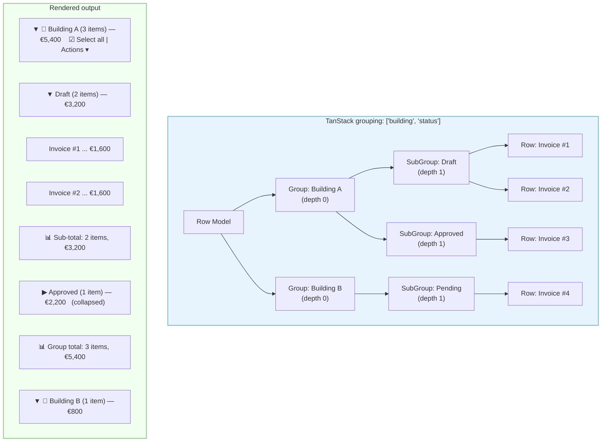

**Solution**: TanStack v8 `grouping` state accepts an array: `grouping: ['building', 'status']`. This nests automatically. The rendering challenge is the UI: group header -> sub-group header -> column header -> rows -> sub-group summary -> group summary. Solve with a `DataTable.Content` that detects grouped row models and renders nested sections.

### Gap 2: Select all across dataset

**Problem**: TanStack's `rowSelection` operates on visible/paginated rows. The RawTable adds a `selectAllMode` boolean meaning "all N items in the dataset are selected, even those not on the current page."

**Solution**: Add `selectAllMode: boolean` to Tier 2 state. When all page rows are selected, `DataTable.SelectionBar` shows a "Select all N items" banner. Domain bulk action callbacks check `selectAllMode` to decide whether to send all IDs or a "select all" flag to the API.

### Gap 3: Group-level selection

**Problem**: Selecting all rows within a group via the group header checkbox is not built into TanStack.

**Solution**: Add `toggleGroupSelection(groupRows: Row<TData>[])` to the `DataTableInstance`. It iterates group rows and calls `row.toggleSelected()`. The group header checkbox reads selection state from `groupRows.every(r => r.getIsSelected())`.

### Selection flow diagram (Gaps 2 + 3 combined)

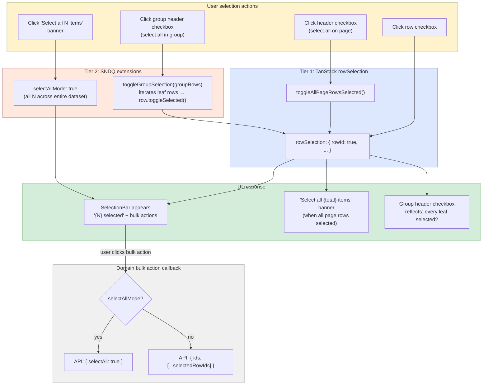

### Gap 4: Linear/Notion-style filter menu

**Problem**: The `FilterMenu` with hover-to-reveal sub-panels is a specific UX pattern not provided by any library.

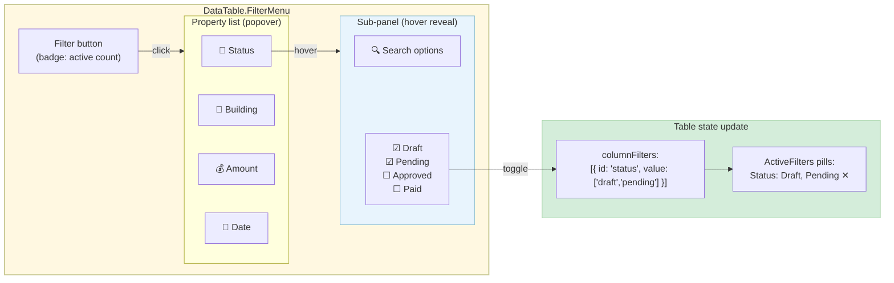

**Solution**: Build as a standalone `DataTable.FilterMenu` component. It receives `PropertyDef[]` defining filterable properties and emits `onToggleValue(property, value)`. Each property type (select, status, date) gets a tailored sub-panel. Date properties show preset options (1d, 3d, 1w, etc.) plus a custom date picker.

### Gap 5: Notion-style settings panel

**Problem**: The settings panel (property visibility with drag reorder, group picker, sub-group picker, page size) is another specific UX compound.

**Solution**: Build `DataTable.Settings` as a compound panel with sub-sections that expand on hover, matching the RawTable prototype's side-panel pattern. Uses TanStack's `columnVisibility`, `columnOrder`, `grouping`, and `pagination.pageSize` state.

---

## 10. State Persistence Strategy

### Current state management (to be absorbed)

| Hook | Location | What it persists | Where |
|------|----------|-----------------|-------|
| `useTableStateStorage` | `sndq-fe/src/hooks/table/` | page, limit, sortBy, filters, fields, groupBy, viewId | Zustand + localStorage + URL |
| `useCompactTableUrl` | `sndq-fe/src/hooks/table/` | page, limit, search, custom string params | URL params + optional localStorage for page size |
| `useCommonTable` | `sndq-fe/src/hooks/table/` | Delegates to `useTableStateStorage`. Debounced search (300ms, not persisted to URL). | N/A |

### Unified persistence adapter

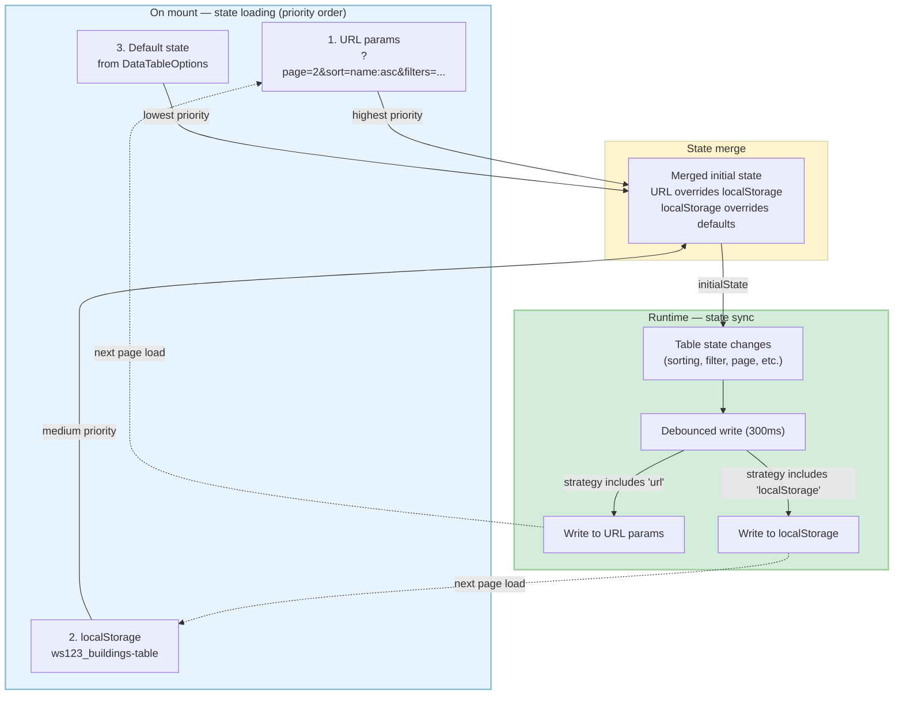

Built into `useDataTable` via a `useTablePersistence` internal hook, configured through `config.persistence`:

```typescript
const table = useDataTable({
  columns,
  data,
  enableSorting: true,
  enableFiltering: true,
  enablePagination: true,
  config: {
    persistence: {
      key: 'buildings-table',
      strategy: 'url+localStorage',
      scope: workspaceId,
      persistSearch: false,  // CommonTable pattern: search not in URL
    },
  },
});
```

**Priority**: URL params > localStorage > default state.

**Isolation key**: `{scope}_{key}` — same table on different workspaces gets separate state.

**What gets persisted**:
- Pagination: `page`, `limit`
- Sorting: `sortBy` (serialized as `field:direction`)
- Filters: `filters` (JSON-encoded)
- Column config: `fields` (visible column keys)
- Column order: `columnOrder` (key array)
- Grouping: `groupBy`, `subGroupBy`
- View: `viewId`
- Search: optionally persisted (configurable via `persistSearch`)

**What does NOT get persisted**:
- Row selection (ephemeral)
- Editing state (ephemeral)
- Density (could be persisted per-user preference separately)
- UI panel visibility (ephemeral)

---

## 11. Migration Path

### Phased approach by risk and complexity

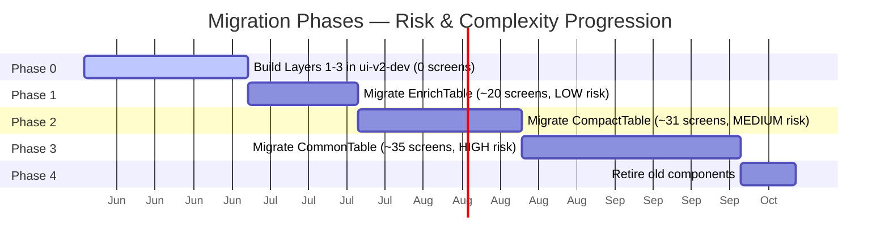

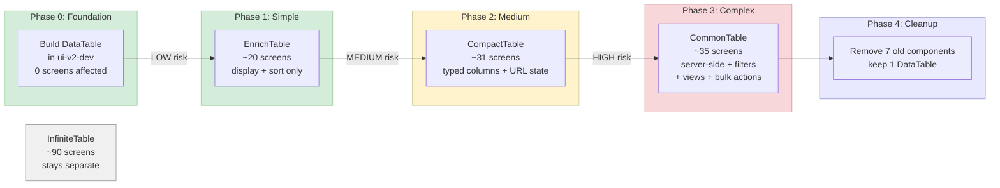

| Phase | Scope | Screens | Why this order |
|-------|-------|---------|----------------|
| Phase 0 | Build Layers 1-3 in ui-v2-dev | 0 | Foundation, no production impact |
| Phase 1 | Migrate EnrichTable direct usage | ~20 | Simplest: no shared state hooks, fewest features |
| Phase 2 | Migrate CompactTable screens | ~31 | Self-contained state, typed columns map cleanly via factory |
| Phase 3 | Migrate CommonTable screens | ~35 | Most complex: filters, saved views, selection bars |
| Phase 4 | Retire old components | — | Remove 7 components, keep 1 |

### What stays separate

- **InfiniteTable** (~90 screens): virtualized picker/list, not a data table. Consider a separate `DataList` or add `DataTable.Virtual` mode later.
- **Domain-specific tables**: `AccountTable`, `VirtualizedReportTable`, form-embedded line tables — evaluate case by case.

### Migration adapter strategy

During migration, teams can use adapter functions to avoid rewriting all column definitions at once:

```typescript
// Before (CommonTable)
const columns: ExtendedColumnConfig[] = [...]
<CommonTable columns={columns} data={data} />

// During migration (adapter)
const tanstackColumns = fromExtendedColumnConfig(columns);
const table = useDataTable({ columns: tanstackColumns, data });
<DataTable table={table}>...</DataTable>

// After migration (native)
const columns = [columnHelper.accessor('name', { ... }), ...];
const table = useDataTable({ columns, data });
<DataTable table={table}>...</DataTable>
```

---

## 12. References

### Analyzed codebases

| Library | Location in workspace | Architecture |
|---------|----------------------|-------------|
| Ant Design Table | `design-system/tables/ant-design/components/table/` | Orchestration on `@rc-component/table` |
| HeroUI Table | `design-system/tables/heroui/packages/react/src/components/table/` | Styled shell on React Aria Components |
| Mantine Core Table | `design-system/tables/mantine/packages/@mantine/core/src/components/Table/` | Pure presentational primitive |
| Mantine React Table | `design-system/tables/mantine-react-table/packages/mantine-react-table/src/` | Feature shell on TanStack v8 |
| Material React Table | `design-system/tables/material-react-table/packages/material-react-table/src/` | Feature shell on TanStack v8 |
| TanStack Table v9 | `design-system/tables/table/` | Headless engine with `createTableHook` |

### Production codebase (sndq-fe)

| Area | Key files |
|------|-----------|
| CommonTable | `sndq-fe/src/components/common-table/CommonTable.tsx`, `types.ts` |
| CompactTable | `sndq-fe/src/components/compact-table/` (compound: Root, Header, Body, Footer, Empty) |
| EnrichTable | `@sndq/ui` package, `SortableColumnConfig` type |
| Table hooks | `sndq-fe/src/hooks/table/useCommonTable.ts`, `useTableStateStorage.ts`, `useCompactTableUrl.ts`, `useSavedViewsTable.ts` |
| Filter hooks | ~22 per-table filter hooks in module directories |
| Showcase | `sndq-prototype/lab/src/modules/prototype/flows/table-patterns/screens/0-showcase/` |
| RawTable prototype | `sndq-prototype/lab/src/modules/prototype/flows/table-patterns/screens/3-raw-table-v2/RawTable.tsx` |

### Target implementation

| Area | Location |
|------|----------|
| Table primitives | `sndq-clone/apps/ui-v2-dev/src/components/ui-v2/Table.tsx` |
| DataTable components | `sndq-clone/apps/ui-v2-dev/src/components/ui-v2/DataTable/` |
| Hooks | `sndq-clone/apps/ui-v2-dev/src/lib/hooks/` |
| TanStack dependency | `@tanstack/react-table` `^8.21.2` (already installed) |
