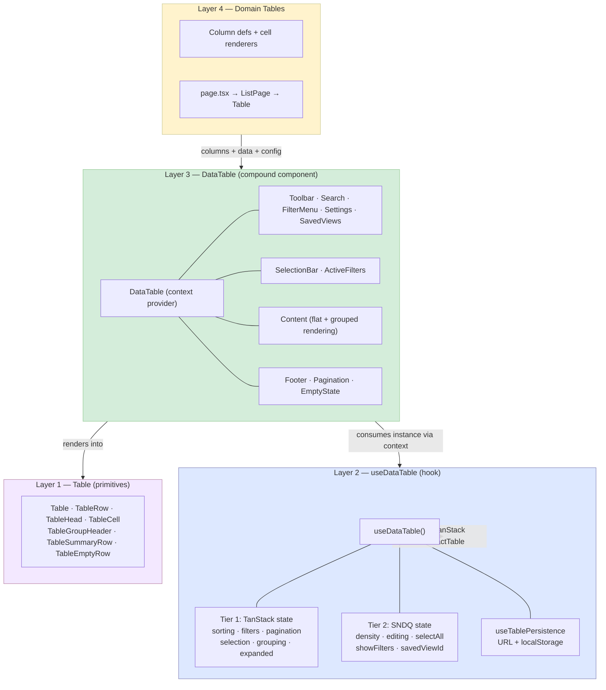

# SNDQ DataTable — Overview

Short reference for the table architecture. See [architecture.md](./architecture.md) for the full deep-dive with research findings, gap analysis, and migration plans.

---

## Architecture diagram



---

## Four-layer model

| Layer | Location | What it does |
|-------|----------|-------------|
| **L1 — Table** | `ui-v2/components/table/` | Semantic `<table>` HTML with density context, sort indicators, group headers. No data logic. |
| **L2 — useDataTable** | `ui-v2/hooks/useDataTable.ts` | TanStack Table v8 wrapper with two-tier state (TanStack + SNDQ extensions). Returns `DataTableInstance<T>`. |
| **L3 — DataTable** | `ui-v2/components/data-table/` | Compound component with 14 composable subcomponents sharing table instance via React Context. |
| **L4 — Domain** | `prototype/modules/*/` | Column definitions, cell renderers, filter configs per domain module. |

---

## Layer 1 — Table primitives

Pure presentational. No TanStack dependency.

| Component | HTML | Key props |
|-----------|------|-----------|
| `Table` | `<table>` | `density` |
| `TableRow` | `<tr>` | hover, `data-selected` |
| `TableHead` | `<th>` | `sortDirection`, `onSort` |
| `TableCell` | `<td>` | alignment, compact |
| `TableGroupHeader` | `<tr>` | `expanded`, `label`, `count`, `depth` |
| `TableSummaryRow` | `<tr>` | `depth` |
| `TableEmptyRow` | `<tr>` | `colSpan` |

---

## Layer 2 — useDataTable hook

```ts
const table = useDataTable({
  columns, data,
  enableSorting: true,
  enableFiltering: true,
  enablePagination: true,
  config: {
    pageSizeOptions: [10, 25, 50],
    persistence: { key: 'invoices', strategy: 'url+localStorage' },
  },
});
```

### Feature flags

| Flag | What it enables |
|------|----------------|
| `enableSorting` | Column sort (default: true) |
| `enableFiltering` | Column filters |
| `enableGlobalFilter` | Search across all columns |
| `enablePagination` | Page-based navigation |
| `enableSelection` | Row checkboxes + select-all |
| `enableGrouping` | Row grouping + sub-grouping |
| `enableColumnResizing` | Drag-to-resize columns |
| `enableColumnVisibility` | Show/hide columns |
| `enableColumnOrdering` | Drag-to-reorder columns |
| `enableEditing` | Inline cell editing |

### Two-tier state

- **Tier 1 (TanStack):** sorting, columnFilters, globalFilter, pagination, rowSelection, columnVisibility, columnSizing, columnOrder, grouping, expanded
- **Tier 2 (SNDQ):** density, selectAllMode, editingCell, showFilters, showColumnConfig, savedViewId

### Instance extensions

`toggleGroupSelection()`, `getSelectionCount()`, `resetAllState()`, `density`/`setDensity`, `selectAllMode`/`setSelectAllMode`, `editingCell`/`setEditingCell`

---

## Layer 3 — DataTable compound component

Root `<DataTable table={table}>` provides context. All subcomponents read the instance via `useDataTableContext()`.

### 14 subcomponents

| Subcomponent | Purpose |
|-------------|---------|
| `Toolbar` | Top bar container (hidden when rows selected) |
| `Search` | Global search input |
| `FilterMenu` | Notion-style filter property picker |
| `ActiveFilters` | Dismissible sort + filter pills |
| `SelectionBar` | Bulk action bar (replaces toolbar) |
| `Settings` | Grouping, density, page size |
| `ColumnConfig` | Column visibility + drag reorder |
| `SavedViews` | View tabs with CRUD |
| `Content` | Renders the `<Table>` (flat + grouped modes) |
| `Pagination` | Page navigation |
| `Footer` | Bottom bar with custom content |
| `EditableCell` | Inline click-to-edit popover |
| `RowContextMenu` | Right-click actions per row |
| `EmptyState` | Empty state display |

### Composition — one component, many configurations

```tsx
// Full (replaces CommonTable)        // Compact (replaces CompactTable)
<DataTable table={table}>             <DataTable table={table}>
  <DataTable.Toolbar>                   <DataTable.Content />
    <DataTable.Search />                <DataTable.Pagination />
    <DataTable.FilterMenu ... />      </DataTable>
    <DataTable.Settings ... />
  </DataTable.Toolbar>                // Embedded (replaces EnrichTable)
  <DataTable.ActiveFilters />         <DataTable table={table}>
  <DataTable.Content />                 <DataTable.Content />
  <DataTable.Footer>                    <DataTable.Footer>
    <DataTable.Pagination />              <span>{n} items</span>
  </DataTable.Footer>                   </DataTable.Footer>
</DataTable>                          </DataTable>
```

---

## Layer 4 — Domain tables

Every route follows a three-file pattern:

```
app/dashboard/.../page.tsx    → Route (imports ListPage)
modules/.../XxxListPage.tsx   → Page chrome (header + description)
modules/.../XxxTable.tsx      → Columns + useDataTable + DataTable tree
```

Column definitions use `createColumnHelper<T>()` with `meta.type` for filter/display behavior:

```ts
col.accessor('status', {
  header: 'Status',
  cell: (info) => <StatusBadge status={info.getValue()} map={STATUS_MAP} />,
  meta: { type: 'select', filterOptions: [...] },
});
```

---

## Production coverage

Advanced features are demonstrated at `/dashboard/demo/data-table`.

The architecture replaces **7 fragmented table components** with one composable system. Migration is phased: EnrichTable (20 screens) → CompactTable (31 screens) → CommonTable (35 screens). InfiniteTable (90 screens) stays separate.
