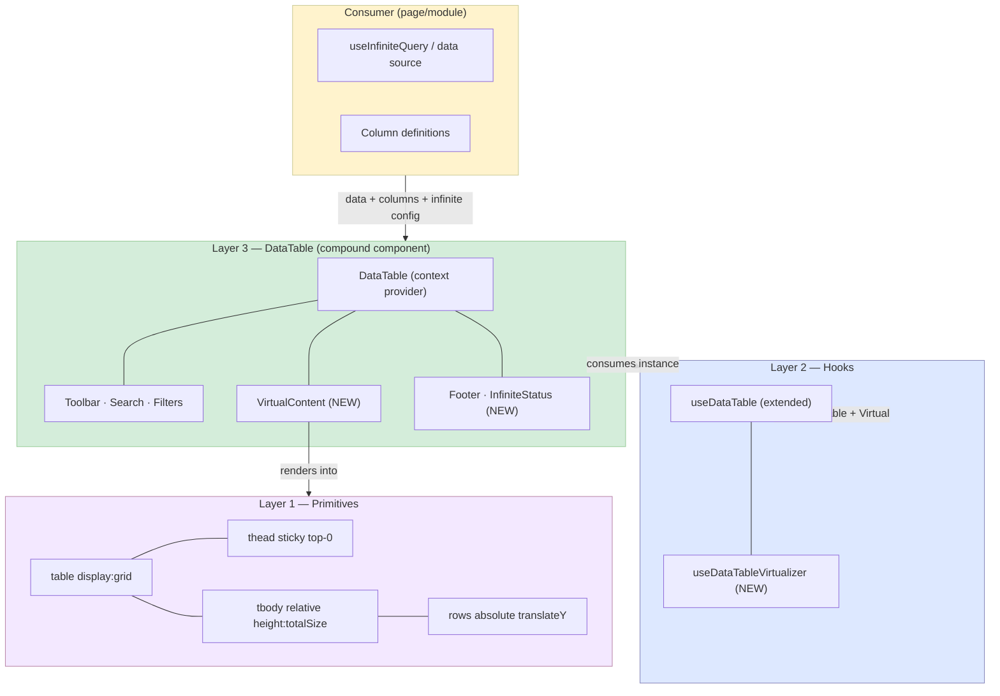

# Virtual Table — Implementation Plan

Design and implementation plan for `DataTable.VirtualContent`, the virtualized infinite-scroll sibling to `DataTable.Content`.

**Created**: 2026-06-22
**Status**: Planning complete — ready for implementation
**Architecture**: [architecture.md](./architecture.md)
**Package**: `packages/ui-v2/src/blocks/data-table/`
**Demo target**: `apps/prototype/src/modules/demo/`

---

## Table of Contents

1. [Context](#1-context)
2. [Decisions](#2-decisions)
3. [Architecture](#3-architecture)
4. [Composition Shape](#4-composition-shape)
5. [Implementation Layers](#5-implementation-layers)
6. [Shared Internals](#6-shared-internals)
7. [Performance Strategy](#7-performance-strategy)
8. [Feature Compatibility](#8-feature-compatibility)
9. [References](#9-references)
10. [Implementation Steps](#10-implementation-steps)

---

## 1. Context

### Problem

The paginated `DataTable.Content` renders all rows in the DOM. For tables with large or unbounded datasets (transactions, ledger entries, contacts), this requires either:
- Server-side pagination (current approach — extra UX friction for users)
- Full DOM rendering (performance death for 500+ rows)

### Solution

A new `DataTable.VirtualContent` component that virtualizes rows using `@tanstack/react-virtual`, supporting both:
- **Client-side virtualization**: all data loaded upfront, virtualize for render performance
- **Server-side infinite scroll**: pages appended via `useInfiniteQuery`, virtualized as loaded

### Constraints

1. No grouping feature — infinite tables are flat only
2. Uses `@tanstack/react-virtual ^3.13.4` (already in monorepo via `sndq-fe`)
3. Composition layers — sibling to `DataTable.Content`, not a mode flag

---

## 2. Decisions

| # | Question | Decision | Rationale |
|---|----------|----------|-----------|
| A | DOM strategy | Semantic `<table>` with `display: grid` | Shares primitives with `DataTable.Content`; maintains table semantics/accessibility. MRT uses this approach. |
| B | Height model | Both: fixed px via prop + flex-fill via className | Covers dashboard panels (fixed) and full-page layouts (flex) |
| C | Column virtualization | Row-only for v1 | SNDQ tables rarely exceed 15 columns. TanStack docs: "add column virtualization only when profiling shows it's needed" |
| D | Scroll container | VirtualContent owns its wrapper; exposes ref for programmatic access | Self-contained by default; consumer gets ref via `scrollRef` prop for `scrollTo`, reset, etc. |
| E | Infinite fetch trigger | Scroll-position based, 400px from bottom | MRT/Mantine standard; proven in production infinite-table.tsx |
| F | Sort/filter reset | Auto-scroll to top by default; opt-out via `resetScrollOnStateChange={false}` | Reduces consumer boilerplate. Data clearing remains consumer's job (React Query key invalidation). |
| G | Grouping | Disabled — runtime guard throws if `enableGrouping` combined with VirtualContent | Grouping adds variable-height rows, expand/collapse, sticky group headers — too complex for v1 |
| H | Editable cells | Supported via existing `EditingCellStore` | External store + row-level memo keeps performance acceptable |
| I | Column pinning | Supported via sticky CSS (same as Content) | `column.getStart('left')` / `column.getAfter('right')` + `position: sticky` |
| J | Dependency | Add `@tanstack/react-virtual` to `@sndq/ui-v2` package.json | Direct dependency, not peer |

---

## 3. Architecture

### Layer diagram



### DOM structure (VirtualContent)

```
div.scroll-container (overflow-auto, height prop or flex-1)
  table (display: grid, width: 100%)
    thead (position: sticky, top: 0, z-index: 10, display: grid)
      tr (display: grid, grid-template-columns: var(--col-sizes))
        th × N (pinned cols: position sticky, left/right)
    tbody (position: relative, height: virtualTotalSize, display: grid)
      tr × visible (position: absolute, translateY, display: grid, grid-template-columns: var(--col-sizes))
        td × N (pinned cols: position sticky, left/right)
```

### Column width sync

CSS custom properties computed from TanStack column sizes, applied to grid root:

```typescript
const columnSizeVars = useMemo(() => {
  const headers = table.getFlatHeaders();
  const sizes: Record<string, string> = {};
  for (const header of headers) {
    sizes[`--col-${header.column.id}-size`] = `${header.column.getSize()}px`;
  }
  return sizes;
}, [table.getState().columnSizing, table.getState().columnVisibility]);
```

Header and body rows use `grid-template-columns` built from these variables.

---

## 4. Composition Shape

### Consumer usage — server-side infinite scroll

```tsx
const { data, fetchNextPage, hasNextPage, isFetchingNextPage } = useInfiniteQuery({
  queryKey: ['invoices', sorting, columnFilters],
  queryFn: ({ pageParam = 0 }) => fetchInvoices({ page: pageParam, sort: sorting, filters: columnFilters }),
  getNextPageParam: (last, pages) => last.hasMore ? pages.length : undefined,
});

const flatData = useMemo(() => data?.pages.flatMap(p => p.data) ?? [], [data]);
const totalCount = data?.pages[0]?.total ?? 0;

const table = useDataTable({
  columns,
  data: flatData,
  enableSorting: true,
  enableFiltering: true,
  enableSelection: true,
  enableColumnPinning: true,
  enableVirtualization: true, // disables pagination + grouping
  config: {
    serverSide: {
      isManualSorting: true,
      isManualFiltering: true,
    },
  },
});

<DataTable table={table}>
  <DataTable.Toolbar>
    <DataTable.Search />
    <DataTable.FilterMenu />
  </DataTable.Toolbar>
  <DataTable.ActiveFilters />
  <DataTable.VirtualContent
    height={600}
    onEndReached={fetchNextPage}
    isFetchingMore={isFetchingNextPage}
    hasMore={hasNextPage}
    emptyState={<DataTable.EmptyState />}
    loading={isLoading}
    contextMenuActions={actions}
  />
  <DataTable.Footer>
    <DataTable.InfiniteStatus loaded={flatData.length} total={totalCount} />
  </DataTable.Footer>
</DataTable>
```

### Consumer usage — client-side virtualization only

```tsx
const table = useDataTable({
  columns,
  data: allRecords, // full dataset in memory
  enableSorting: true,
  enableSelection: true,
  enableVirtualization: true,
  config: { clientSide: true },
});

<DataTable table={table}>
  <DataTable.VirtualContent className="flex-1 min-h-0" />
</DataTable>
```

---

## 5. Implementation Layers

### 5.1 Hook: `useDataTableVirtualizer`

```typescript
interface UseDataTableVirtualizerOptions<TData> {
  table: DataTableInstance<TData>;
  scrollRef: React.RefObject<HTMLDivElement>;
  estimateRowHeight?: number;           // default: density-derived (compact: 36, default: 44)
  overscan?: number;                    // default: 5
  onEndReached?: () => void;
  endReachedThreshold?: number;         // default: 400 (px from bottom)
  isFetchingMore?: boolean;
  hasMore?: boolean;
}

interface UseDataTableVirtualizerReturn {
  virtualItems: VirtualItem[];
  totalSize: number;
  measureElement: (el: Element | null) => void;
  scrollToIndex: (index: number) => void;
  scrollToTop: () => void;
}
```

Responsibilities:
- Wraps `useVirtualizer` from `@tanstack/react-virtual`
- Maps `table.getRowModel().rows` as virtualization source
- Handles end-reached detection via scroll position
- Computes `scrollPaddingStart` for sticky header offset

### 5.2 Component: `DataTable.VirtualContent`

```typescript
interface DataTableVirtualContentProps<TData = any> {
  height?: number | string;
  className?: string;
  scrollRef?: React.Ref<HTMLDivElement>;
  loading?: boolean;
  emptyState?: React.ReactNode;
  contextMenuActions?: ContextMenuAction<TData>[] | ((row: Row<TData>) => ContextMenuAction<TData>[]);
  onEndReached?: () => void;
  endReachedThreshold?: number;
  isFetchingMore?: boolean;
  hasMore?: boolean;
  estimateRowHeight?: number;
  overscan?: number;
  resetScrollOnStateChange?: boolean;   // default: true
}
```

### 5.3 Component: `DataTable.InfiniteStatus`

```typescript
interface DataTableInfiniteStatusProps {
  loaded: number;
  total?: number;
  isFetching?: boolean;
}
```

Renders: "Showing 250 of 12,430" with optional loading spinner.

### 5.4 `useDataTable` extension

When `enableVirtualization: true`:
- Sets `enablePagination: false` internally
- Sets `enableGrouping: false` internally
- Does NOT call `getPaginationRowModel()` or `getGroupedRowModel()`
- DEV warning if consumer also sets `enablePagination` or `enableGrouping`

---

## 6. Shared Internals

Components shared between `DataTable.Content` and `DataTable.VirtualContent`:

| Component | Shared? | Notes |
|-----------|---------|-------|
| `FlatRow` (cell rendering, selection, editing, pinning) | Yes | Extract to shared internal module |
| `DataTableColumnHeader` (sort, resize) | Yes | Rendered in sticky header |
| `getPinnedClassName` / `getPinnedStyle` | Yes | Column pinning utilities |
| `getBodyCellStyle` / `getHeaderCellStyle` | Yes | Cell sizing |
| `SkeletonRows` | Separate variant | Virtual: renders `overscan` count of skeleton rows |
| `EditingCellStore` | Yes | Already context-based, no change needed |
| `DataTableGroupHeaderRow` | No | VirtualContent never renders groups |
| `GroupedRows` / `GroupRow` | No | Exclusive to Content |

---

## 7. Performance Strategy

### Row-level memoization

`FlatRow` already uses `React.memo` with custom comparator:

```typescript
const FlatRow = React.memo(FlatRowInner, (prev, next) => {
  if (prev.row.original !== next.row.original) return false;
  if (prev.isSelected !== next.isSelected) return false;
  if (prev.contextMenuActions !== next.contextMenuActions) return false;
  return true;
});
```

For VirtualContent, add virtual position to comparator:

```typescript
if (prev.translateY !== next.translateY) return false;
```

### Editable cells with virtualization

1. **Edit state in `EditingCellStore`** (external store via `useSyncExternalStore`) — already exists
2. **Commit on blur** — if editing row scrolls out of view, blur fires before unmount
3. **Fixed row heights by density** — avoids layout thrash during editing
4. **Granular cell memo** — only re-render cells whose edit/focus state changes

### Scroll performance

- `transform: translateY()` for GPU-composited positioning
- `will-change: transform` on virtual rows
- Row-only virtualization (no column virtualization overhead)
- `overscan: 5` default balances DOM count vs blank flash

### Sort/filter reset

When `resetScrollOnStateChange` is true (default):
- Watch `table.getState().sorting` and `table.getState().columnFilters` and `table.getState().globalFilter`
- On change: call `virtualizer.scrollToIndex(0)`
- Consumer handles data clearing via React Query key invalidation

---

## 8. Feature Compatibility

| Feature | VirtualContent | Content |
|---------|:-:|:-:|
| Flat rows | Yes | Yes |
| Grouped rows | No | Yes |
| Pagination | No | Yes |
| Column sorting | Yes | Yes |
| Column filters | Yes | Yes |
| Global search | Yes | Yes |
| Row selection | Yes | Yes |
| Select all (across server total) | Yes | Yes |
| Column pinning (sticky) | Yes | Yes |
| Column resizing | Yes | Yes |
| Column visibility | Yes | Yes |
| Column ordering | Yes | Yes |
| Editable cells | Yes | Yes |
| Context menu (right-click) | Yes | Yes |
| Row density (compact/default) | Yes | Yes |
| Loading skeleton | Yes | Yes |
| Empty state | Yes | Yes |
| Infinite scroll (server) | Yes | No |
| Client-side virtualization | Yes | No |
| Sticky header | Yes | N/A (no scroll) |
| Settings panel (group UI) | Hidden | Yes |

---

## 9. References

### Internal

- `sndq-fe/src/components/briicks/tables-lists/infinite-table.tsx` — current production infinite table (div-based, not column-aligned)
- `sndq-fe/src/modules/financial/components/chart-of-accounts/components/account-table/VirtualizedAccountTable.tsx` — production virtualized table with sticky group headers
- `tablecn/src/hooks/use-data-grid.ts` — div-grid data grid with full virtualization + editing
- `tablecn/src/components/data-grid/data-grid.tsx` — div-grid renderer with sticky header

### External

- [TanStack Table — Virtualization Guide](https://tanstack.com/table/latest/docs/guide/virtualization)
- [TanStack — Virtualized Infinite Scrolling Example](https://tanstack.com/table/latest/docs/framework/react/examples/virtualized-infinite-scrolling)
- [Material React Table — Infinite Scrolling](https://www.material-react-table.com/docs/examples/infinite-scrolling)
- [Material React Table — Row Virtualization](https://www.material-react-table.com/docs/guides/virtualization)

### Key learnings from research

| Source | Pattern | Adopted? |
|--------|---------|----------|
| tablecn | Div-based grid + CSS variables for column width | Partial — using `display: grid` on semantic `<table>` instead |
| tablecn | External store + `useSyncExternalStore` for edit state | Yes — already have `EditingCellStore` |
| tablecn | `scrollPaddingStart/End` for sticky header/footer | Yes |
| tablecn | Firefox: `top` instead of `transform` when pinning active | Deferred — will add if Firefox issues arise |
| tablecn | Ref maps (`rowMapRef`, `cellMapRef`) for focus/scroll | Deferred — simpler focus model for v1 |
| MRT | `rowVirtualizerInstanceRef` exposed to consumer | Yes — via `scrollRef` prop |
| MRT | `useEffect([sorting, filters], scrollToIndex(0))` | Yes — automated via `resetScrollOnStateChange` |
| MRT | Scroll threshold 400px for fetch trigger | Yes |
| MRT | `enableRowVirtualization` auto-enables sticky header | Yes — VirtualContent always has sticky header |
| MRT | `layoutMode: grid` for virtual rows | Yes — `display: grid` on table elements |
| Community | Row-only virtualization first, column later | Yes |
| Community | Fixed row heights preferred for predictable scroll | Yes — density-derived heights |

---

## 10. Implementation Steps

### Step 1: Package setup

- [ ] Add `@tanstack/react-virtual: ^3.13.4` to `packages/ui-v2/package.json`
- [ ] Run `pnpm install`

### Step 2: `useDataTableVirtualizer` hook

- [ ] Create `packages/ui-v2/src/blocks/data-table/hooks/useDataTableVirtualizer.ts`
- [ ] Implement virtualizer wrapper with end-reached detection
- [ ] Export from `hooks/index.ts`

### Step 3: `DataTable.VirtualContent` component

- [ ] Create `packages/ui-v2/src/blocks/data-table/DataTableVirtualContent.tsx`
- [ ] Implement scroll container with sticky header
- [ ] Implement virtual row rendering (reuse `FlatRow`)
- [ ] Implement `display: grid` + CSS variable column width sync
- [ ] Implement `resetScrollOnStateChange` behavior
- [ ] Implement loading/empty states

### Step 4: `DataTable.InfiniteStatus` component

- [ ] Create `packages/ui-v2/src/blocks/data-table/DataTableInfiniteStatus.tsx`
- [ ] "Showing X of Y" + loading indicator

### Step 5: `useDataTable` extension

- [ ] Add `enableVirtualization` option
- [ ] Guard: disable pagination/grouping when virtual
- [ ] DEV warning for conflicting options

### Step 6: Wire exports

- [ ] Add `VirtualContent` and `InfiniteStatus` to `DataTable` compound in `index.ts`
- [ ] Export types

### Step 7: Demo

- [ ] Create infinite scroll demo in `apps/prototype/src/modules/demo/` (new file if large)
- [ ] Simulated server fetch with sorting + filtering
- [ ] Selection + editable cells
- [ ] Column pinning demo

### Step 8: Verification

- [ ] Type-check passes
- [ ] Sticky header works with scroll
- [ ] Column pinning works with virtual rows
- [ ] Sort/filter change auto-scrolls to top
- [ ] Infinite scroll triggers fetch at 400px threshold
- [ ] Editable cells work (commit on blur when scrolling away)
- [ ] Selection persists across scroll
- [ ] Loading skeleton renders during initial fetch
- [ ] Empty state renders when no data

---

## Execution Log

| Step | Date | Status | Notes |
|------|------|--------|-------|
| Planning | 2026-06-22 | Done | All decisions locked |
| Step 1 | — | Pending | — |
| Step 2 | — | Pending | — |
| Step 3 | — | Pending | — |
| Step 4 | — | Pending | — |
| Step 5 | — | Pending | — |
| Step 6 | — | Pending | — |
| Step 7 | — | Pending | — |
| Step 8 | — | Pending | — |
