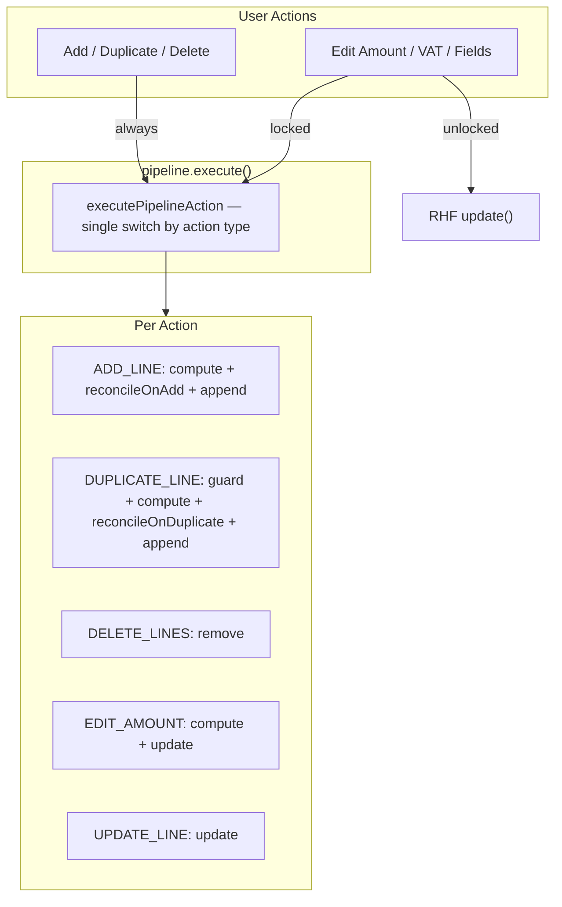

# Lock Total Amount Execution — Purchase Invoice V3

Step-by-step execution guide for the Lock Total Amount feature. Each commit should be independently verifiable and revertable.

**Created**: 2026-05-18
**Status**: In progress — Post-8 done; pipeline refactored to single switch-by-action with `executePipelineAction` pure function
**Branch**: `feature/lock-total-amount`

> **IMPORTANT**: Do NOT automatically commit after each step. Implement each commit's changes, then stop and wait for manual review and testing. Only commit after explicit approval. This allows the implementer to verify each stage before moving forward.
>
> **STATUS TRACKING**: After completing each commit's implementation, automatically update this file:
> 1. Check off the completed items in that commit's **Status** checklist
> 2. Record the date and any notes in the **Execution Log** table at the bottom
> 3. Update the top-level **Status** field (e.g., "In progress — Commit 3 done")
> This keeps the plan as the single source of truth for progress.

---

## Table of Contents

1. [Overview](#1-overview)
2. [Before You Start](#2-before-you-start)
3. [PR 1 — Core Pipeline and Pure Logic](#3-pr-1--core-pipeline-and-pure-logic)
4. [PR 2 — Wire Pipeline into Form and UI](#4-pr-2--wire-pipeline-into-form-and-ui)
5. [PR 3 — Peppol Auto-Lock and Validation](#5-pr-3--peppol-auto-lock-and-validation)
6. [Final Verification](#6-final-verification)
7. [Team Communication](#7-team-communication)
8. [What's Next](#8-whats-next)
9. [Execution Log](#execution-log)

---

## 1. Overview

**Goal**: When the user locks the total incl. VAT amount, every line-level mutation is funnelled through a single pipeline. Actions that create a line can auto-fill that created line from the remaining amount, while edit/delete mismatches stay visible for the user to fix manually and are blocked at submit.

**Structure**: 8 planned commits + post-8 follow-ups across 3 PRs.

| PR | Scope | Risk level | Commits |
|----|-------|------------|---------|
| **PR 1** | Pure logic: extract shared utility, build pipeline + reconciliation | Low | 1–3 |
| **PR 2** | Wire pipeline into form context, CRUD hooks, and footer UI | Medium | 4–6 |
| **PR 3** | Peppol/XML auto-lock, validation, footer display, cleanup | Low | 7–8 + post-8 |

**Why 3 PRs**: PR 1 is zero-UI, pure-function code that can be unit-tested in isolation. PR 2 is the integration work — riskiest because it touches existing CRUD hooks. PR 3 is additive behavior (Peppol default + validation) that doesn't change the core pipeline.

### Architecture: Action Pipeline with Reconciliation

Instead of scattering `if (isAmountLocked)` branches across every handler, all array-level mutations flow through a single `useAmountPipeline` hook. Bulk ops always go through the pipeline; single-line edits only go through it when locked.



### Reconciliation Rules Per Action

| Action | Reconciliation behavior |
|--------|------------------------|
| ADD_LINE | Created line gets remaining amount only when the remaining amount has the expected invoice sign; otherwise it gets `0` |
| EDIT_AMOUNT | No automatic redistribution; keep the user edit and let validation show/block mismatch |
| DELETE_LINES | No automatic redistribution; keep remaining lines unchanged and let validation show/block mismatch |
| DUPLICATE_LINE | Created copy keeps the source amount only when the remaining amount can fully fit the source amount; otherwise the copy gets `0` |
| UPDATE_LINE | No automatic redistribution; keep the updated line and let validation show/block mismatch |

### Created-Line Fill Algorithm

```
sumBeforeCreated = sum of lines before the created line was added
remaining = lockedTotal - sumBeforeCreated

ADD_LINE:
  normal invoice: created total = remaining > 0 ? remaining : 0
  credit note: created total = remaining < 0 ? remaining : 0

DUPLICATE_LINE:
  sourceTotal = source line totalAmount
  canFit = same sign as sourceTotal and abs(remaining) >= abs(sourceTotal)
  copied total = canFit ? sourceTotal : 0

EDIT_AMOUNT / DELETE_LINES / UPDATE_LINE:
  no auto-fill and no redistribution
```

### State Shape

```typescript
type LockState =
  | { locked: false }
  | { locked: true; lockedTotal: number };
```

### Prerequisites

- `feature/purchase-invoice-v3` branch is merged and stable
- Dev server runs without errors (`pnpm dev`)
- Existing Peppol flow works for create-from-Peppol scenario

### Known constraints

- `calculateSubtotalFromTotal` is currently a private function inside `reducer.ts` — must be extracted first
- `useLineCrud` calls `append`/`remove` individually; locked mode routes through `pipeline.execute()` which uses granular RHF methods (`append`/`remove`/`update`)
- The `useInvoiceLineDispatch` hook calls `onUpdate(index, nextState)` for single-line changes; locked mode needs a multi-line update path for amount changes
- All amounts are integers in cents.
- No proportional redistribution should run in locked mode. Only a created line is auto-filled.
- Selected unit allocations must stay valid after the created line is auto-filled: selected unit amounts must sum to the line `totalAmount` or the allocation must be cleared.

---

## 2. Before You Start

### Quality gate before each implementation commit

Use this gate for every implementation commit. If an item is intentionally skipped, record it under that commit's **Deviations from the gate** section.

- [ ] Public API / behavior is stable for this commit scope
- [ ] Public props, types, functions, or commands have minimal useful documentation where applicable
- [ ] Existing project helpers and patterns are reused instead of introducing one-off abstractions
- [ ] Tests or documented manual checks cover the main behavior and likely regressions
- [ ] No unrelated files, app-specific imports, or ownership-boundary leaks are introduced
- [ ] Security-sensitive values, credentials, generated secrets, and local env files are not committed
- [ ] Build, lint, type-check, and any targeted verification commands are known before editing
- [ ] Any skipped verification is recorded as a deviation with a follow-up owner or trigger

### Documentation and comment policy

- Keep code comments minimal and focused on intent, invariants, or non-obvious behavior.
- Put usage examples, migration notes, variant tables, setup steps, and operational runbooks in docs, not inline code comments.
- Add deprecation notices only on the public export or entry point that consumers actually use.
- If docs and code disagree, update the docs in the same commit or record the gap as a deviation.

### Inspect source tree before implementation

Before the first implementation commit, inspect the actual repository state and record any differences from this plan.

- [ ] Confirm `reducer.ts` still contains the private `calculateSubtotalFromTotal` function at line 18
- [ ] Confirm `useLineCrud.ts` has `append`, `remove`, `update`, `prepend` but not `replace`
- [ ] Confirm `useInvoiceLinesData.ts` has `replace` from `useFieldArray` (line 26)
- [ ] Confirm `InvoiceLinesTableFooter.tsx` renders totals at line 47–57
- [ ] Confirm `PurchaseInvoiceFormContext.tsx` exports `PurchaseInvoiceFormContextValue` interface
- [ ] Confirm `usePurchaseInvoiceForm.ts` receives `peppolInvoiceId` and passes it to context
- [ ] Confirm `useInvoiceFormActions.ts` has `onSubmit` and `onError` handlers
- [ ] Confirm current lint, type-check, build status

### Capture baselines

Run these from `sndq-fe/` and save the output. Diff against these after risky commits.

```bash
cd sndq-fe
pnpm tsc --noEmit 2>&1 | tee /tmp/lock-amount-tsc-before.txt
pnpm lint 2>&1 | tee /tmp/lock-amount-lint-before.txt
```

### Create branch

```bash
git checkout develop
git pull origin develop
git checkout -b feature/lock-total-amount
```

---

## 3. PR 1 — Core Pipeline and Pure Logic

Pure-function code with zero UI changes. Extracting shared math, defining types, and building the pipeline + reconciliation logic. Safe to merge independently because nothing consumes it yet.

---

### Commit 1: Extract `calculateSubtotalFromTotal` into shared utility

**What**: Move `calculateSubtotalFromTotal` out of `reducer.ts` into a shared utility so both the reducer and the new pipeline can import it without circular dependencies. The utility also owns created-line total changes via `setTotalAmountForLine`, including selected-unit adjustment through `getDistributionAdjustment`.

**Files to create**:

- `sndq-fe/src/modules/financial/forms/purchase-invoice-v3/components/invoice-lines/utils/amountCalculation.ts`

```typescript
export function calculateSubtotalFromTotal(
  totalAmount: number,
  vatRate: number,
): number {
  return Math.round((totalAmount * 10000) / (10000 + vatRate * 100));
}

/**
 * Recomputes a line's excl-VAT amount from its totalAmount and keeps selected
 * unit allocations valid for schema validation.
 */
export function setTotalAmountForLine(
  line: AmountWithDistributionData,
  totalAmount: number,
  defaultVatRate?: number,
): AmountWithDistributionData {
  const vatRate = line.vatRate ?? defaultVatRate ?? 0;
  const subtotal = line.hasVat
    ? calculateSubtotalFromTotal(totalAmount, vatRate)
    : totalAmount;
  return {
    ...line,
    amount: subtotal,
    totalAmount,
    ...getDistributionAdjustment(line, totalAmount),
  };
}
```

**Files to edit**:

- `sndq-fe/src/modules/financial/forms/purchase-invoice-v3/components/invoice-lines/reducer.ts` — remove the private `calculateSubtotalFromTotal` function (lines 18–23), import from `utils/amountCalculation`. Update `setTotalAmount` and `setVat` functions to use the imported version.

**Files to delete**: None

**Quality gate checklist**:

- [ ] Public API / behavior for this commit is stable
- [ ] Documentation or comments are updated where this commit changes behavior
- [ ] Verification covers the main behavior and likely regression
- [ ] No unrelated or secret-bearing files are included
- [ ] Rollback path is clear

**Risks**:

| Risk | Severity | What to check |
|------|----------|---------------|
| Import path breaks existing reducer usage | LOW | Type-check passes; `InvoiceLineCard` amount editing still works |
| Created-line fill creates invalid unit allocation totals | MEDIUM | Amount utility tests cover selected-unit adjustment and free/manual clearing |

**Verification**:

```bash
cd sndq-fe
pnpm tsc --noEmit
pnpm lint
```

Manual: Open a purchase invoice form, edit a line amount, confirm the excl-VAT back-calculation still works correctly.

**If it fails**:

- **"Cannot find module './utils/amountCalculation'"**: Check relative import path from `reducer.ts`
- **Amount calculation changes**: Verify VAT subtotal calculation is byte-identical to the original, and unit adjustment keeps selected unit totals equal to `totalAmount`

**Deviations from the gate**:

- `useInvoiceLinesData` references the planned `purchase_invoice.validation_error_locked_total_mismatch` key before the i18n commit adds translations. There is no user-facing runtime path yet because CRUD routing and lock UI are later commits.

**Commit message**: `refactor: extract calculateSubtotalFromTotal to shared util`

**Status**:

- [x] Quality gate checklist satisfied
- [x] Tests green or deviation documented
- [x] Build / lint / type-check green or deviation documented
- [ ] Manual verification complete, if applicable
- [ ] Committed

---

### Commit 2: Define pipeline types and pure reconciliation functions

**What**: Create the `PipelineAction` type, `LockState` type, and pure reconciliation helpers for locked-mode post-processing. The helpers must only auto-fill newly created lines; they must not redistribute existing lines.

**Files to create**:

- `sndq-fe/src/modules/financial/forms/purchase-invoice-v3/components/invoice-lines/pipeline/types.ts`

```typescript
import type { AmountWithDistributionData } from '../../../../purchase-invoice-v2/schema';

export type LockState =
  | { locked: false }
  | { locked: true; lockedTotal: number };

export type PipelineAction =
  | { type: 'ADD_LINE'; defaults: AmountWithDistributionData }
  | { type: 'DELETE_LINES'; indices: number[] }
  | { type: 'DUPLICATE_LINE'; index: number }
  | { type: 'EDIT_AMOUNT'; index: number; totalAmount: number }
  | { type: 'UPDATE_LINE'; index: number; data: AmountWithDistributionData };
```

- `sndq-fe/src/modules/financial/forms/purchase-invoice-v3/components/invoice-lines/pipeline/reconcile.ts`

Exports two pure reconciliation functions directly (no dispatcher):
  - `reconcileOnAdd` — sets the created line to the valid remaining amount, or `0` when the remaining amount has the wrong sign
  - `reconcileOnDuplicate` — sets the created copy to the source amount only when the remaining amount can fully fit the source amount, otherwise `0`
  - `EDIT_AMOUNT`, `DELETE_LINES`, and `UPDATE_LINE` — no reconciliation needed; mismatches are blocked at submit

- `sndq-fe/src/modules/financial/forms/purchase-invoice-v3/components/invoice-lines/pipeline/assertTotalMatch.ts`

```typescript
export function assertTotalMatch(
  lines: AmountWithDistributionData[],
  lockedTotal: number,
): { matched: boolean; diff: number } {
  const sum = lines.reduce((s, l) => s + l.totalAmount, 0);
  return { matched: sum === lockedTotal, diff: sum - lockedTotal };
}
```

**Files to edit**:

- `sndq-fe/src/modules/financial/forms/purchase-invoice-v3/components/invoice-lines/pipeline/reconcile.ts`
  - Remove proportional edit/delete redistribution from locked mode.
  - Replace smart duplicate redistribution with created-copy fill logic.
  - Keep `setTotalAmountForLine()` only for the created line that is auto-filled.

- `sndq-fe/src/modules/financial/forms/purchase-invoice-v3/components/invoice-lines/pipeline/__tests__/reconcile.test.ts`
  - Replace smart redistribution tests with created-line fill, duplicate fit/no-fit, credit-note, and no-op edit/delete tests.

**Files to delete**: None

**Quality gate checklist**:

- [ ] Public API / behavior for this commit is stable
- [ ] Documentation or comments are updated where this commit changes behavior
- [ ] Verification covers the main behavior and likely regression
- [ ] No unrelated or secret-bearing files are included
- [ ] Rollback path is clear

**Risks**:

| Risk | Severity | What to check |
|------|----------|---------------|
| Created line gets wrong sign | MEDIUM | Test normal invoices and credit notes separately |
| Duplicate copy overfills locked total | MEDIUM | Test fit and no-fit duplicate cases |
| Edit/delete unexpectedly mutates existing lines | MEDIUM | Tests should assert existing line amounts are preserved |

**Verification**:

```bash
cd sndq-fe
pnpm tsc --noEmit
```

Additionally, write a test file to verify created-line fill behavior:

```bash
pnpm test src/modules/financial/forms/purchase-invoice-v3/components/invoice-lines/pipeline/reconcile.test.ts
```

Test cases to cover:
1. `ADD_LINE`: normal invoice total=1000, existing=[600,300] -> created line gets 100
2. `ADD_LINE`: normal invoice total=1000, existing=[600,400] -> created line gets 0
3. `ADD_LINE`: normal invoice total=1000, existing=[1200] -> created line gets 0
4. `ADD_LINE`: credit note total=-1000, existing=[-600,-300] -> created line gets -100
5. `ADD_LINE`: credit note total=-1000, existing=[-600,-400] -> created line gets 0
6. `DUPLICATE_LINE`: total=1000, existing=[400], duplicate 400 -> copied line gets 400
7. `DUPLICATE_LINE`: total=1000, existing=[700], duplicate 700 -> copied line gets 0
8. `DUPLICATE_LINE`: total=1000, existing=[600,400], duplicate 400 -> copied line gets 0
9. `DUPLICATE_LINE`: credit note total=-1000, existing=[-400], duplicate -400 -> copied line gets -400
10. `DUPLICATE_LINE`: credit note total=-1000, existing=[-600,-400], duplicate -400 -> copied line gets 0
11. `EDIT_AMOUNT`: changed amount is kept, existing lines are not redistributed, mismatch is reported
12. `DELETE_LINES`: remaining lines are kept as-is, mismatch is reported
13. Created-line VAT and selected-unit invariants: `setTotalAmountForLine` still back-calculates VAT and keeps unit totals valid for the created line only

**If it fails**:

- **Created line stays 0 unexpectedly**: Check whether the remaining amount has the expected invoice sign and can fit the duplicated source amount.
- **Existing line changed unexpectedly**: Remove proportional redistribution from edit/delete/duplicate handling.

**Deviations from the gate**: None

**Commit message**: `feat: add pipeline types and reconciliation logic`

**Status**:

- [x] Quality gate checklist satisfied
- [x] Tests green or deviation documented
- [x] Build / lint / type-check green or deviation documented
- [ ] Manual verification complete, if applicable
- [ ] Committed

---

### Commit 3: Create `useAmountPipeline` hook and vendor `useStableCallback`

**What**: The React hook that wraps `executePipelineAction` (a pure function containing a single switch-by-action-type). Accepts `liveAmounts`, granular RHF methods (`append`/`remove`/`update`), and `lockState`. The hook is a thin wrapper — all logic lives in `executePipelineAction`.

Uses a vendored `useStableCallback` hook (based on [Base UI's implementation](https://github.com/mui/base-ui/blob/master/packages/utils/src/useStableCallback.ts)) to stabilize the `execute` function identity without manual refs or `useCallback`. This eliminates the 3-ref + `useCallback` boilerplate and reads directly from closure values. The hook will be replaced by React's `useEffectEvent` when it graduates from experimental.

**Files to create**:

- `sndq-fe/src/hooks/lib/useStableCallback.ts` — Vendored from Base UI, adapted for React 19.2+ (uses `useInsertionEffect` natively). Stabilizes a callback so it's always the same reference between renders while always calling the latest closure. Includes a render-time safety guard that throws in development if called during render.

- `sndq-fe/src/hooks/lib/useRefWithInit.ts` — Vendored from Base UI. A `useRef` variant that accepts a lazy initializer function (avoids re-creating the init value on every render).

- `sndq-fe/src/common/utils/lib/safeReact.ts` — Vendored from Base UI. A spread-clone of the React namespace for safely reading APIs that may be missing in older versions (prevents bundler import rewriting issues).

- `sndq-fe/src/modules/financial/forms/purchase-invoice-v3/components/invoice-lines/pipeline/executePipelineAction.ts`

Pure function containing the single switch-by-action-type. Each case handles compute, reconcile (if locked), and commit inline. Tested directly without React dependencies.

- `sndq-fe/src/modules/financial/forms/purchase-invoice-v3/components/invoice-lines/pipeline/useAmountPipeline.ts`

Thin React wrapper that delegates to `executePipelineAction` via `useStableCallback`:

```typescript
interface UseAmountPipelineParams {
  liveAmounts: AmountWithDistributionData[];
  append: (value: AmountWithDistributionData) => void;
  remove: (index: number | number[]) => void;
  update: (index: number, value: AmountWithDistributionData) => void;
  lockState: LockState;
}

export interface AmountPipeline {
  execute: (action: PipelineAction) => void;
}
```

No manual refs needed — `useStableCallback` handles the stale-closure problem via `useInsertionEffect`.

- `sndq-fe/src/modules/financial/forms/purchase-invoice-v3/components/invoice-lines/pipeline/index.ts`

Barrel export for all pipeline modules.

**Files to edit**: None

**Files to delete**: None

**Quality gate checklist**:

- [ ] Public API / behavior for this commit is stable
- [ ] Documentation or comments are updated where this commit changes behavior
- [ ] Verification covers the main behavior and likely regression
- [ ] No unrelated or secret-bearing files are included
- [ ] Rollback path is clear

**Risks**:

| Risk | Severity | What to check |
|------|----------|---------------|
| `useStableCallback` called during render | LOW | Runtime guard (`assertNotCalled`) throws in dev; `execute` is only called from event handlers |
| Future migration to `useEffectEvent` | LOW | JSDoc on `useStableCallback` documents the migration path; `useEffectEvent` has a stricter contract (no prop/context passing) |

**Verification**:

```bash
cd sndq-fe
pnpm tsc --noEmit
pnpm lint
pnpm test src/modules/financial/forms/purchase-invoice-v3/components/invoice-lines/
```

**If it fails**:

- **Cannot call event handler during rendering**: The `execute` function was called during render. Move the call into an event handler or effect.
- **Import path issues**: Verify `@/hooks/lib/useStableCallback` resolves correctly via the `@/` path alias.

**Deviations from the gate**:

- **Vendored Base UI utilities** — introduced `useStableCallback`, `useRefWithInit`, and `safeReact` as vendored code in `src/hooks/lib/` and `src/common/utils/lib/`. These are library-grade utilities that replace the manual ref pattern used in 25+ files across the codebase. Marked for replacement by `useEffectEvent` when stable.

**Commit message**: `feat: add useAmountPipeline hook with vendored useStableCallback`

**Status**:

- [x] Quality gate checklist satisfied
- [x] Tests green or deviation documented
- [x] Build / lint / type-check green or deviation documented
- [ ] Manual verification complete, if applicable
- [ ] Committed

---

### PR 1 Checkpoint

Push PR 1 and wait for CI or the relevant automated checks to pass before continuing.

```bash
git push -u origin feature/lock-total-amount
# Create PR targeting develop
# Wait for CI to complete successfully
```

**This validates**: Pure logic compiles, lint passes, unit tests for reconciliation math pass.

**Manual checkpoint**:

- [ ] PR description matches the commit scope
- [ ] CI passes or failures are explained
- [ ] No existing behavior changed — pipeline is not wired yet
- [ ] Rollback: revert the 3 commits; no runtime impact

**Status**:

- [ ] PR created
- [ ] CI passes
- [ ] Reviewed
- [ ] Merged or approved to continue

---

## 4. PR 2 — Wire Pipeline into Form and UI

Integration work — connects the pipeline to the existing form context, replaces direct field-array calls in CRUD hooks, adds the lock toggle UI in the footer. This is the riskiest PR because it changes how all line mutations work.

---

### Commit 4: Add lock state to context and instantiate pipeline

**What**: Add `lockState` and `toggleAmountLock` to `PurchaseInvoiceFormContext`. Instantiate `useAmountPipeline` in `useInvoiceLinesData` and expose it alongside existing returns.

**Files to edit**:

- `sndq-fe/src/modules/financial/forms/purchase-invoice-v3/contexts/PurchaseInvoiceFormContext.tsx` — add to `PurchaseInvoiceFormContextValue`:

```typescript
lockState: LockState;
toggleAmountLock: () => void;
```

- `sndq-fe/src/modules/financial/forms/purchase-invoice-v3/PurchaseInvoiceFormV3.tsx` — add `useState` for lock state, compute `lockedTotal` from current totals when toggling, pass into context provider.

- `sndq-fe/src/modules/financial/forms/purchase-invoice-v3/components/invoice-lines/hooks/useInvoiceLinesData.ts` — instantiate `useAmountPipeline` with `liveAmounts`, `replace` (already available from `useFieldArray`), `lockState` (from context), and a `onMismatch` callback that calls `toast.error`. Expose `pipeline` in return value.

**Files to create**: None

**Files to delete**: None

**Quality gate checklist**:

- [ ] Public API / behavior for this commit is stable
- [ ] Documentation or comments are updated where this commit changes behavior
- [ ] Verification covers the main behavior and likely regression
- [ ] No unrelated or secret-bearing files are included
- [ ] Rollback path is clear

**Risks**:

| Risk | Severity | What to check |
|------|----------|---------------|
| Context type change breaks existing consumers | MEDIUM | All usages of `usePurchaseInvoiceFormContext()` must handle new fields |
| Lock state initial value must not interfere with unlocked flow | LOW | Default is `{ locked: false }` — pipeline is passthrough |

**Verification**:

```bash
cd sndq-fe
pnpm tsc --noEmit
pnpm lint
```

Manual: Open purchase invoice form. Confirm everything still works normally (lock is not toggled yet, pipeline is in passthrough mode).

**If it fails**:

- **"Property 'lockState' is missing in type..."**: Add the new properties to the context provider value in `PurchaseInvoiceFormV3.tsx`

**Deviations from the gate**: None

**Commit message**: `feat: add lock state to context and instantiate pipeline`

**Status**:

- [x] Quality gate checklist satisfied
- [x] Tests green or deviation documented
- [x] Build / lint / type-check green or deviation documented
- [ ] Manual verification complete, if applicable
- [ ] Committed

---

### Commit 5: Route CRUD operations through pipeline

**What**: Replace direct `append`/`remove`/`update` calls in `useLineCrud` with `pipeline.execute()` calls. Route amount edits from `useInvoiceLineDispatch` through the pipeline when totalAmount changes.

**Files to edit**:

- `sndq-fe/src/modules/financial/forms/purchase-invoice-v3/components/invoice-lines/hooks/useLineCrud.ts`
  - Add `pipeline` to params (from `useAmountPipeline`)
  - `handleAdd` -> `pipeline.execute({ type: 'ADD_LINE', defaults: createDefaultLine(...) })`
  - `handleDuplicate` -> `pipeline.execute({ type: 'DUPLICATE_LINE', index })`
  - `handleConfirmDelete` (single) -> `pipeline.execute({ type: 'DELETE_LINES', indices: [idx] })`
  - `handleConfirmDelete` (bulk) -> `pipeline.execute({ type: 'DELETE_LINES', indices: [...] })`
  - Remove direct `append`, `remove` calls from the hook params (they are no longer needed — pipeline uses `replace`)
  - Keep `update` for non-pipeline operations (distribution sheet submit)

- `sndq-fe/src/modules/financial/forms/purchase-invoice-v3/components/invoice-lines/hooks/useInvoiceLineDispatch.ts`
  - Add `pipeline` and `lockState` to params
  - In the dispatch callback: after computing `nextState` via `applyInvoiceLineAction`, check if `totalAmount` changed and `lockState.locked`:
    - If yes: `pipeline.execute({ type: 'EDIT_AMOUNT', index, totalAmount: nextState.totalAmount })`
    - If `totalAmount` unchanged but other fields changed: `pipeline.execute({ type: 'UPDATE_LINE', index, data: nextState })`
    - If not locked: `onUpdate(index, nextState)` (existing behavior, untouched)
  - This is the key integration point — single-line edits that change the total (e.g., VAT rate change) are automatically routed through the pipeline

- `sndq-fe/src/modules/financial/forms/purchase-invoice-v3/components/invoice-lines/hooks/useInvoiceLinesData.ts` — pass `pipeline` to `useLineCrud` and `useInvoiceLineDispatch` consumers (via the returned `update` callback or directly)

- `sndq-fe/src/modules/financial/forms/purchase-invoice-v3/components/invoice-lines/hooks/useInvoiceLineHandlers.ts` — pass `pipeline` and `lockState` through to `useInvoiceLineDispatch`

**Files to create**: None

**Files to delete**: None

**Quality gate checklist**:

- [ ] Public API / behavior for this commit is stable
- [ ] Documentation or comments are updated where this commit changes behavior
- [ ] Verification covers the main behavior and likely regression
- [ ] No unrelated or secret-bearing files are included
- [ ] Rollback path is clear

**Risks**:

| Risk | Severity | What to check |
|------|----------|---------------|
| Unlocked mode regression — pipeline passthrough must be identical to old behavior | HIGH | Full manual test of unlocked add/edit/delete/duplicate |
| All actions use granular RHF methods | LOW | `append`/`remove`/`update` preserve field IDs; no `replace()` is used anywhere in the pipeline |
| Distribution sheet submit bypasses pipeline | LOW | `handleDistributionSubmit` still uses direct `update()` — acceptable since it updates a single line's distribution, not amount |

**Verification**:

```bash
cd sndq-fe
pnpm tsc --noEmit
pnpm lint
```

Manual (critical — test with lock OFF):
1. Add a line -> line appears with default values
2. Edit a line's total amount -> excl-VAT recalculates correctly
3. Change VAT rate -> total stays, excl-VAT recalculates
4. Duplicate a line -> copy appears with same values
5. Delete a line -> line is removed
6. Bulk delete -> selected lines removed
7. Open distribution sheet -> submit distribution -> line updates correctly

All must behave identically to pre-pipeline behavior.

**If it fails**:

- **Lines disappear or reset on edit**: Verify `commitToForm` routes to the correct granular RHF method (`append`/`remove`/`update`) for each action type.
- **Stale data after rapid edits**: `useStableCallback` reads from closure; verify `liveAmounts` is always fresh when `execute` fires.
- **Distribution sheet broken**: Confirm `handleDistributionSubmit` still uses direct `update()`, not the pipeline.

**Deviations from the gate**:

- **Distribution sheet submit is not routed through pipeline** — acceptable because it updates distribution fields (units), not the totalAmount. If in locked mode the totalAmount changes via custom distribution, this should be handled in a follow-up.
- **Steward form updated** — `useStewardInvoiceLinesData` was updated to use `useAmountPipeline` in unlocked passthrough mode (`lockState: { locked: false }`) to satisfy the updated `useLineCrud` interface that now requires `pipeline` instead of `append`/`remove`/`prepend`. This was not in the original plan but is necessary because the steward form imports `useLineCrud` from the V3 module.

**Commit message**: `feat: route CRUD operations through amount pipeline`

**Status**:

- [x] Quality gate checklist satisfied
- [x] Tests green or deviation documented
- [x] Build / lint / type-check green or deviation documented
- [ ] Manual verification complete, if applicable
- [ ] Committed

---

### Commit 6: Add lock toggle UI to footer

**What**: Add a lock/unlock icon button next to the total amount in `InvoiceLinesTableFooter`. Wire it to `toggleAmountLock` from context.

**Files to edit**:

- `sndq-fe/src/modules/financial/forms/purchase-invoice-v3/components/invoice-lines/InvoiceLinesTableFooter.tsx`
  - Add props: `isLocked: boolean`, `onToggleLock: () => void`
  - Import `Lock` and `LockOpen` from `lucide-react`
  - Add a button to the right of the total amount display:

```tsx
<div className="mt-1 flex items-center justify-between gap-8 border-t pt-2">
  <Paragraph className="font-base text-[16px]">
    {t('financial.invoice_total_short')}:
  </Paragraph>
  <div className="flex items-center gap-2">
    <Paragraph
      variant="mono"
      className={`text-[20px] ${isCreditNote ? 'text-warning-700' : ''}`}
    >
      {formatAmount(totals.totalInclVat, isCreditNote)}
    </Paragraph>
    <button
      type="button"
      onClick={onToggleLock}
      className="rounded p-1 text-neutral-400 transition-colors hover:bg-neutral-100 hover:text-neutral-600"
      title={t(isLocked ? 'purchase_invoice.unlock_total_amount' : 'purchase_invoice.lock_total_amount')}
    >
      {isLocked ? <Lock size={16} /> : <LockOpen size={16} />}
    </button>
  </div>
</div>
```

- `sndq-fe/src/modules/financial/forms/purchase-invoice-v3/components/invoice-lines/InvoiceLinesTableV3.tsx` — pass `isLocked` and `onToggleLock` to `InvoiceLinesTableFooter` from the context/pipeline data.

**Files to create**: None

**Files to delete**: None

**Quality gate checklist**:

- [ ] Public API / behavior for this commit is stable
- [ ] Documentation or comments are updated where this commit changes behavior
- [ ] Verification covers the main behavior and likely regression
- [ ] No unrelated or secret-bearing files are included
- [ ] Rollback path is clear

**Risks**:

| Risk | Severity | What to check |
|------|----------|---------------|
| Lock icon misaligned on small screens | LOW | Visual check at various widths |
| Toggle fires form submit | LOW | Button must have `type="button"` |

**Verification**:

```bash
cd sndq-fe
pnpm tsc --noEmit
pnpm lint
```

Manual (critical — test locked mode end-to-end):
1. Create invoice with 2 lines: line1=600, line2=400 (total=1000)
2. Click lock icon -> icon changes to locked state
3. Add new line -> line3 should auto-fill with 0 (remainder is 0)
4. Edit line3 to 200 -> no other line changes; mismatch toast appears because the total is now 1200
5. Delete line3 -> remaining lines stay as-is; mismatch toast appears if the total no longer equals 1000
6. Duplicate line2 when no remaining amount is available -> copied line total is 0
7. Click unlock icon -> icon changes to unlocked state
8. Edit line1 -> no redistribution, normal behavior restored

**If it fails**:

- **Lock icon doesn't toggle**: Check that `toggleAmountLock` is correctly wired from context through `InvoiceLinesTableV3` to `InvoiceLinesTableFooter`
- **Redistribution not happening**: Check that `lockState.locked` is `true` when the pipeline's `execute` runs; add a `console.log` in the reconcile function

**Deviations from the gate**:

- **Props made optional** — `isLocked` and `onToggleLock` are optional on `InvoiceLinesTableFooterProps` so the steward form (`InvoiceLinesTableV3Steward`) can use the footer without knowing about locking. The lock button only renders when `onToggleLock` is provided.

**Commit message**: `feat: add lock toggle UI to invoice lines footer`

**Status**:

- [x] Quality gate checklist satisfied
- [x] Tests green or deviation documented
- [x] Build / lint / type-check green or deviation documented
- [ ] Manual verification complete, if applicable
- [ ] Committed

---

### PR 2 Checkpoint

Push PR 2 and wait for CI or the relevant automated checks to pass before continuing.

```bash
git push -u origin feature/lock-total-amount
# Update PR or create new PR targeting develop
# Wait for CI to complete successfully
```

**This validates**: Full pipeline integration works. Unlocked mode is regression-free. Locked mode only auto-fills created lines and leaves edit/delete mismatches for manual correction.

**Manual checkpoint**:

- [ ] PR description matches the commit scope
- [ ] CI passes or failures are explained
- [ ] Unlocked mode regression test passes (commit 5 manual checks)
- [ ] Locked mode end-to-end test passes (commit 6 manual checks)
- [ ] Rollback: revert commits 4–6; form reverts to pre-pipeline direct field-array calls

**Status**:

- [ ] PR created
- [ ] CI passes
- [ ] Reviewed
- [ ] Merged or approved to continue

---

## 5. PR 3 — Peppol Auto-Lock and Validation

Additive behavior — auto-enables lock for Peppol invoices and adds submit-time validation as a safety net.

---

### Commit 7: Auto-enable lock for Peppol invoices

**What**: When `peppolInvoiceId` is set and form data is populated from Peppol, automatically enable locked mode with the computed total. User can still unlock manually.

**Files to edit**:

- `sndq-fe/src/modules/financial/forms/purchase-invoice-v3/types.ts`
  - Added `PurchaseInvoiceFormConfig` interface with `initialLockState?: LockState`
  - Added `config?: PurchaseInvoiceFormConfig` to `PurchaseInvoiceFormV3Props`

- `sndq-fe/src/modules/financial/forms/purchase-invoice-v3/PurchaseInvoiceFormV3.tsx`
  - Destructured `config` from props
  - Initialized `lockState` via `useState(config?.initialLockState ?? { locked: false })`
  - Removed `onPeppolPrefillComplete` callback (Path B eliminated)

- `sndq-fe/src/modules/peppol/components/PeppolInvoiceSheetRoute.tsx`
  - Added `formConfig` state, computed `lockedTotal` from `initialData.amounts` in `onCreatePurchaseInvoice`
  - Passed `config={formConfig}` to `PurchaseInvoiceFormFactory`

- `sndq-fe/src/modules/financial/forms/purchase-invoice-v2/hooks/usePeppolPrefill.ts`
  - Removed debug `console.log` statements
  - Removed `onPrefillComplete` param, `useStableCallback` import, and lock computation from `.then()` chain
  - Cleaned up `useEffect` deps (`getValues` and `stableOnPrefillComplete` removed)

- `sndq-fe/src/modules/financial/forms/purchase-invoice-v3/hooks/usePurchaseInvoiceForm.ts`
  - Removed `onPeppolPrefillComplete` from params and its threading to `usePeppolPrefill`

**Files to create**: None

**Files to delete**: None

**Quality gate checklist**:

- [ ] Public API / behavior for this commit is stable
- [ ] Documentation or comments are updated where this commit changes behavior
- [ ] Verification covers the main behavior and likely regression
- [ ] No unrelated or secret-bearing files are included
- [ ] Rollback path is clear

**Risks**:

| Risk | Severity | What to check |
|------|----------|---------------|
| Auto-lock triggers before Peppol lines are populated | MEDIUM | Lock total would be 0, causing created-line fill and validation to behave incorrectly |
| Auto-lock re-triggers on re-render | LOW | Use a ref guard to fire only once |
| Editing existing Peppol invoice should NOT auto-lock | MEDIUM | Only auto-lock on create-from-Peppol (no invoiceId), not edit |

**Verification**:

```bash
cd sndq-fe
pnpm tsc --noEmit
pnpm lint
```

Manual:
1. Navigate to create invoice from Peppol XML -> form populates -> lock icon should be in locked state
2. Check that the locked total matches the sum of Peppol-parsed lines
3. Add a new line -> gets remainder amount
4. Click unlock -> icon changes, normal edit behavior
5. Open an existing invoice that was created from Peppol -> lock should NOT be auto-enabled (it was already saved)

**If it fails**:

- **Lock total is 0**: The `useEffect` fires before Peppol lines are set. Add a guard: only auto-lock when `amounts.length > 0` and `peppolInvoiceId` is set.
- **Lock re-triggers after user unlocks**: The ref guard (`hasAutoLocked.current`) must be set to `true` on the first auto-lock and never reset.

**Deviations from the gate**:

- **Prop-only approach instead of `useEffect` + ref guard** — the original plan called for a `useEffect` in `PurchaseInvoiceFormV3.tsx`. The actual implementation uses a single prop-driven mechanism:
  - `PeppolInvoiceSheetRoute` computes `lockedTotal` from `initialData.amounts` and passes it via `config.initialLockState` prop through `PurchaseInvoiceFormFactory` to `PurchaseInvoiceFormV3`, which uses it in `useState` initialization. Fully deterministic, no effects.
  - The URL navigation path (Path B) callback chain was removed entirely since the only way to convert a Peppol invoice is through the Sheet "Edit" button.
- **`config` prop added to `PurchaseInvoiceFormV3Props`** — a `PurchaseInvoiceFormConfig` interface was introduced in `types.ts` with `initialLockState?: LockState`. This provides a clean extension point for future form-level configuration.
- **Callback chain removed from `usePeppolPrefill`** — `onPrefillComplete`, `useStableCallback` import, and the lock computation `.then()` block were all removed. The `useEffect` in `usePeppolPrefill` now only handles data prefilling without any lock-related side effects.

**Commit message**: `feat: auto-enable lock for Peppol invoices`

**Status**:

- [x] Quality gate checklist satisfied
- [x] Tests green or deviation documented
- [x] Build / lint / type-check green or deviation documented
- [ ] Manual verification complete, if applicable
- [ ] Committed

---

### Commit 8: Add submit-time validation and translation keys

**What**: Add a safety-net validation in `onSubmit` that prevents submission when locked total mismatches. Add the required translation keys.

**Files to edit**:

- `sndq-fe/src/modules/financial/forms/purchase-invoice-v2/hooks/useInvoiceFormActions.ts`
  - Add `lockState: LockState` to `UseInvoiceFormActionsParams` interface
  - In `onSubmit`, before the API call, add:

```typescript
if (lockState.locked) {
  const currentSum = data.amounts.reduce((s, a) => s + a.totalAmount, 0);
  if (currentSum !== lockState.lockedTotal) {
    toast.error(t('purchase_invoice.validation_error_locked_total_mismatch'));
    return;
  }
}
```

  - In `onError`, add a block after the existing amounts checks:

```typescript
if (lockState.locked) {
  const currentAmounts = methods.getValues('amounts');
  const currentSum = currentAmounts.reduce((s: number, a: { totalAmount: number }) => s + a.totalAmount, 0);
  if (currentSum !== lockState.lockedTotal) {
    toast.error(t('purchase_invoice.validation_error_locked_total_mismatch'));
    return;
  }
}
```

- `sndq-fe/src/modules/financial/forms/purchase-invoice-v3/hooks/usePurchaseInvoiceForm.ts` — pass `lockState` to `useInvoiceFormActions`

- `sndq-fe/messages/en/purchase_invoice.json` — add keys:

```json
"lock_total_amount": "Lock total amount",
"unlock_total_amount": "Unlock total amount",
"validation_error_locked_total_mismatch": "The total of all lines does not match the locked total amount. Please adjust line amounts."
```

- `sndq-fe/messages/nl/purchase_invoice.json` — add equivalent Dutch translations (request from language expert or use placeholder)
- `sndq-fe/messages/fr/purchase_invoice.json` — add equivalent French translations
- `sndq-fe/messages/de/purchase_invoice.json` — add equivalent German translations

**Files to create**: None

**Files to delete**: None

**Quality gate checklist**:

- [ ] Public API / behavior for this commit is stable
- [ ] Documentation or comments are updated where this commit changes behavior
- [ ] Verification covers the main behavior and likely regression
- [ ] No unrelated or secret-bearing files are included
- [ ] Rollback path is clear

**Risks**:

| Risk | Severity | What to check |
|------|----------|---------------|
| Submit blocked when not locked | LOW | Guard is `if (lockState.locked)` — no-op when unlocked |
| Missing translation keys crash the UI | LOW | next-intl falls back to key name; won't crash |

**Verification**:

```bash
cd sndq-fe
pnpm tsc --noEmit
pnpm lint
```

Manual:
1. Lock total at 1000, add a line with positive remaining amount -> total remains 1000, click Submit -> form submits successfully
2. Edit/delete to force a mismatch state during testing, click Submit -> toast error appears, form does NOT submit
3. Unlock, click Submit -> form submits normally (no locked validation)
4. Check all 4 languages show the translation (switch locale in app settings)

**If it fails**:

- **Form submits despite mismatch**: Check that `onSubmit` has an early `return` after the toast, not just the toast call
- **Translation key not found**: Verify the JSON key path matches `purchase_invoice.validation_error_locked_total_mismatch`

**Deviations from the gate**:

- **Translation keys already existed** — all keys (`lock_total_amount`, `unlock_total_amount`, `validation_error_locked_total_mismatch`) were already present in all 4 languages (EN, NL, FR, DE). No translation file edits needed.
- **`lockState` is optional** — `lockState?: LockState` in `UseInvoiceFormActionsParams` to maintain backward compatibility, checked via `lockState?.locked`.
- **`lockState` threaded via `usePurchaseInvoiceForm`** — added `lockState: LockState` to `UsePurchaseInvoiceFormOptions`, passed from `PurchaseInvoiceFormV3.tsx` where it already existed.

**Commit message**: `feat: add submit validation for locked total`

**Status**:

- [x] Quality gate checklist satisfied
- [x] Tests green or deviation documented
- [x] Build / lint / type-check green or deviation documented
- [ ] Manual verification complete, if applicable
- [ ] Committed

---

### Post-8a: Remove real-time mismatch toast

**What**: Remove the per-action mismatch toast so submit-time validation is the sole mismatch notification.

**Files edited**:

- `pipeline/useAmountPipeline.ts` — removed `onMismatch` from `UseAmountPipelineParams` and the `assertTotalMatch` call in `applyReconciliation`
- `hooks/useInvoiceLinesData.ts` — removed `handleAmountMismatch` callback and `onMismatch` prop from `useAmountPipeline` call; removed unused `useTranslations` and `toast` imports

**Status**:

- [x] Build / lint / type-check green
- [ ] Committed

---

### Post-8b: Footer displays locked total

**What**: When locked, the footer shows the frozen `lockedTotal` instead of the live sum of line items.

**Files edited**:

- `InvoiceLinesTableFooter.tsx` — added `lockedTotal?: number` prop; pre-computed `displayTotal` variable selects `lockedTotal` when locked, live total otherwise
- `InvoiceLinesTableV3.tsx` — passes `lockedTotal={lockState.locked ? lockState.lockedTotal : undefined}` to footer

**Status**:

- [x] Build / lint / type-check green
- [ ] Committed

---

### Post-8c: XML upload auto-lock

**What**: Auto-lock the total when an XML file is uploaded and parsed, using the same mechanism as Peppol Sheet "Edit" but triggered from `safePeppolDataParsed`.

**Files edited**:

- `usePeppolPrefill.ts` — changed `handlePeppolDataParsed` return type from `Promise<void>` to `Promise<AmountWithDistributionData[]>`; returns `(transformedData.amounts ?? [])` at the end, `[]` for early `!peppolData` bail-out
- `PurchaseInvoiceFormContext.tsx` — added `setLockState: Dispatch<SetStateAction<LockState>>` to `PurchaseInvoiceFormContextValue`
- `PurchaseInvoiceFormV3.tsx` — passed `setLockState` into context provider; updated `safePeppolDataParsed` in `InvoiceRightPanelConnected` to await returned amounts, compute `lockedTotal`, and call `setLockState`

**Status**:

- [x] Build / lint / type-check green
- [ ] Committed

---

### Post-8d: Extract `sumTotalAmounts` and remove dead code

**What**: Extract the repeated `.reduce((s, a) => s + a.totalAmount, 0)` pattern into a shared `sumTotalAmounts` utility. Remove dead `assertTotalMatch` function.

**Files edited**:

- Renamed `pipeline/assertTotalMatch.ts` to `pipeline/sumTotalAmounts.ts` — contains only `sumTotalAmounts`; `assertTotalMatch` removed (no production callers)
- `pipeline/index.ts` — updated barrel export
- `useInvoiceFormActions.ts` — replaced 2 inline reduces with `sumTotalAmounts`
- `PurchaseInvoiceFormV3.tsx` — replaced 1 inline reduce with `sumTotalAmounts`
- `pipeline/__tests__/reconcile.test.ts` — replaced `assertTotalMatch` import/usage with `sumTotalAmounts`; removed `assertTotalMatch` describe block

**Status**:

- [x] Build / lint / type-check green
- [x] 25/25 reconcile tests pass
- [ ] Committed

---

### Post-8e: Refactor pipeline to single switch-by-action

**What**: Refactored the three-phase pipeline architecture (`computeNewLines` -> `reconcile` -> `commitToForm`) into a single switch-by-action-type. Extracted the logic into a pure `executePipelineAction` function, making the hook a thin wrapper and enabling direct unit testing without React.

**Files created**:

- `pipeline/executePipelineAction.ts` — pure function containing the single switch. Each action case handles compute, reconcile (if locked), and commit inline. Imports `uuid`, `setTotalAmountForLine`, `reconcileOnAdd`, `reconcileOnDuplicate`.
- `pipeline/__tests__/executePipelineAction.test.ts` — 10 pure-function tests covering all action types including invalid-index guard for `DUPLICATE_LINE`.

**Files edited**:

- `pipeline/useAmountPipeline.ts` — slimmed to thin wrapper that delegates to `executePipelineAction` via `useStableCallback`. Removed imports of `uuid`, `setTotalAmountForLine`, `reconcileOnAdd`, `reconcileOnDuplicate`.
- `pipeline/reconcile.ts` — exported `reconcileOnAdd` and `reconcileOnDuplicate` (previously private). Removed the top-level `reconcile()` dispatcher function.
- `pipeline/index.ts` — removed `computeNewLines` and `reconcile` barrel exports.
- `pipeline/__tests__/reconcile.test.ts` — updated to call `reconcileOnAdd`/`reconcileOnDuplicate` directly. Removed `computeNewLines` describe block and `DELETE_LINES`/`EDIT_AMOUNT`/`UPDATE_LINE` no-op reconcile tests.

**Files deleted**:

- `pipeline/computeNewLines.ts` — logic inlined into each action case in `executePipelineAction`.

**Bug fix**: `DUPLICATE_LINE` invalid-index bug fixed naturally by the `if (!source) return` guard — the `append` call is never reached when the source index is out of range.

**Status**:

- [x] Build / lint / type-check green
- [x] 25/25 pipeline tests pass (15 reconcile + 10 executePipelineAction)
- [ ] Committed

---

### PR 3 Checkpoint

Push PR 3 and wait for CI or the relevant automated checks to pass before continuing.

```bash
git push -u origin feature/lock-total-amount
# Update PR or create new PR targeting develop
# Wait for CI to complete successfully
```

**This validates**: Peppol auto-lock works correctly, XML upload auto-locks, footer shows locked total, submit validation catches mismatches, dead code removed.

**Manual checkpoint**:

- [ ] PR description matches the commit scope
- [ ] CI passes or failures are explained
- [ ] Peppol create flow auto-locks correctly
- [ ] XML upload auto-locks correctly
- [ ] Footer shows frozen locked total when locked
- [ ] Submit validation blocks on mismatch
- [ ] Rollback: revert commits 7–8 and post-8; Peppol/XML flow works normally without auto-lock

**Status**:

- [ ] PR created
- [ ] CI passes
- [ ] Reviewed
- [ ] Merged or approved to continue

---

## 6. Final Verification

After all commits (8 + post-8), run the full suite from the repository root:

```bash
cd sndq-fe
pnpm tsc --noEmit 2>&1 | tee /tmp/lock-amount-tsc-final.txt
pnpm lint 2>&1 | tee /tmp/lock-amount-lint-final.txt
pnpm build
```

Compare against baselines:

```bash
diff /tmp/lock-amount-tsc-before.txt /tmp/lock-amount-tsc-final.txt
diff /tmp/lock-amount-lint-before.txt /tmp/lock-amount-lint-final.txt
```

**Manual verification**:

- [ ] **Unlocked mode**: Full regression test — add/edit/delete/duplicate/VAT change/distribution all work identically to pre-feature behavior
- [ ] **Locked mode — add**: New line gets valid remaining amount by invoice sign, or `0` when there is no valid remaining amount
- [ ] **Locked mode — duplicate**: Copied line gets the source amount only when remaining amount can fully fit it; otherwise copied line gets `0`
- [ ] **Locked mode — edit**: User edit is kept, no other line changes, submit block handles invalid totals
- [ ] **Locked mode — delete**: Remaining lines stay unchanged, submit block handles invalid totals
- [ ] **Locked mode — selected units**: Created-line share/percentage unit allocations stay valid when the created line is auto-filled
- [ ] **Locked mode — free/manual units**: Created-line free/manual allocations are cleared when auto-fill changes the created line total
- [ ] **Locked mode — VAT change**: If totalAmount changes, no balancing is triggered; submit block handles invalid totals
- [ ] **Locked mode — unlock**: Returns to normal behavior, current amounts preserved
- [ ] **Peppol create**: Auto-locks with correct total
- [ ] **XML upload**: Auto-locks with correct total
- [ ] **Footer**: Shows frozen locked total when locked, live sum when unlocked
- [ ] **Peppol edit existing**: Does NOT auto-lock
- [ ] **Submit with mismatch**: Blocked with toast
- [ ] **Submit without mismatch**: Succeeds normally
- [ ] **Translations**: All 4 languages render correctly for new keys

**Expected result**: The lock toggle appears next to the total in the invoice lines footer. When locked, add/duplicate can auto-fill the created line only; edit/delete mismatches are left for the user to resolve manually. Peppol invoices auto-lock. Submit is blocked on mismatch.

**Final status**:

- [ ] All commits complete (8 + post-8)
- [ ] Build passes
- [ ] Lint passes
- [ ] Type-check passes
- [ ] Tests pass or missing coverage is documented
- [ ] Manual verification complete
- [ ] All PRs created and merged, or ready for merge

---

## 7. Team Communication

Send to the team before merging PR 2 (the riskiest PR):

> **Heads up: Lock Total Amount feature for Purchase Invoice V3**
>
> PR [link] adds a lock/unlock toggle next to the invoice total. When locked, newly created lines can be auto-filled from the remaining amount, while edit/delete mismatches remain visible for manual correction. Peppol invoices auto-lock by default.
>
> After pulling:
>
> 1. Run `pnpm install` (no new dependencies)
> 2. Restart dev server
>
> Files that changed and may conflict:
> - `invoice-lines/hooks/useLineCrud.ts`
> - `invoice-lines/hooks/useInvoiceLineDispatch.ts`
> - `invoice-lines/hooks/useInvoiceLinesData.ts`
> - `invoice-lines/InvoiceLinesTableFooter.tsx`
> - `invoice-lines/InvoiceLinesTableV3.tsx`
> - `invoice-lines/reducer.ts`
> - `contexts/PurchaseInvoiceFormContext.tsx`
> - `PurchaseInvoiceFormV3.tsx`
> - `hooks/useInvoiceFormActions.ts`
>
> Known deviations or follow-ups:
> - NL/FR/DE translations are placeholders — language expert review needed
> - Share/percentage unit allocations are adjusted only for created lines that are auto-filled; free/manual allocations are cleared when their intended split cannot be inferred safely
> - Custom distribution sheet submit is not routed through pipeline (follow-up if needed)

---

## 8. What's Next

After Lock Total Amount is merged, consider:

- **Manual allocation UX**: Consider showing an inline hint when created-line auto-fill clears a free/manual allocation
- **Visual mismatch indicator**: Show the difference between locked total and current sum inline (e.g., red badge showing "+200" next to the lock icon)
- **Steward V3 support**: If the steward purchase invoice form (V2-steward) needs the same feature, the pipeline can be reused

### Lessons to carry forward

- The pipeline pattern avoids if/else branching across many files
- Granular RHF methods (`append`/`remove`/`update`) preserve field IDs and avoid full-array re-renders; `replace()` is not needed because reconciliation only modifies the created line
- `setTotalAmountForLine` is the invariant boundary for line total changes: keep VAT subtotal and unit allocation adjustments together

### Known lessons from prior phases

- Peppol data parsing is async — auto-lock must wait for lines to populate
- RHF `replace` triggers a full array re-render — avoided by using granular methods exclusively in the pipeline

---

## Execution Log

Record notes, issues, verification results, and deviations here as you go.

| Date | Commit | Notes |
|------|--------|-------|
| 2026-05-19 | 1 | Done. Extracted `calculateSubtotalFromTotal` to `utils/amountCalculation.ts`, added `setTotalAmountForLine` and `getDistributionAdjustment`. Reducer imports from new util. ESLint clean, 21/21 reducer tests pass, 20/20 `amountCalculation.test.ts` tests pass. Type-check errors in `PurchaseInvoiceFormV3.tsx` are pre-existing (from partial future-commit changes already in working tree). Pending: manual verification and commit. |
| 2026-05-19 | 2 | Done. Simplified locked reconciliation to created-line-only auto-fill for add/duplicate. Edit/delete/update no longer rebalance existing lines; mismatches remain for user correction and submit validation. 29/29 pipeline tests and 20/20 amount utility tests pass. Pending: manual verification and commit. |
| 2026-05-19 | 3 | Done. Vendored Base UI's `useStableCallback` (+ `useRefWithInit`, `safeReact`) into `src/hooks/lib/` and `src/common/utils/lib/`. Created `pipeline/useAmountPipeline.ts` using `useStableCallback` — eliminates 3 manual refs and `useCallback`, reads directly from closure. Created `pipeline/index.ts` barrel export. JSDoc documents future migration to `useEffectEvent`. Type-check clean, ESLint clean. Invoice-lines tests passed at the time with zero regressions. Pending: manual verification and commit. |
| 2026-05-19 | 4 | Done. Added `lockState` and `toggleAmountLock` to Purchase Invoice V3 context/provider. Instantiated `useAmountPipeline` in `useInvoiceLinesData` with `liveAmounts`, granular RHF methods (`append`/`remove`/`update`), `lockState`, and mismatch toast callback, then exposed `pipeline` for the next routing commit. No CRUD operations are routed yet. Scoped ESLint clean, `pnpm tsc --noEmit` clean. Pending: manual verification and commit. |
| 2026-05-19 | 5 | Done. Replaced direct `append`/`remove`/`prepend` in `useLineCrud` with `pipeline.execute()` for add, duplicate, and delete. Updated `useInvoiceLineDispatch` to read `lockState` from context and route locked single-line edits through pipeline (`EDIT_AMOUNT` when totalAmount changes, `UPDATE_LINE` otherwise). Threaded `pipeline` prop through `useInvoiceLineHandlers`, `InvoiceLinesTableV3`, `InvoiceLineCard`, and `SingleTotalView`. Also updated steward form (`useStewardInvoiceLinesData`) to use `useAmountPipeline` in unlocked passthrough mode to satisfy the updated `useLineCrud` interface. `pnpm tsc --noEmit` clean, scoped ESLint clean (0 errors, only pre-existing prettier warnings). Pending: manual verification and commit. |
| 2026-05-20 | 5 (perf) | Refactored `useAmountPipeline` to use granular RHF methods (`append`/`remove`/`update`) exclusively. Removed `replace` from pipeline params. All actions route through `commitToForm` which switches on action type to call the appropriate RHF method. Preserves RHF's internal field ID stability and avoids full-array deep-clone. Both `useInvoiceLinesData` and `useStewardInvoiceLinesData` pass only `append`/`remove`/`update` to the pipeline. Updated PR description architecture diagrams. `pnpm tsc --noEmit` clean, scoped ESLint clean. Pending: manual verification and commit. |
| 2026-05-20 | 5 (no-replace) | Removed `replace` entirely from `UseAmountPipelineParams` and the `needsAtomicReplace` branch. Since `reconcileOnAdd`/`reconcileOnDuplicate` only modify the last element (the created line), `append(result[result.length - 1])` produces the same outcome — no full-array replacement needed. Removed `replace` from both `useInvoiceLinesData` and `useStewardInvoiceLinesData` pipeline calls (`replace` stays in `useFieldArray` destructuring for `useLineGrouping`/`useStewardLineGrouping`). `pnpm tsc --noEmit` clean. Updated PR description and execution docs. Pending: manual verification and commit. |
| 2026-05-20 | 5 (cleanup) | Inlined `applyGranular` into two named functions inside the hook: `applyReconciliation` and `commitToForm`. Updated both research docs. Pending: manual verification and commit. Note: this three-step structure was later replaced by a single switch-by-action in Post-8e. |
| 2026-05-20 | 6 | Done. Added lock/unlock icon button (`Lock`/`LockOpen` from lucide-react) next to the total amount in `InvoiceLinesTableFooter`. Wired `lockState.locked` and `toggleAmountLock` from context through `InvoiceLinesTableV3`. Made `isLocked`/`onToggleLock` props optional so steward form footer works without locking. Lock button conditionally renders only when `onToggleLock` is provided. `pnpm tsc --noEmit` clean, scoped lint clean. Pending: manual verification and commit. |
| 2026-05-21 | 7 | Done. Peppol auto-lock via prop-only mechanism: `PeppolInvoiceSheetRoute` computes `lockedTotal` from `initialData.amounts` and passes via `config.initialLockState` prop to `PurchaseInvoiceFormV3` which uses it in `useState` init — fully deterministic, no effects. URL navigation callback chain (Path B) removed entirely since the only Peppol conversion path is the Sheet "Edit" button. Added `PurchaseInvoiceFormConfig` interface and `config` prop to `types.ts`. Removed `onPrefillComplete`/`onPeppolPrefillComplete` from `usePeppolPrefill`, `usePurchaseInvoiceForm`, and `PurchaseInvoiceFormV3`. Removed `useStableCallback` import and lock computation from `usePeppolPrefill`. Cleaned up debug `console.log`s. `pnpm tsc --noEmit` clean, scoped ESLint clean. Pending: manual verification and commit. |
| 2026-05-21 | 8 | Done. Added submit-time locked total mismatch validation. Threaded `lockState` from `PurchaseInvoiceFormV3` → `usePurchaseInvoiceForm` → `useInvoiceFormActions`. In `onSubmit`: early return with toast before API call when sum of `data.amounts` differs from `lockedTotal`. In `onError`: same check using `methods.getValues('amounts')` after the amounts array-level check. `lockState` is optional (`lockState?: LockState`) in `UseInvoiceFormActionsParams`. Translation keys (`lock_total_amount`, `unlock_total_amount`, `validation_error_locked_total_mismatch`) already existed in all 4 languages — no translation file edits needed. `pnpm tsc --noEmit` clean, scoped ESLint clean. Pending: manual verification and commit. |
| 2026-05-21 | Post-8a | Done. Removed real-time mismatch toast from `useAmountPipeline` (`onMismatch` param and `assertTotalMatch` call) and `useInvoiceLinesData` (`handleAmountMismatch` callback). Submit-time validation is now the sole mismatch notification. |
| 2026-05-21 | Post-8b | Done. Footer now shows frozen `lockedTotal` when locked instead of live sum. Added `lockedTotal` prop to `InvoiceLinesTableFooter`, pre-computed `displayTotal` variable. Passed from `InvoiceLinesTableV3`. |
| 2026-05-21 | Post-8c | Done. XML upload auto-lock. Changed `handlePeppolDataParsed` return type to `Promise<AmountWithDistributionData[]>`. Added `setLockState` to `PurchaseInvoiceFormContextValue`. Updated `safePeppolDataParsed` to await returned amounts, compute `lockedTotal`, and call `setLockState`. `pnpm tsc --noEmit` clean, scoped ESLint clean. |
| 2026-05-21 | Post-8d | Done. Extracted `sumTotalAmounts` utility to `pipeline/sumTotalAmounts.ts`. Replaced inline `.reduce()` in `useInvoiceFormActions` (2 sites) and `PurchaseInvoiceFormV3` (1 site). Removed dead `assertTotalMatch` function and its test block. Renamed `assertTotalMatch.ts` to `sumTotalAmounts.ts`. 25/25 reconcile tests pass. `pnpm tsc --noEmit` clean. |
| 2026-05-21 | Post-8e | Done. Refactored pipeline from three-phase (`computeNewLines` -> `reconcile` -> `commitToForm`) to single switch-by-action in `executePipelineAction`. Extracted pure function, slimmed hook to thin wrapper. Deleted `computeNewLines.ts`. Exported `reconcileOnAdd`/`reconcileOnDuplicate` directly, removed `reconcile()` dispatcher. Fixed `DUPLICATE_LINE` invalid-index bug. Added 10 `executePipelineAction` tests. 25/25 pipeline tests pass (15 reconcile + 10 execute). `pnpm tsc --noEmit` clean. |
