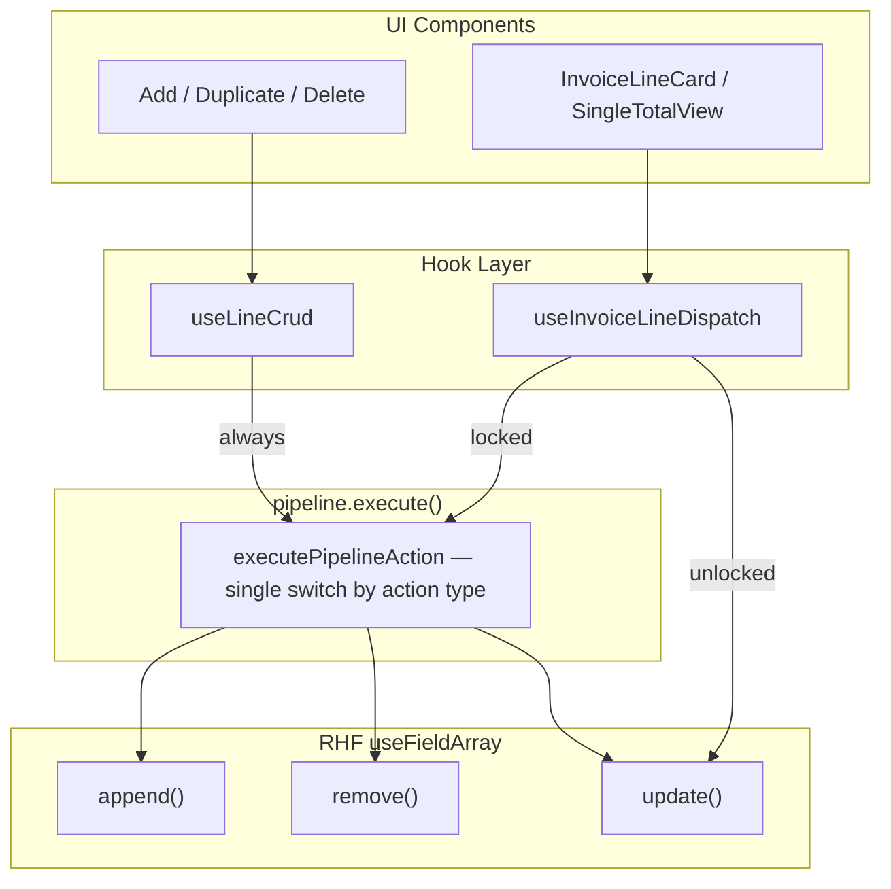

# Lock Total Amount — Purchase Invoice V3

## What

Adds a lock/unlock toggle next to the invoice total (incl. VAT) in the purchase invoice lines footer. When locked, newly created lines can be auto-filled from the remaining amount, while edits/deletes that create mismatches stay visible for the user to fix manually.

## Why

Users importing Peppol invoices need to ensure the sum of allocation lines always matches the original invoice total. Without this, manual edits can silently drift the total, causing reconciliation errors at submission.

## Architecture

### Data flow overview

All line mutations either go through `pipeline.execute()` or directly to RHF, depending on the lock state and action type:

- **Bulk ops** (add, duplicate, delete) always go through `pipeline.execute()` via `useLineCrud`
- **Single-line edits** split on lock state: locked edits go through `pipeline.execute()` via `useInvoiceLineDispatch`; unlocked edits call RHF `update()` directly
- **`AmountPipeline`** is the shared return type; consumers don't need to know about `PipelineAction` internals

### RHF method routing

The pipeline receives three granular RHF field-array methods and routes each action to the appropriate one. Reconciliation for `ADD_LINE`/`DUPLICATE_LINE` only modifies the last element (the newly created line), so `append()` is sufficient — no full-array `replace()` is needed.

| Action | Unlocked | Locked |
|--------|----------|--------|
| `ADD_LINE` | `append()` | `append()` — reconciliation sets created line's amount |
| `DUPLICATE_LINE` | `append()` | `append()` — reconciliation adjusts copy's amount |
| `DELETE_LINES` | `remove()` | `remove()` — reconciliation is a no-op |
| `EDIT_AMOUNT` | `update()` | `update()` — reconciliation is a no-op |
| `UPDATE_LINE` | `update()` | `update()` — reconciliation is a no-op |

All actions use the same granular RHF method in both locked and unlocked modes, preserving RHF's internal field tracking and ID stability.

### Locked reconciliation steps

When `lockState.locked` is true, one extra step runs after the raw action:

1. **Reconcile** — only adjusts a newly created line when the action creates one

## How it works

- **Lock toggle**: Icon button next to the total amount in `InvoiceLinesTableFooter`. Clicking it captures the current total as the locked value.
- **Reconciliation rules**:
  - **Add**: New line gets the remaining amount only when the remaining amount has the expected invoice sign; otherwise it gets `0`.
  - **Duplicate**: Copied line keeps the source amount only when the remaining amount can fully fit that source amount; otherwise the copied line gets `0`.
  - **Edit/Delete**: No automatic redistribution. The mismatch remains until the user manually adjusts line amounts.
- **Credit-note sign handling**: Normal invoices fill positive remaining amounts; credit notes fill negative remaining amounts. Opposite-sign or zero remaining amounts create a `0` line.
- **VAT and unit handling**: When the created line is auto-filled, `setTotalAmountForLine` back-calculates `amount` (excl. VAT) from `totalAmount` (incl. VAT). Selected share/percentage unit allocations on that created line stay valid; free/manual distributions are cleared instead of being guessed.
- **Rounding**: No proportional redistribution is performed. The only automatic amount is the direct remaining amount or the duplicated source amount.
- **Validation**: Submit-time guard blocks submission if the sum of line totals does not match the locked total.
- **Peppol default**: Auto-enabled when converting a Peppol invoice via the Sheet "Edit" button. `PeppolInvoiceSheetRoute` computes `lockedTotal` from `initialData.amounts` and passes it as `config.initialLockState` — fully deterministic, no effects. User can still unlock manually.
- **XML upload auto-lock**: Auto-enabled when an XML file is uploaded and parsed. `handlePeppolDataParsed` returns the parsed amounts, and `safePeppolDataParsed` computes `lockedTotal` and calls `setLockState` via context.
- **Footer display**: When locked, the footer shows the frozen `lockedTotal` instead of the live sum of line items.

## Key files

| Area | Files | Notes |
|------|-------|-------|
| Pipeline types | `pipeline/types.ts` | `PipelineAction`, `LockState` |
| Pipeline pure logic | `pipeline/executePipelineAction.ts` | Pure function with single switch-by-action; compute + reconcile + commit per action |
| Pipeline hook | `pipeline/useAmountPipeline.ts` | Thin React wrapper; delegates to `executePipelineAction` via `useStableCallback` |
| Reconciliation | `pipeline/reconcile.ts` | Exports `reconcileOnAdd`, `reconcileOnDuplicate` directly |
| Pipeline barrel | `pipeline/index.ts` | Re-exports `useAmountPipeline`, `AmountPipeline`, `LockState`, `PipelineAction`, `sumTotalAmounts` |
| Shared utility | `utils/amountCalculation.ts` | `calculateSubtotalFromTotal`, `getDistributionAdjustment`, `setTotalAmountForLine` |
| CRUD hook | `hooks/useLineCrud.ts` | Bulk ops (add/duplicate/delete) → `pipeline.execute()` |
| Dispatch hook | `hooks/useInvoiceLineDispatch.ts` | Single-line edits → `pipeline.execute()` when locked, `update()` when unlocked |
| Handlers hook | `hooks/useInvoiceLineHandlers.ts` | Forwards `AmountPipeline` to dispatch |
| Data hook | `hooks/useInvoiceLinesData.ts` | Instantiates pipeline with `append`/`remove`/`update` |
| UI | `InvoiceLinesTableV3.tsx`, `InvoiceLineCard.tsx`, `SingleTotalView.tsx` | Thread `AmountPipeline` prop to handlers |
| UI (footer) | `InvoiceLinesTableFooter.tsx` | Lock icon toggle |
| Context | `PurchaseInvoiceFormContext.tsx` | `lockState`, `setLockState`, `toggleAmountLock` |
| Validation | `hooks/useInvoiceFormActions.ts` | Submit-time mismatch check using `sumTotalAmounts` |
| Vendored hooks | `src/hooks/lib/useStableCallback.ts` | Stabilizes `execute` identity; future `useEffectEvent` replacement |
| Form types | `purchase-invoice-v3/types.ts` | `PurchaseInvoiceFormConfig` with `initialLockState` |
| Peppol auto-lock | `peppol/components/PeppolInvoiceSheetRoute.tsx` | Computes `lockedTotal`, passes `config.initialLockState` |

## Testing

- Unit tests for pipeline functions (`executePipelineAction`, `reconcileOnAdd`, `reconcileOnDuplicate`), including created-line fill, duplicate fit/no-fit, credit-note sign handling, invalid-index guard, and no-redistribution edit/delete behavior
- 20 unit tests for amount calculation utilities, including direct `getDistributionAdjustment` coverage
- Existing 75 tests (reducer, amountDefaults, lineGrouping) pass with zero regressions

## Manual test checklist

- [ ] Unlocked mode: add/edit/delete/duplicate work identically to before
- [ ] Lock at 1000, add line with 100 remaining -> new line gets 100
- [ ] Lock at 1000, add line with no positive remaining -> new line gets 0
- [ ] Credit note locked at -1000, add line with -100 remaining -> new line gets -100
- [ ] Duplicate in locked mode with enough remaining -> copied line keeps source amount
- [ ] Duplicate in locked mode without enough remaining -> copied line gets 0
- [ ] Edit/delete in locked mode -> no other line is changed; mismatch remains for manual correction
- [ ] Unlock -> normal behavior restored
- [ ] Peppol create -> auto-locks with correct total
- [ ] XML upload -> auto-locks with correct total
- [ ] Footer shows frozen locked total when locked, live sum when unlocked
- [ ] Submit with mismatch -> blocked with toast
