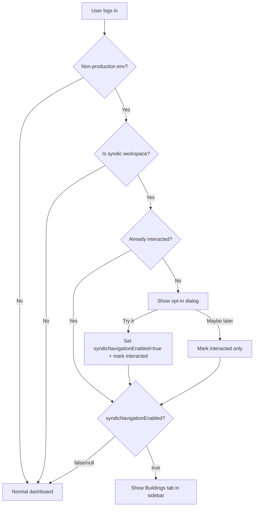
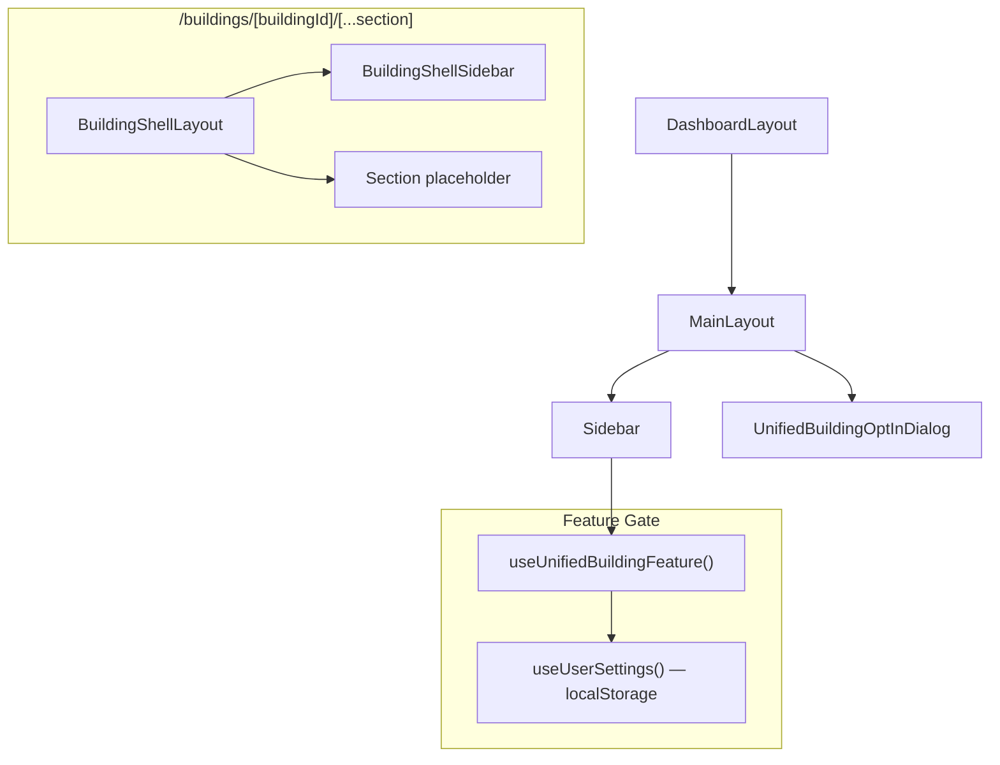
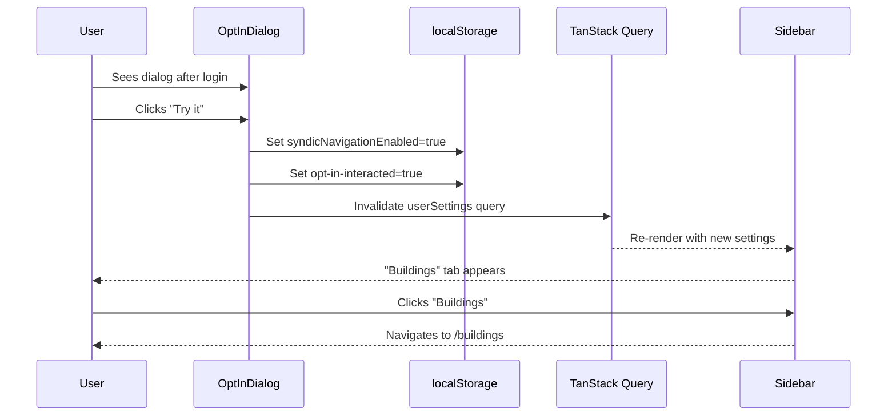

# Unified Building — A/B Opt-In & Shell Layout

## What

Introduces an environment-gated, per-user A/B opt-in flow for the new unified building experience. On non-production environments (staging and local dev), syndic users see a one-time dialog offering the merged building layout. Opting in adds a "Buildings" tab to the main sidebar and unlocks a new route with a dedicated building shell (left sidebar with building/financial sub-navigation). Production (`NEXT_PUBLIC_APP_ENV='production'`) is unaffected.

## Why

The current building detail view is split across Patrimony and Financial modules, forcing users to context-switch between pages to manage a single building. The unified building layout consolidates units, accounts, invoices, meetings, and more under one building. This ticket gates the rollout behind an environment flag and a per-user opt-in, so only syndic workspaces on staging experience it during A/B testing.

## Scope

This ticket covers the **infrastructure and shell only** — no section content implementations.

| In scope | Out of scope |
|----------|-------------|
| Environment gate via `!IS_PRODUCTION_ENV` (`src/constants/appEnv.ts`) | Section content (units, owners, accounting, etc.) |
| User settings types mirroring BE `UserSettingsResponseDto` | Actual BE API integration (fake server via localStorage) |
| localStorage-backed TanStack Query hooks (fake server layer) | Real API endpoints for user settings |
| One-time opt-in dialog after login (syndic only) | Non-syndic workspace support |
| "Buildings" sidebar tab (conditionally shown) | Building list page content (placeholder only) |
| Personal settings toggle in `InfoSidebar` | Full building detail features |
| Building shell layout with sidebar nav | Customizable sidebar persistence (drag-and-drop reorder) |
| Route structure: `/buildings/[buildingId]/[...section]` | |

## How it works

### Feature gating (3 layers)

```
Environment gate          →  !IS_PRODUCTION_ENV (`@/constants/appEnv`)
Workspace type check      →  isSyndic === true
Per-user opt-in           →  syndicNavigationEnabled === true (localStorage, later BE)
```

All three must be true for the unified building UI to appear.

### Opt-in dialog flow



**Interaction tracking**: `localStorage.getItem('sndq:unified-building-opt-in-interacted')` — set to `'true'` when user clicks either button. Prevents repeat display.

### Fake server layer (localStorage + TanStack Query)

Since the BE doesn't support `syndicNavigationEnabled` yet, we simulate it:

```
┌──────────────────────────────────────────────┐
│  useUserSettings()          — useQuery        │
│  reads from localStorage('sndq:user-settings')│
├──────────────────────────────────────────────┤
│  useUpdateSyndicNavigation() — useMutation    │
│  writes to localStorage + invalidates query   │
└──────────────────────────────────────────────┘
```

When the BE is ready, swap `queryFn` and `mutationFn` — hooks and components stay unchanged.

### Sidebar integration

When all 3 gates pass, a "Buildings" item is prepended as the **first** sidebar entry:

```
┌─────────────────────┐
│ 🏢 Buildings  ← NEW │  ← navigates to /buildings
│ 🏢 Patrimony        │
│ 📡 Broadcasts       │
│ 👥 Contacts         │
│ ✓  Tasks            │
│ 💰 Financial        │
│ 📄 Invoices         │
│ ⊞  App Library      │
└─────────────────────┘
```

### Personal settings toggle

A toggle in `InfoSidebar.tsx` under a new "Feature Preview" section lets the user manually enable/disable the unified building view. Only visible on non-production environments when the workspace is syndic.

### Building shell layout

The shell follows the prototype's sidebar-nav pattern (building-shell.tsx lines 348–474):

```
┌─────────────────────┬───────────────────────────────────┐
│  ← All buildings    │                                   │
│  🏢 Building Name   │                                   │
│  2024 · Open        │                                   │
│─────────────────────│                                   │
│  Building           │         Section Content           │
│  ▸ Overview         │         (placeholder for now)     │
│  ▸ Units            │                                   │
│  ▸ Owners           │                                   │
│  ▸ Meters           │                                   │
│  ▸ Distribution keys│                                   │
│  ▸ Meetings         │                                   │
│  ▸ ...              │                                   │
│─────────────────────│                                   │
│  Financial          │                                   │
│  ▸ Bookkeeping      │                                   │
│  ▸ Chart of accounts│                                   │
│  ▸ ...              │                                   │
│─────────────────────│                                   │
│  ⋯ More             │                                   │
└─────────────────────┴───────────────────────────────────┘
```

## Architecture

### Component tree



### User flow — opt-in



## Types (mirroring BE)

```typescript
// Mirrors UserSettingsResponseDto from sndq-be
interface UserSettings {
  id: string;
  userId: string;
  syndicNavigationConfig?: SyndicNavigationConfig | null;
  syndicNavigationEnabled?: boolean | null; // null = not yet decided
  createdAt: Date;
  updatedAt: Date;
}

interface SyndicNavigationConfig {
  sidebar?: {
    building?: BuildingNavigationKey[];
    financial?: FinancialNavigationKey[];
  };
}
```

## Route structure

```
src/app/(dashboard)/buildings/
  page.tsx                          → Buildings list (placeholder)
  [buildingId]/
    layout.tsx                      → Building shell layout (sidebar nav)
    page.tsx                        → Redirect to overview
    [...section]/
      page.tsx                      → Section content (placeholder)
```

## Key files

| Area | File | Notes |
|------|------|-------|
| Env gate | `src/constants/appEnv.ts` | `IS_PRODUCTION_ENV` — `NEXT_PUBLIC_APP_ENV === 'production'` (feature hidden when true) |
| Types | `src/common/types/userSettings.ts` | Mirrors BE `UserSettingsResponseDto` + `SyndicNavigationConfig` |
| Fake server hooks | `src/hooks/useUserSettings.ts` | `useQuery`/`useMutation` backed by localStorage |
| Feature gate hook | `src/modules/unified-building/hooks/useUnifiedBuildingFeature.ts` | Composes `!IS_PRODUCTION_ENV` + workspace type + opt-in state |
| Opt-in dialog | `src/modules/unified-building/components/UnifiedBuildingOptInDialog.tsx` | One-time dialog using `@/components/ui/dialog` |
| Navigation constants | `src/modules/unified-building/constants/navigation.ts` | `ALL_SECTIONS`, `OVERVIEW_ITEM`, `DEFAULT_PINNED` |
| Sidebar | `src/components/layout/main-layout/side-bar/Sidebar.tsx` | Conditional "Buildings" item prepended |
| Personal settings toggle | `src/modules/personal-settings/InfoSidebar.tsx` | Toggle in "Feature Preview" section |
| Shell sidebar | `src/modules/unified-building/components/BuildingShellSidebar.tsx` | Left nav with building/financial groups |
| Shell layout | `src/app/(dashboard)/buildings/[buildingId]/layout.tsx` | Composes shell sidebar + content area |
| Buildings list | `src/app/(dashboard)/buildings/page.tsx` | Placeholder list page |
| Route constants | `src/common/constants/system.ts` | Add `buildings` route paths |

## localStorage keys

| Key | Purpose | Values |
|-----|---------|--------|
| `sndq:user-settings` | Fake server store for user settings | JSON of `UserSettings` |
| `sndq:unified-building-opt-in-interacted` | Dialog interaction tracking | `'true'` or absent |

## Manual test checklist

- [ ] Production env (`NEXT_PUBLIC_APP_ENV='production'`): no dialog, no "Buildings" tab, no `/buildings` route
- [ ] Staging env + non-syndic workspace: no dialog, no "Buildings" tab
- [ ] Staging env + syndic + first visit: dialog appears after login
- [ ] Dialog "Try it": `syndicNavigationEnabled` set to `true`, "Buildings" tab appears
- [ ] Dialog "Maybe later": dialog dismissed, no "Buildings" tab, dialog won't show again
- [ ] Revisit after "Maybe later": dialog does NOT reappear
- [ ] Sidebar "Buildings" tab navigates to `/buildings`
- [ ] Buildings list page renders (placeholder)
- [ ] Click a building → navigates to `/buildings/[id]/overview`
- [ ] Building shell sidebar shows building + financial nav groups
- [ ] Shell nav links navigate between sections (placeholder content)
- [ ] "More" popover shows unpinned items
- [ ] Personal settings toggle: ON → "Buildings" tab appears; OFF → tab disappears
- [ ] Page refresh preserves opt-in state (localStorage persistence)

## Migration path to real BE

When the backend implements the `syndicNavigationEnabled` field on `UserSettings`:

1. Replace `queryFn` in `useUserSettings` with actual API call
2. Replace `mutationFn` in `useUpdateSyndicNavigation` with actual API call
3. Remove localStorage read/write logic
4. Keep the `sndq:unified-building-opt-in-interacted` localStorage key (dialog tracking stays client-side)
5. Types in `src/common/types/user-settings.ts` should already match the BE response

## UI component strategy

Components are sourced in this priority order:

1. **`@sndq/ui-v2`** (workspace package) — Button, Badge, Text, Heading, Popover, Icon, Skeleton, etc.
2. **`@/components/ui-v2`** — additional components from the new design system
3. **`@/components/ui/dialog`** — for the opt-in dialog (shadcn, ui-v2 doesn't have Dialog yet)
4. **`@/components/briicks`** — only when neither ui-v2 covers the component

The prototype (`OptInAffordance.tsx`) uses `@sndq/ui-v2/components` directly — the production implementation should match this where possible, falling back to the priority order above.
