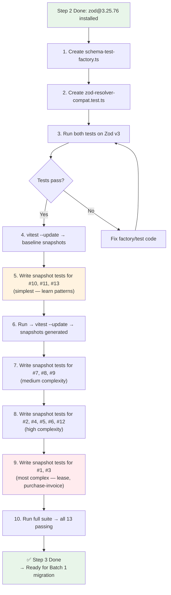

# Step 3: Create Test Factory + zodResolver Smoke Test — Deep-Dive

Implementation guide for the Zod v3 → v4 migration test infrastructure and per-file migration workflow.

**Created**: 2026-04-03
**Updated**: 2026-04-03 (revised: just-in-time per-file approach instead of all-upfront)
**Prerequisite**: Step 2 done (zod@3.25.76 installed)
**Estimated effort**: Infra ~1h + per-file migration ~8-9h total
**Deliverables**: 2 infra files (created once) + 13 snapshot test files (created just-in-time during migration)

**Related**: [Ticket Summary](./ticket.md) · [Migration Plan](./README.md) · [Progress Tracker](./progress.md)

---

## Table of Contents

- [Overview](#overview)
- [Deliverable A: Schema Test Factory](#deliverable-a-schema-test-factory)
- [Deliverable B: zodResolver Smoke Test](#deliverable-b-zodresolver-smoke-test)
- [Deliverable C: 13 Schema Snapshot Test Files](#deliverable-c-13-schema-snapshot-test-files)
- [13-File Audit Table](#13-file-audit-table)
- [Implementation Workflow](#implementation-workflow)
- [FAQ](#faq)

---

## Overview

### Revised Approach: Just-in-Time per-file

Originally Step 3 planned to write all 13 snapshot tests upfront before any migration. **The revised approach** merges Step 3 + Batch 1 into a single per-file workflow:

1. **Infra first** (~1h): Create the 2 reusable files (A + B) — done once.
2. **Per-file migration** (~8-9h): For each of the 13 files, write snapshot test → run v3 baseline → migrate → compare → fix → QA → commit.

**Why the change**: Writing all 13 tests upfront requires understanding 13 different schemas at once. Just-in-time means you read the schema, understand it, write the test, and migrate it — all in one focused session per file.

The deliverables remain the same:

| # | File(s) to Create | Purpose | Lines | When |
|---|---|---|---|---|
| A | `src/__tests__/helpers/schema-test-factory.ts` | Reusable `describeSchema()` factory | ~50 | **Once — infra step** |
| B | `src/__tests__/zod-resolver-compat.test.ts` | Regression guard for `zodResolver` | ~65 | **Once — infra step** |
| C | 13 snapshot test files (one per critical schema) | Baseline snapshots → migration diff | ~30-60 each | **Just-in-time — per-file** |

**Critical**: Each test must first run on **Zod v3** (`import { z } from 'zod'`) to capture the baseline snapshot, then switch to `'zod/v4'` to detect changes.

---

## Deliverable A: Schema Test Factory

### File: `src/__tests__/helpers/schema-test-factory.ts`

This factory function generates a standard snapshot test suite for any Zod schema, minimizing boilerplate per-file to just imports + fixtures + one function call.

```typescript
// src/__tests__/helpers/schema-test-factory.ts
import { describe, it, expect } from 'vitest';
import type { ZodSchema } from 'zod';

interface SchemaFixtures {
  /** Complete valid input — exercises all fields, transforms, and enum values */
  valid: Record<string, unknown>;
  /** Only required fields — exposes default value behavior */
  minimal: Record<string, unknown>;
  /** Fields with wrong types — captures error format and structure (optional) */
  invalid?: Record<string, unknown>;
}

/**
 * Generates a standard snapshot test suite for a Zod schema.
 *
 * Produces 3-4 tests per schema:
 * 1. Valid input → snapshots full parsed output (catches .transform() changes)
 * 2. Minimal input → snapshots defaults (catches .default() behavior changes)
 * 3. Empty input → snapshots error structure (catches error format changes)
 * 4. Invalid input → snapshots type error structure (optional)
 *
 * Error snapshots capture `path` + `code` only (not `message`) because
 * error message strings may intentionally change during migration.
 *
 * @example
 * describeSchema('LeaseForm', leaseFormSchema, {
 *   valid: { ... },
 *   minimal: { ... },
 * });
 */
export function describeSchema(
  name: string,
  schema: ZodSchema,
  fixtures: SchemaFixtures,
): void {
  describe(`${name} — migration snapshot`, () => {
    it('parses valid input and produces expected output', () => {
      const result = schema.safeParse(fixtures.valid);
      expect(result.success).toBe(true);
      if (result.success) {
        expect(result.data).toMatchSnapshot();
      }
    });

    it('parses minimal input with correct defaults', () => {
      const result = schema.safeParse(fixtures.minimal);
      expect(result.success).toBe(true);
      if (result.success) {
        expect(result.data).toMatchSnapshot();
      }
    });

    it('rejects empty input with expected error structure', () => {
      const result = schema.safeParse({});
      if (!result.success) {
        expect(
          result.error.issues.map((i) => ({
            path: i.path,
            code: i.code,
          })),
        ).toMatchSnapshot();
      }
    });

    if (fixtures.invalid) {
      it('rejects invalid types with expected errors', () => {
        const result = schema.safeParse(fixtures.invalid);
        expect(result.success).toBe(false);
        if (!result.success) {
          expect(
            result.error.issues.map((i) => ({
              path: i.path,
              code: i.code,
            })),
          ).toMatchSnapshot();
        }
      });
    }
  });
}
```

### Design decisions

| Decision | Rationale |
|---|---|
| `toMatchSnapshot()` over `toEqual()` | Auto-generates expected values — no manual construction of complex nested output objects |
| Error snapshots capture `path` + `code` only | `message` text may intentionally change during `message:` → `error:` migration — reduces false positives |
| `minimal` fixture is required | This is the **primary defense** against `.default()` behavior changes — it tests what happens when optional fields are omitted |
| `invalid` fixture is optional | Not all schemas have meaningful "wrong type" cases worth snapshotting |

---

## Deliverable B: zodResolver Smoke Test

### File: `src/__tests__/zod-resolver-compat.test.ts`

### Context Update: From Blocker to Regression Guard

`@hookform/resolvers@4.1.3` has been confirmed compatible with Zod v4:

```json
// @hookform/resolvers@4.1.3 package.json
"peerDependencies": {
  "zod": "^3.25.76 || ^4.1.8"
}
```

The resolver now uses `@standard-schema/utils` instead of Zod internal APIs (`._def`, `ZodEffects` class-checking). This test is kept as a **regression guard** against future breaking changes, not as a migration blocker.

### Code

```typescript
// src/__tests__/zod-resolver-compat.test.ts
import { describe, it, expect } from 'vitest';
import { zodResolver } from '@hookform/resolvers/zod';
import { z } from 'zod';

const simpleSchema = z.object({
  name: z.string().min(1),
  email: z.string().email(),
  age: z.number().int().positive().optional(),
});

const schemaWithDefaults = z.object({
  title: z.string(),
  isActive: z.boolean().default(true),
  tags: z.array(z.string()).default([]),
});

const schemaWithTransform = z.object({
  amount: z.string().transform((v) => Number(v)),
});

describe('zodResolver — Zod version compatibility', () => {
  it('creates resolver without throwing', () => {
    expect(() => zodResolver(simpleSchema)).not.toThrow();
    expect(() => zodResolver(schemaWithDefaults)).not.toThrow();
    expect(() => zodResolver(schemaWithTransform)).not.toThrow();
  });

  it('validates valid data correctly', async () => {
    const resolver = zodResolver(simpleSchema);
    const result = await resolver(
      { name: 'John', email: 'john@example.com' },
      undefined,
      { fields: {}, shouldUseNativeValidation: false } as any,
    );
    expect(result.errors).toEqual({});
    expect(result.values).toBeDefined();
  });

  it('returns errors for invalid data', async () => {
    const resolver = zodResolver(simpleSchema);
    const result = await resolver(
      { name: '', email: 'not-email' },
      undefined,
      { fields: {}, shouldUseNativeValidation: false } as any,
    );
    expect(result.errors.name).toBeDefined();
    expect(result.errors.email).toBeDefined();
  });

  it('applies .default() values through resolver', async () => {
    const resolver = zodResolver(schemaWithDefaults);
    const result = await resolver(
      { title: 'Test' },
      undefined,
      { fields: {}, shouldUseNativeValidation: false } as any,
    );
    expect(result.values.isActive).toBe(true);
    expect(result.values.tags).toEqual([]);
  });

  it('applies .transform() through resolver', async () => {
    const resolver = zodResolver(schemaWithTransform);
    const result = await resolver(
      { amount: '42' },
      undefined,
      { fields: {}, shouldUseNativeValidation: false } as any,
    );
    expect(result.values.amount).toBe(42);
  });
});
```

### After migration: change one line

When all schemas have migrated to `"zod/v4"`:

```diff
- import { z } from 'zod';
+ import { z } from 'zod/v4';
```

If all 5 tests still pass → zodResolver works with v4. If any fail → investigate before proceeding.

---

## Deliverable C: 13 Schema Snapshot Test Files

### File naming convention

Each schema file gets a corresponding test file in the same directory (or a `__tests__/` subfolder if the directory is cluttered):

```
src/modules/patrimony/forms/lease/__tests__/schema.snapshot.test.ts
src/modules/financial/forms/purchase-invoice-v2/__tests__/schema.snapshot.test.ts
src/components/contact/__tests__/schema.snapshot.test.ts
...
```

The `.snapshot.test.ts` suffix distinguishes these migration-specific tests from any existing unit tests.

### Pattern for each test file

Each file follows the same structure — ~20-50 lines depending on schema complexity:

```typescript
// src/modules/patrimony/forms/property/__tests__/schema.snapshot.test.ts
import { describeSchema } from '@/__tests__/helpers/schema-test-factory';
import { propertyFormSchema } from '../schema';

const UUID = '550e8400-e29b-41d4-a716-446655440000';

describeSchema('propertyFormSchema', propertyFormSchema, {
  valid: {
    // Complete valid fixture — exercises all fields
    name: 'Apartment 4B',
    type: 'apartment',
    floor: 2,
    buildingId: UUID,
    // ... all required + optional fields
  },
  minimal: {
    // Only required fields — exposes .default() behavior
    name: 'X',
    buildingId: UUID,
  },
});
```

For complex schemas with multiple sub-schemas (e.g., lease), test each individually for granular failure detection:

```typescript
// src/modules/patrimony/forms/lease/__tests__/schema.snapshot.test.ts
import { describeSchema } from '@/__tests__/helpers/schema-test-factory';
import {
  generalInfoSchema,
  vatRuleSchema,
  extraCostSchema,
  discountSchema,
  leaseFormSchema,
} from '../schema';

const UUID = '550e8400-e29b-41d4-a716-446655440000';

// Sub-schemas tested individually for granular failure isolation
describeSchema('GeneralInfoSchema', generalInfoSchema, {
  valid: { /* ... */ },
  minimal: { /* ... */ },
});

describeSchema('VatRuleSchema', vatRuleSchema, {
  valid: { /* ... */ },
  minimal: { /* ... */ },  // tests .default('21') on rate
});

describeSchema('ExtraCostSchema', extraCostSchema, {
  valid: { /* ... */ },
  minimal: { /* ... */ },
});

// Full composite schema (top-level)
describeSchema('LeaseFormSchema (full)', leaseFormSchema, {
  valid: { /* ... complete fixture ... */ },
  minimal: { /* ... minimal fixture ... */ },
});
```

---

## 13-File Audit Table

Detailed audit of each Batch 1 schema file with exact pattern counts and identified sub-schemas.

| # | Full Path | `.default()` | `.transform()` | `nativeEnum()` | `.superRefine()` | Exported Schemas (for `zodResolver`) | Sub-schemas to Test Individually | Est. Effort |
|---|---|---|---|---|---|---|---|---|
| 1 | `patrimony/forms/lease/schema.ts` | **21** | 4 | 8 | 10 | `leaseFormSchema` | `generalInfoSchema`, `vatRuleSchema`, `indexationRuleSchema`, `extraCostSchema`, `discountSchema`, `payerSchema`, `financialDetailsSchema`, `propertyRentConfigSchema` | **~1h** |
| 2 | `financial/forms/purchase-invoice-v2/schema.ts` | 11 | 3 | 2 | 3 | `purchaseInvoiceFormV2Schema` | `amountWithDistributionSchema`, `amountWithDistributionSchemaSyndic` | ~30m |
| 3 | `financial/forms/purchase-invoice/schema.ts` | 18 | 3 | 1 | 4 | `purchaseInvoiceFormSchema` | `amountFormSchema`, `createAmountFormSchema`, `generalInfoSchema`, `amountSplitSchema`, `settlementSchema`, `paymentSchema` | ~45m |
| 4 | `components/contact/schema.ts` | 9 | 4 | 0 | 7 | `contactFormSchema`, `supplierFormSchema`, `eidContactFormSchema` | All 3 schemas are top-level exports; also test `.optional().default([]).superRefine().transform()` chain on emails/phone_numbers | ~30m |
| 5 | `financial/forms/cost-settlement/CostSettlementForm/schema.ts` | 6 | 2 | 2 | 0 | `costSettlementFormSchema`, `stewardCostSettlementFormSchema` | `detailsSchema`, `stewardDetailsSchema`, `costSettlementCosts`, `costSettlementIncome`, `paymentSchema` | ~30m |
| 6 | `financial/forms/close-fiscal-year/schema.ts` | 9 | 2 | 1 | 0 | `closeFiscalYearFormSchema` | `detailsSchema`, `costsSchema`, `incomeSchema`, `balancesSchema`, `capitalSchema`, `paymentSchema` | ~30m |
| 7 | `patrimony/forms/lease/revision/schema.ts` | 0 | 3 | 3 | 0 | `leaseRevisionFormSchema` | `leaseRevisionGeneralInfoSchema`, `leaseRevisionItemSchema`, `leaseRevisionUnitsSchema`, `adjustmentTransactionSchema` | ~15m |
| 8 | `patrimony/forms/building/schema.ts` | 0 | 2 | 0 | 0 | `buildingFormSchema`, `createBuildingFormSchema(workspaceType)` | `distributionKeyFormSchema`; factory function needs testing per `WorkspaceType` | ~20m |
| 9 | `financial/forms/purchase-invoice-v2-steward/schema.ts` | 5 | 3 | 1 | 2 | `purchaseInvoiceFormV2StewardSchema` | `amountWithDistributionSchemaSteward` | ~20m |
| 10 | `patrimony/forms/property/schema.ts` | 0 | 1 | 0 | 0 | `propertyFormSchema` | None — single small schema | ~10m |
| 11 | `patrimony/forms/lease/components/lease-deposit/schema.ts` | 1 | 1 | 1 | 1 | `leaseDepositFormSchema` | None — single schema but has `superRefine` + `transform` on attachment | ~10m |
| 12 | `fee-management/FeeConfiguratorForm/schema.ts` | 7 | 1 | **8** | 2 | `feeConfigurationSchema` | `propertyUnitFeeSchema`, `propertyBuildingFeeSchema`, `leaseFeeSchema`, `amountScaleSchema`, `propertiesFeesSchema`, `additionalFeeSchema`, `usageSurchargeSchema` | ~30m |
| 13 | `contact-book/.../detail-overview-content/form/schema.ts` | 0 | 1 | 0 | 0 | `identityFormSchema` | None — single schema | ~10m |

### Priority guidance

| Priority | Files | Reason |
|---|---|---|
| **Start here** (learn patterns) | #10, #11, #13 | Simplest — 0-1 `.default()`, 1 `.transform()`, single schema. ~30m total. |
| **Then** (medium complexity) | #7, #8, #9 | 0-5 `.default()`, 2-3 `.transform()`, multiple sub-schemas. ~55m total. |
| **Then** (high complexity) | #2, #4, #5, #6, #12 | 6-11 `.default()`, multiple sub-schemas. ~2.5h total. |
| **Last** (most complex) | #1, #3 | 18-21 `.default()`, deeply nested, 6-8+ sub-schemas each. ~1.75h total. |

### Existing test reuse

File #2 (`purchase-invoice-v2/schema.ts`) already has an existing test file `schema.test.ts` (split into `schema/amount-with-distribution.test.ts` and `schema/purchase-invoice-form.test.ts`). These contain valid/invalid fixtures that can be reused in the snapshot tests, significantly reducing fixture authoring effort.

### Key patterns to watch

| Pattern | Where Found | Why Dangerous |
|---|---|---|
| `.optional().default([]).superRefine().transform()` | #4 (contact — emails, phone_numbers) | `.default()` short-circuit skips the `.superRefine()` and `.transform()` in v4 |
| `.boolean().default(true/false)` inside `z.object()` | #1 (lease — 8+ boolean defaults) | If parent field is optional, v4 may now inject these keys where v3 didn't |
| `z.array(subSchema).default([])` | #1 (lease — payers, extraCosts, discounts) | Array defaults may interact differently with parent object defaults |
| `createBuildingFormSchema(workspaceType)` | #8 (building) | Dynamic factory — needs testing with multiple workspace types |
| `nativeEnum` with `.Enum` / `.Values` accessors | #1, #7, #12 | Runtime crash in v4 — `tsc` catches but snapshot confirms correct enum values post-migration |

---

## Implementation Workflow

### Step-by-step for the entire Step 3



### Per-file workflow (for each of the 13 files)

```
1. Read the schema file → identify exported schemas + sub-schemas
2. Check if existing test fixtures exist (reuse if possible)
3. Create __tests__/schema.snapshot.test.ts
4. Import describeSchema + schema exports
5. Write `valid` fixture — all fields populated with realistic data
6. Write `minimal` fixture — only required fields (deliberately omit .default() fields)
7. Optionally write `invalid` fixture
8. Run: pnpm test src/path/to/__tests__/schema.snapshot.test.ts
9. If tests pass → run: pnpm test src/path/to/__tests__/schema.snapshot.test.ts -- -u
10. Verify .snap file looks reasonable
11. Move to next file
```

### After all 13 files are done

```bash
# Verify everything passes
pnpm test

# Commit the test infrastructure
git add -A
git commit -m "test(zod): add schema snapshot tests + zodResolver smoke test for v3→v4 migration"
```

This commit establishes the **safety net** that Step 6 (Batch 1 migration) will rely on.

---

## FAQ

### Why not use the existing `purchase-invoice-v2/schema.test.ts` directly?

The existing tests use `expect(result.success).toBe(true)` and `expect(result.error.issues).toHaveLength(N)` assertions — they verify **pass/fail** but don't snapshot the **actual parsed output**. Snapshot tests capture the exact data produced by `.default()` and `.transform()` chains, which is what changes silently in v4.

However, the **fixtures** from those existing tests (valid UUID constants, `validAmountData`, etc.) can be reused to populate the `describeSchema()` fixtures, saving significant authoring time.

### How long does the snapshot test suite take to run?

Schema snapshot tests execute `schema.safeParse()` calls only — no DOM, no API, no filesystem. Expected runtime: **<2 seconds** for all 13 files combined.

### What happens if a snapshot changes after migrating to `"zod/v4"`?

This is the **entire point** of the tests. For each snapshot diff:

1. **Read the diff carefully** — which field changed? What was the old value? What's the new value?
2. **Determine if the change is from `.default()` behavior** — if a new key appeared in the minimal fixture output, it's the `.default()` + `.optional()` interaction (Category 4.1)
3. **Decide**: accept new behavior OR use `.prefault()` to restore v3 behavior
4. **Update snapshot**: `pnpm test -- -u` (only after reviewing every diff)

### Can AI agents help write the fixtures?

Yes — AI agents can read each schema file and generate fixture objects that satisfy all validations. The main challenge is understanding the business context of enum values and cross-field validations (e.g., `superRefine` rules that require specific combinations). Review AI-generated fixtures carefully.

### Should I commit the `.snap` files to git?

Yes. The `.snap` files are the v3 behavioral baseline. They must be committed so that when you change the import to `"zod/v4"`, the CI/CD pipeline will detect any snapshot diffs and fail the build if unreviewed changes exist.

---

## References

- [Migration Plan §Testing Strategy](./README.md#pre-migration-testing-strategy) — full rationale for schema snapshot + zodResolver smoke approach
- [Ticket Summary §Step 3](./ticket.md) — ticket-level description
- [Progress Tracker §Batch 1](./progress.md#batch-1-transform-files-highest-risk) — per-file checklist
- [Vitest Snapshot Testing](https://vitest.dev/guide/snapshot) — official docs
