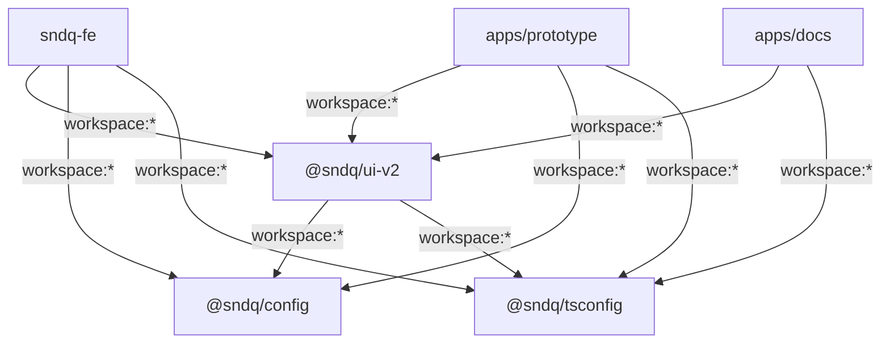
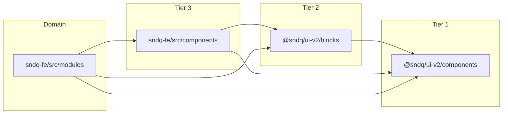

# Monorepo Restructure & UI Design System — Architecture Document

Full architecture specification for reorganizing the `sndq` monorepo into a hybrid `sndq-fe` + `apps/` + `packages/` structure with a shared design system.

**Created**: 2026-04-17
**Status**: Planning
**Quick overview**: [overview.md](./overview.md) — folder structure and dependency flow at a glance
**Ticket summary**: [ticket.md](./ticket.md) — copy-paste-ready for Linear (monorepo restructure)
**Component ticket**: [ticket-component-structure.md](./ticket-component-structure.md) — copy-paste-ready for Linear (component organization)
**Lifting process**: [component-lifting-process.md](./component-lifting-process.md) — four-tier promotion model, signals, waves, detection script
**Lifting ticket**: [ticket-component-lifting.md](./ticket-component-lifting.md) — copy-paste-ready for Linear (lifting process)
**Migration plan**: [migration-plan.md](./migration-plan.md) — five-phase gradual migration, deprecation strategy, API compatibility
**Migration ticket**: [ticket-migration.md](./ticket-migration.md) — copy-paste-ready for Linear (migration phases)
**Reference**: [cal.com monorepo](https://github.com/calcomhq/cal.com) — used as architectural reference

---

## Table of Contents

1. [Current State](#1-current-state)
2. [Problems](#2-problems)
3. [Target Structure](#3-target-structure)
4. [Package Details](#4-package-details)
5. [Component Classification](#5-component-classification)
6. [Config File Contents](#6-config-file-contents)
7. [Dependency Graph](#7-dependency-graph)
8. [Import Rules](#8-import-rules)
9. [Migration Steps](#9-migration-steps)

---

## 1. Current State

```
sndq/
├── package.json                # Lerna root (scripts delegate to lerna run)
├── pnpm-workspace.yaml         # workspaces: ['sndq-fe', 'sndq-ui-v2']
├── lerna.json                  # packages: ['sndq-fe'] (sndq-ui-v2 missing!)
├── sndq-fe/                    # Main Next.js app (port 3000)
│   ├── src/
│   │   ├── components/briicks/ # 55 Briicks wrapper components
│   │   ├── components/common-* # 7 app-specific composite components
│   │   └── modules/            # domain modules (financial, contact, patrimony, etc.)
│   └── packages/ui/            # Git submodule → github.com/Struqta/sndq-ui.git
└── sndq-ui-v2/                 # Design showcase app (port 3001)
    └── src/
        ├── components/ui-v2/   # 70 UI-V2 primitives + 9 blocks
        ├── patterns/form/      # 7 form patterns
        └── lib/                # chart utils, hooks
```

### Key metrics

| Item | Count |
|------|-------|
| UI-V2 primitive components | 70 |
| UI-V2 block components | 9 |
| Form patterns in showcase | 7 (6 demo forms + FormShell) |
| Briicks wrapper components in sndq-fe | 55 |
| App-specific composites in sndq-fe | 7 |
| Duplicated globals.css token lines | ~160 (Briicks colors, type scale, spacing, radius) |

---

## 2. Problems

### 2.1 No proper package boundaries

Both apps are top-level siblings. There is no `apps/` or `packages/` folder. PNPM workspace config lists them, but `lerna.json` only includes `sndq-fe` — root scripts like `pnpm dev` do not start `sndq-ui-v2`.

### 2.2 Git submodule for shared UI

The `@sndq/ui` library is consumed via a git submodule (`sndq-fe/packages/ui/`) and resolved through TypeScript path aliases:

```json
"paths": {
  "@sndq/ui": ["./packages/ui/src"],
  "@sndq/ui/*": ["./packages/ui/src/*"]
}
```

This has no dependency graph awareness — PNPM does not know `sndq-fe` depends on `@sndq/ui`. Build ordering, cache invalidation, and version coordination are all manual.

### 2.3 Design token duplication

Both `sndq-fe/src/app/globals.css` and `sndq-ui-v2/src/app/globals.css` define the same Briicks color system (~160 lines), type scale, spacing scale, and radius tokens. Changes must be applied to both files manually — drift is inevitable.

### 2.4 Missing tooling in showcase

`sndq-ui-v2` has no ESLint config and no Prettier config. Only `sndq-fe` enforces code quality. Components developed in the showcase have no lint enforcement.

### 2.5 TypeScript config duplication

Both apps have near-identical `tsconfig.json` files (same target, module, strict settings). Only `paths` differ. A third config will be needed for `packages/ui`.

### 2.6 UI-V2 components trapped in an app

The 70+ UI-V2 components and 9 blocks live inside `sndq-ui-v2/src/components/ui-v2/`. They cannot be imported by `sndq-fe` without copy-paste. The entire point of these components is reuse across apps.

---

## 3. Target Structure

```
sndq/
├── package.json                  # Lerna root scripts
├── pnpm-workspace.yaml           # packages: ['sndq-fe', 'apps/*', 'packages/*']
├── pnpm-lock.yaml
├── lerna.json                    # packages: ['sndq-fe', 'apps/*', 'packages/*']
├── lefthook.yml
├── .gitignore
├── .github/workflows/
│
├── sndq-fe/                      # Main Next.js app (kept at root to avoid conflicts)
│   ├── package.json              # name: "sndq-fe"
│   ├── tsconfig.json             # extends @sndq/tsconfig/nextjs.json
│   ├── eslint.config.mjs         # imports from @sndq/config/eslint.mjs
│   ├── next.config.ts
│   ├── postcss.config.mjs
│   └── src/
│       ├── app/
│       │   └── globals.css       # imports @sndq/config/tailwind/* + app theme
│       ├── modules/
│       ├── components/           # app-specific (business tier only)
│       ├── common/
│       ├── hooks/
│       ├── services/
│       ├── lib/
│       └── constants/
│
├── apps/
│   ├── docs/                     # Standalone docs site — standardized components only
│   │   ├── package.json
│   │   ├── tsconfig.json         # extends @sndq/tsconfig/nextjs.json
│   │   └── src/app/              # Imports @sndq/ui-v2, manages its own showcase UI
│   └── prototype/                # <-- sndq-ui-v2 (UI prototype/component playground)
│       ├── package.json          # name: "sndq-ui-v2"
│       ├── tsconfig.json         # extends @sndq/tsconfig/nextjs.json
│       ├── eslint.config.mjs     # imports from @sndq/config/eslint.mjs
│       ├── next.config.ts
│       ├── postcss.config.mjs
│       └── src/
│           ├── app/
│           │   └── globals.css   # imports @sndq/config/tailwind/* + app theme
│           ├── lib/
│           └── patterns/form/    # demo forms (consume @sndq/ui-v2)
│
├── packages/
│   ├── ui-v2/                    # @sndq/ui-v2
│   │   ├── package.json
│   │   ├── tsconfig.json         # extends @sndq/tsconfig/library.json
│   │   └── src/
│   │       ├── components/       # Tier 1: primitives (70 components)
│   │       ├── blocks/           # Tier 2: compositions (9+ blocks)
│   │       └── index.ts
│   │
│   ├── config/                   # @sndq/config
│   │   ├── package.json
│   │   ├── eslint.mjs            # shared ESLint flat config
│   │   ├── prettier.json         # shared Prettier config
│   │   └── tailwind/
│   │       ├── tokens.css        # Briicks primitives + UI-V2 semantic tokens
│   │       ├── components.css    # UI-V2 component CSS classes
│   │       ├── animations.css    # shared keyframes
│   │       └── shared-sources.css
│   │
│   └── tsconfig/                 # @sndq/tsconfig
│       ├── package.json
│       ├── base.json
│       ├── nextjs.json
│       └── library.json
│
└── README.md
```

---

## 4. Package Details

### 4.1 `@sndq/ui-v2` — component library

The design system package with a **three-tier component model**. Only Tier 1 (primitives) and Tier 2 (blocks) live here. Tier 3 (business components) remain in app code.

> **Why `-v2`?** The old `@sndq/ui` submodule at `sndq-fe/packages/ui/` still resolves via tsconfig paths. Using `-v2` avoids naming conflict during the coexistence period. Can be renamed after cleanup (see [migration-plan.md](./migration-plan.md#8-phase-5-cleanup)).

**`package.json`**:

```json
{
  "name": "@sndq/ui-v2",
  "private": true,
  "version": "0.1.0",
  "sideEffects": false,
  "exports": {
    "./components": "./src/components/index.ts",
    "./components/*": "./src/components/*.tsx",
    "./blocks": "./src/blocks/index.ts",
    "./blocks/*": "./src/blocks/*.tsx"
  },
  "dependencies": {
    "@sndq/config": "workspace:*"
  },
  "peerDependencies": {
    "react": "^19.0.0",
    "react-dom": "^19.0.0"
  }
}
```

**`tsconfig.json`**:

```json
{
  "extends": "@sndq/tsconfig/library.json",
  "compilerOptions": {
    "paths": { "@/*": ["./src/*"] }
  },
  "include": ["src"]
}
```

### 4.2 `@sndq/config` — shared tooling and design tokens

Houses all shared configuration: ESLint rules, Prettier settings, and the full Tailwind/CSS design token system.

**`package.json`**:

```json
{
  "name": "@sndq/config",
  "private": true,
  "version": "0.0.0",
  "sideEffects": ["./tailwind/*.css"],
  "exports": {
    "./eslint.mjs": "./eslint.mjs",
    "./prettier.json": "./prettier.json",
    "./tailwind/tokens.css": "./tailwind/tokens.css",
    "./tailwind/components.css": "./tailwind/components.css",
    "./tailwind/animations.css": "./tailwind/animations.css",
    "./tailwind/shared-sources.css": "./tailwind/shared-sources.css"
  },
  "devDependencies": {
    "@eslint/eslintrc": "^3.0.0",
    "eslint-config-next": "^15.0.0",
    "eslint-config-prettier": "^10.0.0",
    "eslint-plugin-prettier": "^5.0.0",
    "prettier": "^3.0.0",
    "prettier-plugin-tailwindcss": "^0.6.0"
  }
}
```

#### `tailwind/tokens.css`

Single source of truth for the Briicks design system. Contains:

- **Briicks primitive colors**: `brand-[25-900]`, `neutral-[0-900]`, `success-[25-900]`, `warning-[25-900]`, `error-[25-900]`
- **Type scale**: `--font-size-xs` through `--font-size-3xl`, weights, line-heights
- **Spacing scale**: `--spacing-1` through `--spacing-12` (4px base)
- **Radius**: `--radius-sm`, `--radius-md`, `--radius-lg`, `--radius-full`
- **UI-V2 semantic tokens**: `--ui-action`, `--ui-surface`, `--ui-text`, `--ui-border`, `--ui-success`, `--ui-warning`, `--ui-error`, `--ui-info`, typography, control sizing

Source: extracted from `sndq-ui-v2/src/app/globals.css` lines 17-253.

#### `tailwind/components.css`

UI-V2 component base CSS classes used by `@sndq/ui-v2` components:

- `.ui-control` — shared base for input/select/textarea
- `.ui-input-wrap` — icon + trailing action variant
- `.ui-btn` + variants (`.ui-btn-primary`, `.ui-btn-secondary`, `.ui-btn-ghost`, `.ui-btn-outline`, `.ui-btn-destructive`, `.ui-btn-light`)
- `.ui-btn-sm`, `.ui-btn-lg`, `.ui-btn-icon` — size variants
- `.ui-menu` — dropdown/popover surface
- `.ui-item` — menu item
- `.ui-menu-label`, `.ui-separator` — menu section elements
- `.ui-label`, `.ui-helper`, `.ui-error-msg` — form text
- `.ui-badge` — badge base
- `.ui-card` — card/panel surface
- `.font-heading` — typography helper

Source: extracted from `sndq-ui-v2/src/app/globals.css` lines 464-743.

#### `tailwind/animations.css`

Shared keyframes for dialogs, accordions, drawers, collapsibles, and tooltips.

Source: extracted from `sndq-ui-v2/src/app/globals.css` lines 270-358.

#### `tailwind/shared-sources.css`

Tells Tailwind where to scan for class usage across the monorepo:

```css
@source "../../../sndq-fe/src/**/*.{js,ts,jsx,tsx}";
@source "../../../apps/prototype/src/**/*.{js,ts,jsx,tsx}";
@source "../../../packages/ui-v2/src/**/*.{js,ts,jsx,tsx}";
```

#### `eslint.mjs`

Shared ESLint flat config, extracted from `sndq-fe/eslint.config.mjs`:

```js
import { FlatCompat } from '@eslint/eslintrc';

export function createEslintConfig(dirname) {
  const compat = new FlatCompat({ baseDirectory: dirname });
  return [
    ...compat.extends(
      'next/core-web-vitals',
      'next/typescript',
      'plugin:prettier/recommended',
    ),
    {
      rules: {
        '@typescript-eslint/no-explicit-any': 'off',
        '@typescript-eslint/no-unused-vars': [
          'warn',
          {
            vars: 'all',
            args: 'after-used',
            caughtErrors: 'all',
            caughtErrorsIgnorePattern: '^_',
            ignoreRestSiblings: true,
            destructuredArrayIgnorePattern: '^_',
          },
        ],
        '@typescript-eslint/no-empty-object-type': 'off',
        'prettier/prettier': 'warn',
      },
    },
  ];
}
```

Apps consume with local ignores:

```js
// sndq-fe/eslint.config.mjs
import { dirname } from 'path';
import { fileURLToPath } from 'url';
import { createEslintConfig } from '@sndq/config/eslint.mjs';

const __dirname = dirname(fileURLToPath(import.meta.url));

export default [
  { ignores: ['.next/**', 'out/**', 'agent-workspace/**'] },
  ...createEslintConfig(__dirname),
];
```

#### `prettier.json`

```json
{
  "plugins": ["prettier-plugin-tailwindcss"],
  "singleQuote": true,
  "jsxSingleQuote": false
}
```

Apps reference via `package.json`:

```json
{ "prettier": "@sndq/config/prettier.json" }
```

### 4.3 `@sndq/tsconfig` — shared TypeScript configs

Three base configs that apps and packages extend.

**`package.json`**:

```json
{
  "name": "@sndq/tsconfig",
  "private": true,
  "version": "0.0.0",
  "files": ["base.json", "nextjs.json", "library.json"]
}
```

#### `base.json`

```json
{
  "$schema": "https://json.schemastore.org/tsconfig",
  "compilerOptions": {
    "target": "ES2017",
    "strict": true,
    "esModuleInterop": true,
    "skipLibCheck": true,
    "isolatedModules": true,
    "resolveJsonModule": true,
    "moduleResolution": "bundler",
    "module": "esnext"
  },
  "exclude": ["node_modules"]
}
```

#### `nextjs.json`

```json
{
  "$schema": "https://json.schemastore.org/tsconfig",
  "extends": "./base.json",
  "compilerOptions": {
    "lib": ["dom", "dom.iterable", "esnext"],
    "allowJs": true,
    "noEmit": true,
    "jsx": "preserve",
    "incremental": true,
    "plugins": [{ "name": "next" }]
  },
  "include": ["next-env.d.ts", "**/*.ts", "**/*.tsx", ".next/types/**/*.ts"]
}
```

#### `library.json`

```json
{
  "$schema": "https://json.schemastore.org/tsconfig",
  "extends": "./base.json",
  "compilerOptions": {
    "lib": ["dom", "dom.iterable", "esnext"],
    "jsx": "react-jsx",
    "declaration": true
  },
  "exclude": ["dist", "node_modules"]
}
```

Apps extend and add local paths:

```json
{
  "extends": "@sndq/tsconfig/nextjs.json",
  "compilerOptions": {
    "paths": { "@/*": ["./src/*"] }
  }
}
```

---

## 5. Component Classification

### Tier 1 — Primitives (`@sndq/ui-v2/components`)

Well-known UI atoms. Zero business logic, fully controlled via props. 70 components from `sndq-ui-v2/src/components/ui-v2/`:

| Category | Components |
|----------|-----------|
| **Inputs** | Input, Textarea, Select, SelectNative, Checkbox, RadioGroup, RadioCardGroup, Switch, Slider, OtpField, DatePicker, Calendar, Autocomplete, Combobox |
| **Buttons** | Button, ComboButton, Toggle, ToggleGroup |
| **Display** | Badge, MoreBadge, Chip, ChipGroup, Avatar, AvatarGroup, Card, Skeleton, Spinner, Kbd |
| **Feedback** | Alert, Callout, EmptyState, ProgressBar, ProgressCircle, Toast, Toaster, Tracker, CategoryBar |
| **Layout** | Separator, Divider, Row, Frame, Group, ScrollArea |
| **Overlays** | Dialog, Drawer, Sheet, FloatingSheet, Popover, Tooltip, DropdownMenu, Command |
| **Navigation** | Tabs, TabNavigation, SegmentedControl, Breadcrumb, Pagination, Toolbar |
| **Data** | Table |
| **Form** | FormField, Label |
| **Charts** | AreaChart, BarChart, BarList, LineChart, DonutChart, ComboChart, SparkChart, ChartPrimitives |
| **Composition** | Accordion, Collapsible |

### Tier 2 — Blocks (`@sndq/ui-v2/blocks`)

Reusable compositions that combine primitives into opinionated layouts. No business logic — no API calls, no translations, no app context. 9 blocks from `sndq-ui-v2/src/components/ui-v2/blocks/` + FormShell from `sndq-ui-v2/src/patterns/form/`:

| Block | Composes |
|-------|----------|
| PageHeader | Title + breadcrumb + action buttons layout |
| SectionHeader | Heading + description + optional action |
| SectionBanner | Alert-like banner with icon + CTA |
| DetailHeader | Entity detail page top bar |
| KpiCard | Card + number + trend indicator |
| StatList | Grid of KpiCards |
| EntityCard | Card + avatar + metadata layout |
| ConfirmDialog | Dialog + warning text + confirm/cancel buttons |
| ActivityItem | Avatar + timestamp + description row |
| FormShell | Card + heading + form layout + submit/cancel footer |

### Tier 3 — Business components (stays in `sndq-fe/src/components`)

Logic-bound, app-specific components. These import from hooks, services, contexts, and use translations. They remain inside the app:

| Component | Why it stays in the app |
|-----------|------------------------|
| CommonTable | Tied to API filter/sort patterns, uses app-specific hooks |
| CommonSheet | Uses app-specific form patterns and translations |
| CommonDrawer | Same as CommonSheet |
| CommonHoverCard | App-specific entity preview logic |
| PopoverMultiSelect | Tied to app filter infrastructure |
| ActionButton | Uses `useTranslations`, renders app-specific action variants |
| MultiSelectBar | Tied to CommonTable selection state |
| All `briicks/` components | Wrapper layer to be replaced by `@sndq/ui-v2` imports |

### Decision rule

```
Can you find it on Radix/shadcn/Material UI?
  YES → Tier 1 (primitives) → packages/ui-v2/src/components/

Does it compose primitives into a layout WITHOUT calling APIs, hooks, or translations?
  YES → Tier 2 (blocks) → packages/ui-v2/src/blocks/

Does it import from @/hooks, @/services, @/contexts, or use useTranslations()?
  YES → Tier 3 (business) → sndq-fe/src/components/
```

### Note on `sndq-ui-v2/src/patterns/form/` demo forms

The 6 demo forms (`AddContactForm`, `CreateLeaseForm`, `CreateInvoiceForm`, etc.) are **prototype-only** — they demonstrate how to use `@sndq/ui-v2` components in forms. They stay in `apps/prototype/src/patterns/form/`. Only `FormShell` (the reusable layout wrapper) moves to `@sndq/ui-v2/blocks`.

---

## 6. Config File Contents

### Root `package.json`

```json
{
  "name": "sndq-monorepo",
  "private": true,
  "scripts": {
    "build": "lerna run build",
    "dev": "lerna run dev --parallel",
    "lint": "lerna run lint",
    "type-check": "lerna run type-check",
    "test": "lerna run test",
    "clean": "lerna clean",
    "publish": "lerna publish",
    "version": "lerna version"
  },
  "devDependencies": {
    "lerna": "^8.0.0"
  },
  "engines": {
    "node": ">=22.0.0"
  },
  "packageManager": "pnpm@10.5.2+sha512..."
}
```

### `pnpm-workspace.yaml`

```yaml
packages:
  - 'sndq-fe'
  - 'apps/*'
  - 'packages/*'
```

### `lerna.json`

```json
{
  "$schema": "node_modules/lerna/schemas/lerna-schema.json",
  "version": "independent",
  "npmClient": "pnpm",
  "packages": [
    "sndq-fe",
    "apps/*",
    "packages/*"
  ],
  "command": {
    "publish": {
      "conventionalCommits": true,
      "message": "chore(release): publish"
    },
    "version": {
      "conventionalCommits": true,
      "message": "chore(release): version bump"
    }
  }
}
```

### App `globals.css` (after migration)

Both `sndq-fe` and `apps/prototype` reduce to:

```css
@import url('https://fonts.googleapis.com/css2?family=Inter:...');
@import '@sndq/config/tailwind/tokens.css';
@import '@sndq/config/tailwind/components.css';
@import '@sndq/config/tailwind/animations.css';
@import 'tailwindcss';
@plugin "tailwindcss-animate";

@custom-variant dark (&:is(.dark *));

/* App-specific theme (shadcn vars) */
:root {
  --background: oklch(1 0 0);
  --foreground: oklch(0.141 0.005 285.823);
  /* ... shadcn theme vars ... */
}

.dark { /* ... dark theme overrides ... */ }

@layer base {
  * { @apply border-border outline-ring/50; font-family: var(--font-inter); }
  body { @apply bg-background text-foreground; }
}
```

All Briicks tokens, semantic tokens, and component CSS classes are consumed from `@sndq/config`.

---

## 7. Dependency Graph



Import flow (one-directional only):



---

## 8. Import Rules

### From apps

```tsx
// Tier 1: primitives
import { Button, Input, Dialog, Badge } from '@sndq/ui-v2/components';

// Tier 2: blocks
import { PageHeader, ConfirmDialog, KpiCard } from '@sndq/ui-v2/blocks';

// Tier 3: app-internal only
import { CommonTable } from '@/components/common-table';
import { ActionButton } from '@/components/action-button';
```

### From `@sndq/ui-v2` blocks

```tsx
// blocks only import from components (same package)
import { Button } from '../components/Button';
import { Dialog } from '../components/Dialog';
import { Card } from '../components/Card';
```

### Forbidden imports

```tsx
// packages/ui-v2 MUST NOT import from any app
import { anything } from '@/modules/...';        // FORBIDDEN
import { anything } from 'sndq-fe/...';          // FORBIDDEN

// packages/ui-v2 MUST NOT use app-specific context
import { useTranslations } from 'next-intl';      // FORBIDDEN in packages/ui-v2
import { useWorkspace } from '@/contexts/...';     // FORBIDDEN in packages/ui-v2
```

### Briicks migration path

Current `sndq-fe` imports from `@/components/briicks` need to be migrated:

```tsx
// Before (sndq-fe)
import { Button } from '@/components/briicks';
import { InputV2 } from '@/components/briicks';

// After (sndq-fe)
import { Button } from '@sndq/ui-v2/components';
import { Input } from '@sndq/ui-v2/components';
```

This is a gradual, module-by-module migration — both import paths coexist during the transition. APIs are **not** drop-in compatible; see [API Compatibility Matrix](./migration-plan.md#10-api-compatibility-matrix) for the full mapping.

---

## 9. Migration Plan

The migration follows a **five-phase gradual approach** — each phase is independently mergeable and verifiable. The old `@sndq/ui` submodule stays in place until full cleanup in Phase 5.

| Phase | Name | Key scope |
|-------|------|-----------|
| **1a** | Structural Foundation | Create `apps/`, `packages/` dirs. Extract `@sndq/tsconfig` + `@sndq/config` (ESLint, Prettier). Wire `sndq-fe`. |
| **1b** | Tailwind Tokens | Extract Briicks primitive tokens into `@sndq/config/tailwind/tokens.css`. |
| **2** | Prototype Integration | Move `sndq-ui-v2` to `apps/prototype/`. Add UI-V2 tokens. Create `packages/ui-v2/` and `apps/docs/` skeletons. Deprecate old submodule via ESLint. |
| **3** | Standardize + Graduate | Standardize components in batches, graduate to `packages/ui-v2/`, deprecate legacy per-batch. |
| **4** | Module Migration | Direct per-module migration: change imports + update props. Pilot on small module first. |
| **5** | Cleanup | Remove `briicks/`, `ui/`, old submodule. Optional rename `@sndq/ui-v2` → `@sndq/ui`. Bundle audit. |

For full details including step-by-step instructions, deprecation strategy, API compatibility matrix, and key decisions log, see **[migration-plan.md](./migration-plan.md)**.

---

## Appendix: Why not Turborepo?

Evaluated and deferred. With only 3 packages, the build caching and dependency-aware scheduling of Turborepo provide minimal benefit over Lerna's `run` command. Turbo can be added later as a drop-in replacement if the package count grows (add `turbo.json`, swap `lerna run` to `turbo run` in root scripts). See conversation history for full analysis.
