# Architecture — UI-V2-Dev Route Structure

Target route-based architecture for `apps/ui-v2-dev`. Replaces the single-page tab shell with Next.js App Router conventions.

---

## Table of Contents

1. [Route Tree](#1-route-tree)
2. [Naming Conventions](#2-naming-conventions)
3. [Layout Hierarchy](#3-layout-hierarchy)
4. [Registry Pattern](#4-registry-pattern)
5. [File Placement Rules](#5-file-placement-rules)
6. [Migration Mapping](#6-migration-mapping)
7. [Dropped Content](#7-dropped-content)

---

## 1. Route Tree

```
apps/ui-v2-dev/
├── next.config.ts
├── package.json
├── postcss.config.mjs
├── tsconfig.json
│
└── src/
    ├── app/
    │   ├── globals.css
    │   ├── layout.tsx                        # Root: fonts, providers
    │   ├── page.tsx                          # "/" = OverviewTab (4 layer cards landing)
    │   │
    │   ├── (showcase)/                       # Route group: sidebar + content shell
    │   │   ├── layout.tsx                    # Sidebar nav + content area
    │   │   │
    │   │   ├── primitives/                   # /primitives — ComponentsTab gallery
    │   │   │   ├── layout.tsx                # Category sub-tabs (inputs, display, feedback, etc.)
    │   │   │   ├── page.tsx                  # Masonry grid of all primitives (16 sections)
    │   │   │   └── [component]/              # /primitives/button, /primitives/row
    │   │   │       └── page.tsx              # Focused view of one primitive
    │   │   │
    │   │   ├── blocks/                       # /blocks
    │   │   │   ├── layout.tsx                # Sub-tabs: ui-v2 | sndq | composable
    │   │   │   ├── page.tsx                  # Overview / redirect to ui-v2
    │   │   │   ├── ui-v2/                    # BlocksTab (generic: KPI, Headers, EntityCards, etc.)
    │   │   │   │   └── page.tsx
    │   │   │   ├── sndq/                     # SndqBlocksTab (domain blocks, 18 categories)
    │   │   │   │   ├── page.tsx              # Category grid
    │   │   │   │   └── [domain]/             # /blocks/sndq/building
    │   │   │   │       └── page.tsx
    │   │   │   └── composable/               # ComposableTab (5 assembled patterns)
    │   │   │       └── page.tsx
    │   │   │
    │   │   ├── patterns/                     # /patterns
    │   │   │   ├── layout.tsx                # Sub-tabs: forms | tables | filters | metrics | page-shells
    │   │   │   ├── page.tsx                  # Overview / redirect
    │   │   │   ├── forms/                    # FormsTab (6 form patterns)
    │   │   │   │   └── page.tsx
    │   │   │   ├── tables/                   # TableRowTab (6 table demos)
    │   │   │   │   └── page.tsx
    │   │   │   ├── filters/                  # FilterTab (11 filter patterns)
    │   │   │   │   └── page.tsx
    │   │   │   ├── metrics/                  # MetricStripTab (9 metric patterns)
    │   │   │   │   └── page.tsx
    │   │   │   └── page-shells/              # FloatingSheetTab (4 sheet demos)
    │   │   │       └── page.tsx
    │   │   │
    │   │   ├── integrations/                 # /integrations — external library showcases
    │   │   │   ├── layout.tsx                # Sub-tabs: coss | tremor | charts | data-table | forms | date-pickers
    │   │   │   ├── page.tsx                  # Overview / redirect
    │   │   │   ├── coss/                     # CossTab (492 particles, 6 sidebar groups)
    │   │   │   │   ├── page.tsx              # Full particle browser with sidebar categories
    │   │   │   │   └── [category]/           # /integrations/coss/button
    │   │   │   │       └── page.tsx
    │   │   │   ├── tremor/                   # TremorBlocksTab (~303 blocks, 28 categories)
    │   │   │   │   ├── page.tsx              # Category grid
    │   │   │   │   └── [category]/           # /integrations/tremor/kpi-cards
    │   │   │   │       └── page.tsx
    │   │   │   ├── charts/                   # Chart integration (Recharts)
    │   │   │   │   └── page.tsx
    │   │   │   ├── data-table/               # @tanstack/react-table
    │   │   │   │   └── page.tsx
    │   │   │   ├── forms/                    # react-hook-form + zod
    │   │   │   │   └── page.tsx
    │   │   │   └── date-pickers/             # react-day-picker
    │   │   │       └── page.tsx
    │   │   │
    │   │   └── foundations/                   # /foundations
    │   │       ├── layout.tsx                # Sub-tabs: identity | tokens
    │   │       ├── page.tsx                  # Redirect to /foundations/identity
    │   │       ├── identity/                 # IdentityTab (spec + design canvas)
    │   │       │   └── page.tsx
    │   │       └── tokens/                   # FoundationTab (swatches + scales)
    │   │           └── page.tsx
    │   │
    │   └── (standalone)/                     # Route group: full-screen previews
    │       └── preview/
    │           └── [component]/
    │               └── page.tsx
    │
    ├── components/                           # Dev-app internal components
    │   ├── layout/
    │   │   ├── Sidebar.tsx
    │   │   ├── TopTabs.tsx
    │   │   ├── ComponentGrid.tsx
    │   │   └── index.ts
    │   ├── showcase/
    │   │   ├── ExampleCard.tsx
    │   │   ├── VariantSection.tsx
    │   │   ├── LazyExample.tsx
    │   │   └── index.ts
    │   └── ui/
    │       └── index.ts
    │
    ├── registry/                             # Metadata (NOT component source)
    │   ├── primitives.ts
    │   ├── blocks.ts
    │   ├── integrations.ts
    │   └── categories.ts
    │
    ├── examples/                             # All example source files
    │   ├── primitives/                       # Per-component folders (graduated)
    │   │   ├── button/
    │   │   │   ├── ButtonPrimary.tsx
    │   │   │   ├── ButtonVariants.tsx
    │   │   │   └── index.ts
    │   │   ├── input/
    │   │   │   ├── InputBasic.tsx
    │   │   │   └── index.ts
    │   │   └── ...
    │   │
    │   ├── prototypes/                       # Not yet graduated to @sndq/ui-v2
    │   │   ├── floating-sheet/
    │   │   │   └── index.ts
    │   │   └── ...
    │   │
    │   ├── blocks/
    │   │   ├── ui-v2/                        # Generic blocks (from BlocksTab)
    │   │   │   └── index.ts
    │   │   ├── sndq/                         # Domain blocks (from SndqBlocksTab)
    │   │   │   ├── building/
    │   │   │   │   ├── BuildingCell.tsx
    │   │   │   │   ├── BuildingRow.tsx
    │   │   │   │   └── index.ts
    │   │   │   └── lease/
    │   │   │       ├── LeaseRow.tsx
    │   │   │       └── index.ts
    │   │   └── composable/                   # Composable patterns
    │   │       └── index.ts
    │   │
    │   └── integrations/
    │       ├── coss/                         # CossTab particle examples (492 files)
    │       │   ├── button/
    │       │   │   ├── ButtonVariant01.tsx
    │       │   │   └── index.ts
    │       │   └── ...
    │       ├── tremor/                       # TremorBlocksTab blocks (~303 files)
    │       │   ├── kpi-cards/
    │       │   │   ├── KpiCard01.tsx
    │       │   │   └── index.ts
    │       │   └── ...
    │       ├── charts/
    │       │   └── index.ts
    │       ├── data-table/
    │       │   └── index.ts
    │       └── forms/
    │           └── index.ts
    │
    ├── patterns/
    │   └── form/                             # Stays in place (FormsTab source)
    │       ├── FormShell.tsx
    │       ├── AddContactForm.tsx
    │       └── ...
    │
    └── lib/
        ├── utils.ts
        └── hooks/
            └── useToast.ts
```

---

## 2. Naming Conventions

Source of truth: `apps/docs/.cursor/rules/naming-conventions.mdc`

| Element | Convention | Example |
|---------|-----------|---------|
| Directories | kebab-case | `data-table/`, `page-shells/`, `floating-sheet/` |
| Component files | PascalCase | `Sidebar.tsx`, `ExampleCard.tsx`, `ButtonPrimary.tsx` |
| Hook files | camelCase, starts with `use` | `useToast.ts` |
| Barrel files | `index.ts` in every component folder | Re-exports named public API |
| Exports | Named only | `export function Sidebar()`, never `export default` |
| Route files | Next.js convention | `page.tsx`, `layout.tsx`, `loading.tsx` |
| Route directories | kebab-case | `primitives/`, `data-table/`, `page-shells/` |
| Dynamic segments | bracketed kebab-case | `[component]/`, `[category]/`, `[domain]/` |
| Route groups | parenthesized kebab-case | `(showcase)/`, `(standalone)/` |

---

## 3. Layout Hierarchy

```mermaid
graph TD
    RootLayout["src/app/layout.tsx<br/>(fonts, globals.css)"]
    OverviewPage["src/app/page.tsx<br/>(OverviewTab landing)"]

    RootLayout --> OverviewPage
    RootLayout --> ShowcaseLayout
    RootLayout --> StandaloneLayout

    subgraph showcase ["(showcase) route group"]
        ShowcaseLayout["(showcase)/layout.tsx<br/>(Sidebar + content area)"]
        ShowcaseLayout --> PrimitivesLayout
        ShowcaseLayout --> BlocksLayout
        ShowcaseLayout --> PatternsLayout
        ShowcaseLayout --> IntegrationsLayout
        ShowcaseLayout --> FoundationsLayout

        PrimitivesLayout["primitives/layout.tsx<br/>(category sub-tabs)"]
        PrimitivesLayout --> PrimitivesPage["primitives/page.tsx<br/>(masonry grid)"]
        PrimitivesLayout --> ComponentPage["[component]/page.tsx"]

        BlocksLayout["blocks/layout.tsx<br/>(source sub-tabs)"]
        BlocksLayout --> BlocksUiV2["ui-v2/page.tsx"]
        BlocksLayout --> BlocksSndq["sndq/page.tsx"]
        BlocksLayout --> BlocksSndqDomain["sndq/[domain]/page.tsx"]
        BlocksLayout --> BlocksComposable["composable/page.tsx"]

        PatternsLayout["patterns/layout.tsx<br/>(type sub-tabs)"]
        PatternsLayout --> PatternsForms["forms/page.tsx"]
        PatternsLayout --> PatternsTables["tables/page.tsx"]
        PatternsLayout --> PatternsFilters["filters/page.tsx"]
        PatternsLayout --> PatternsMetrics["metrics/page.tsx"]
        PatternsLayout --> PatternsShells["page-shells/page.tsx"]

        IntegrationsLayout["integrations/layout.tsx<br/>(library sub-tabs)"]
        IntegrationsLayout --> IntCoss["coss/page.tsx"]
        IntegrationsLayout --> IntCossCategory["coss/[category]/page.tsx"]
        IntegrationsLayout --> IntTremor["tremor/page.tsx"]
        IntegrationsLayout --> IntTremorCategory["tremor/[category]/page.tsx"]
        IntegrationsLayout --> IntCharts["charts/page.tsx"]
        IntegrationsLayout --> IntDataTable["data-table/page.tsx"]
        IntegrationsLayout --> IntForms["forms/page.tsx"]
        IntegrationsLayout --> IntDatePickers["date-pickers/page.tsx"]

        FoundationsLayout["foundations/layout.tsx<br/>(sub-tabs)"]
        FoundationsLayout --> FoundIdentity["identity/page.tsx"]
        FoundationsLayout --> FoundTokens["tokens/page.tsx"]
    end

    subgraph standalone ["(standalone) route group"]
        StandaloneLayout["(standalone)<br/>(no sidebar)"]
        StandaloneLayout --> PreviewPage["preview/[component]/page.tsx"]
    end
```



### Layout responsibilities

| Layout | Renders | Persists across |
|--------|---------|-----------------|
| `src/app/layout.tsx` | Fonts, `globals.css`, base HTML | All routes |
| `src/app/page.tsx` | OverviewTab (landing) | Only `/` |
| `(showcase)/layout.tsx` | Sidebar navigation + content wrapper | All showcase routes |
| `primitives/layout.tsx` | Category sub-tabs (Inputs, Display, Feedback, Navigation, etc.) | `/primitives` and `/primitives/[component]` |
| `blocks/layout.tsx` | Source sub-tabs (UI-V2, SNDQ, Composable) | All `/blocks/*` |
| `patterns/layout.tsx` | Type sub-tabs (Forms, Tables, Filters, Metrics, Page Shells) | All `/patterns/*` |
| `integrations/layout.tsx` | Library sub-tabs (Coss, Tremor, Charts, Data Table, Forms, Date Pickers) | All `/integrations/*` |
| `foundations/layout.tsx` | Sub-tabs (Identity, Tokens) | All `/foundations/*` |

---

## 4. Registry Pattern

The registry bridges routes and examples. It provides metadata for rendering grids and lazy-loading.

### Registry type

```typescript
// src/registry/integrations.ts
export type IntegrationEntry = {
  name: string;
  slug: string;
  library: 'coss' | 'tremor' | 'charts' | 'data-table' | 'forms' | 'date-pickers';
  category?: string;
  tags: string[];
  importFn: () => Promise<Record<string, React.ComponentType>>;
};
```

### How routes use it

```typescript
// src/app/(showcase)/integrations/coss/[category]/page.tsx
import { notFound } from 'next/navigation';
import { cossRegistry } from '@/registry/integrations';
import { LazyExample } from '@/components/showcase';

export function generateStaticParams() {
  return cossRegistry.map((entry) => ({ category: entry.slug }));
}

export default function CossCategoryPage({ params }: { params: { category: string } }) {
  const entries = cossRegistry.filter((e) => e.category === params.category);
  if (entries.length === 0) notFound();

  return (
    <div className="grid gap-6">
      {entries.map((entry) => (
        <LazyExample key={entry.slug} importFn={entry.importFn} title={entry.name} />
      ))}
    </div>
  );
}
```

---

## 5. File Placement Rules

| File type | Location | Import pattern |
|-----------|----------|----------------|
| Route pages | `src/app/(showcase)/[category]/page.tsx` | N/A (Next.js) |
| Route layouts | `src/app/(showcase)/[category]/layout.tsx` | N/A (Next.js) |
| Layout UI (Sidebar, TopTabs) | `src/components/layout/` | `@/components/layout` |
| Showcase utilities (ExampleCard, LazyExample) | `src/components/showcase/` | `@/components/showcase` |
| Registry metadata | `src/registry/` | `@/registry/primitives` |
| Primitive sections (from ComponentsTab) | `src/components/sections/` | Kept in place, imported by primitives page |
| Coss particle examples | `src/examples/integrations/coss/[category]/` | Dynamic import via registry |
| Tremor block examples | `src/examples/integrations/tremor/[category]/` | Dynamic import via registry |
| SNDQ block examples | `src/examples/blocks/sndq/[domain]/` | Dynamic import via registry |
| Composable examples | `src/examples/blocks/composable/` | Direct import |
| Form patterns | `src/patterns/form/` | Direct import (stays in place) |
| Identity tab helpers | `src/components/tabs/identity/` | Moved to route-local `_components/` |
| Hooks | `src/lib/hooks/` | `@/lib/hooks/useX` |
| Utilities | `src/lib/` | `@/lib/utils` |

---

## 6. Migration Mapping

### Current file → Target location

| Current location | Target location | Notes |
|-----------------|-----------------|-------|
| `src/app/page.tsx` | `src/app/page.tsx` | Change from `ShowcasePage` to `OverviewTab` render |
| `src/app/layout.tsx` | `src/app/layout.tsx` | No change |
| `src/modules/showcase/ShowcasePage.tsx` | **DELETE** | Replaced by route-based navigation |
| `src/components/tabs/OverviewTab.tsx` | Imported by `src/app/page.tsx` | Becomes the root page content |
| `src/components/tabs/IdentityTab.tsx` | Imported by `(showcase)/foundations/identity/page.tsx` | |
| `src/components/tabs/identity/*.tsx` | Move to `(showcase)/foundations/identity/_components/` | Route-local helpers |
| `src/components/tabs/FoundationTab.tsx` | Imported by `(showcase)/foundations/tokens/page.tsx` | |
| `src/components/tabs/ComponentsTab.tsx` | Imported by `(showcase)/primitives/page.tsx` | |
| `src/components/tabs/CossTab.tsx` | Imported by `(showcase)/integrations/coss/page.tsx` | |
| `src/components/tabs/TremorBlocksTab.tsx` | Imported by `(showcase)/integrations/tremor/page.tsx` | |
| `src/components/tabs/BlocksTab.tsx` | Imported by `(showcase)/blocks/ui-v2/page.tsx` | |
| `src/components/tabs/SndqBlocksTab.tsx` | Imported by `(showcase)/blocks/sndq/page.tsx` | |
| `src/components/tabs/ComposableTab.tsx` | Imported by `(showcase)/blocks/composable/page.tsx` | |
| `src/components/tabs/FormsTab.tsx` | Imported by `(showcase)/patterns/forms/page.tsx` | |
| `src/components/tabs/TableRowTab.tsx` | Imported by `(showcase)/patterns/tables/page.tsx` | |
| `src/components/tabs/FilterTab.tsx` | Imported by `(showcase)/patterns/filters/page.tsx` | |
| `src/components/tabs/MetricStripTab.tsx` | Imported by `(showcase)/patterns/metrics/page.tsx` | |
| `src/components/tabs/FloatingSheetTab.tsx` | Imported by `(showcase)/patterns/page-shells/page.tsx` | |
| `src/components/tabs/RowTab.tsx` | Imported by `(showcase)/primitives/[component]/page.tsx` (slug=row) | |
| `src/components/sections/*.tsx` | Stay in place | Imported by primitives page |
| `src/components/blocks/[category]/*.tsx` | `src/examples/integrations/tremor/[category]/` | Move |
| `src/components/sndq-blocks/[domain]/*.tsx` | `src/examples/blocks/sndq/[domain]/` | Move |
| `src/components/composable/*.tsx` | `src/examples/blocks/composable/` | Move |
| `src/app/particles/examples/*.tsx` | `src/examples/integrations/coss/[category]/` | Rename + restructure |
| `src/app/particles/registry-*.ts` | `src/registry/integrations.ts` (coss section) | Consolidate |
| `src/app/particles/page.tsx` | **DELETE** | Merged into `/integrations/coss` |
| `src/patterns/form/*.tsx` | Stay in place | No change |
| `src/components/ui-v2/*.tsx` | Stay in place | Prototype source |
| `src/lib/*.ts` | Stay in place | No change |
| `src/components/ComponentCard.tsx` | `src/components/showcase/ExampleCard.tsx` | Rename |

### Current URL → Target URL

| Current | Target |
|---------|--------|
| `/` (with `?tab=overview`) | `/` |
| `/?tab=identity` | `/foundations/identity` |
| `/?tab=foundation` | `/foundations/tokens` |
| `/?tab=components` | `/primitives` |
| `/?tab=cell` | `/primitives/row` |
| `/?tab=forms` | `/patterns/forms` |
| `/?tab=table` | `/patterns/tables` |
| `/?tab=filter` | `/patterns/filters` |
| `/?tab=metric` | `/patterns/metrics` |
| `/?tab=sheet` | `/patterns/page-shells` |
| `/?tab=blocks` | `/blocks/ui-v2` |
| `/?tab=sndq-blocks` | `/blocks/sndq` |
| `/?tab=composable` | `/blocks/composable` |
| `/?tab=coss` | `/integrations/coss` |
| `/?tab=tremor-blocks` | `/integrations/tremor` |
| `/particles` | `/integrations/coss` |
| `/particles?tags=button` | `/integrations/coss/button` |

---

## 7. Dropped Content

These files are intentionally not migrated:

| File | Reason | Safe to delete |
|------|--------|----------------|
| `src/components/tabs/TremorTab.tsx` | Orphaned — never imported in ShowcasePage, unreachable to users | Yes |
| `src/components/sections/FoundationsSection.tsx` | Orphaned — exists but never mounted in ComponentsTab | Yes |
| `src/components/forms/*.tsx` (7 files) | Exact duplicates of `src/patterns/form/*.tsx` — FormsTab uses the patterns version | Yes |
