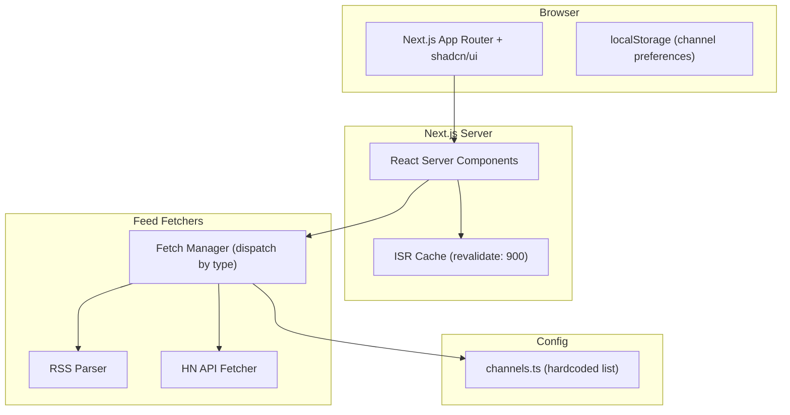
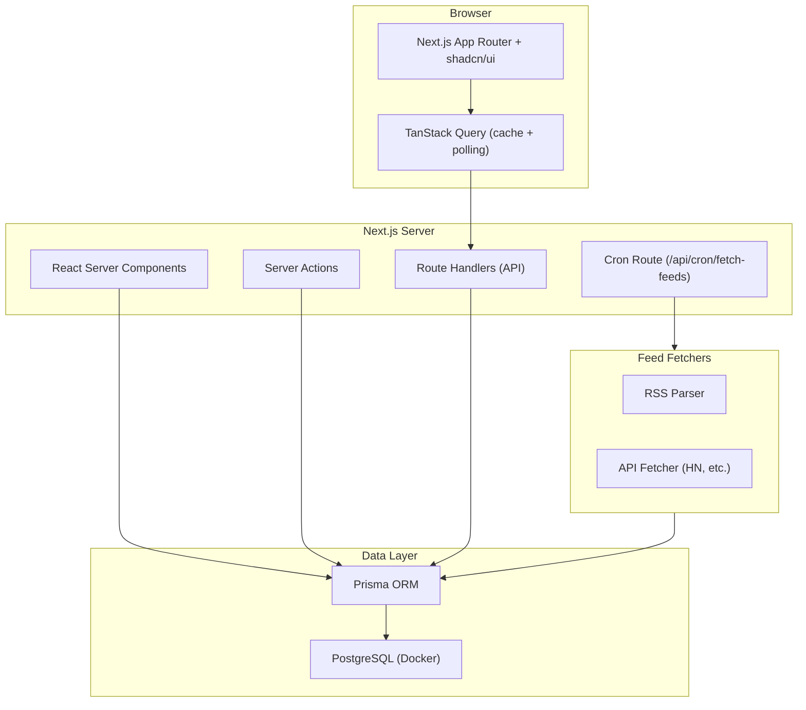
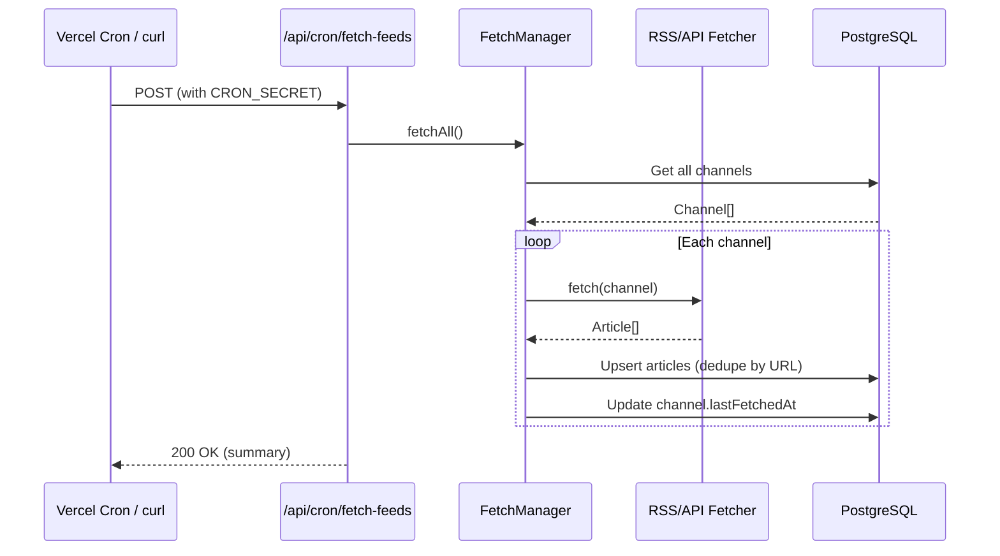
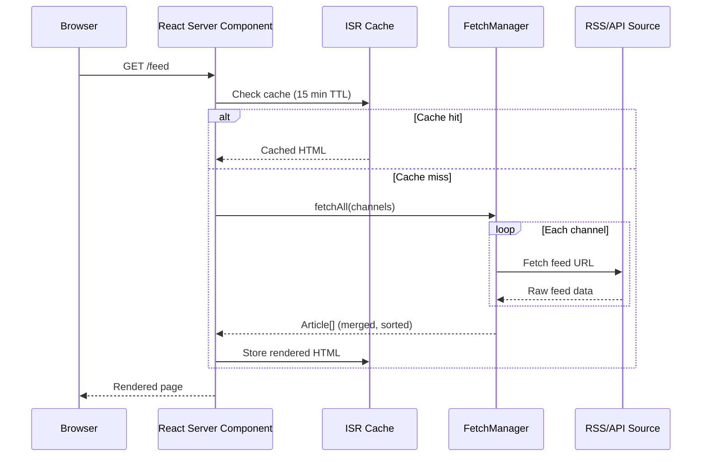

# Developer Broadcast — Architecture

## TL;DR

A Next.js 16 full-stack app that aggregates RSS feeds and API sources into a unified article feed. Built incrementally: starts as a zero-infrastructure RSS reader (Phase 0-4), then optionally adds PostgreSQL, API routes, and TanStack Query (Phase 5) when persistence is needed.

## Architecture Evolution

The app architecture evolves across micro-phases. Phase 0-4 uses a simple SSR-only approach. Phase 5 adds the full data pipeline.

### Phase 0-4 Architecture (Current Target)

No database, no API routes, no client-side data fetching. React Server Components fetch RSS feeds directly and render the page server-side. Next.js ISR handles caching.



### Phase 5 Architecture (Full Persistence)

Adds PostgreSQL, Prisma, API routes, cron-based fetching, and TanStack Query for infinite scroll and optimistic mutations.



## Feed Ingestion Data Flow



## Phase 0-4 Data Flow

In the early phases, there is no database. Data flows directly from external feeds through the fetch manager to the rendered page.



## Phase 5 Feed Ingestion Data Flow

Once the database is introduced, a cron job handles feed fetching separately from page rendering.


## Database Schema (Prisma — Phase 5)

> Not used in Phases 0-4. The schema below is the target for Phase 5 when persistence is introduced.

```prisma
generator client {
  provider = "prisma-client-js"
}

datasource db {
  provider = "postgresql"
  url      = env("DATABASE_URL")
}

model Channel {
  id            String         @id @default(cuid())
  name          String
  slug          String         @unique
  description   String?
  url           String
  feedUrl       String?
  type          ChannelType
  logoUrl       String?
  category      String
  metadata      Json?
  articles      Article[]
  subscriptions Subscription[]
  lastFetchedAt DateTime?
  createdAt     DateTime       @default(now())
  updatedAt     DateTime       @updatedAt
}

enum ChannelType {
  RSS
  API
  SCRAPE
  WEBHOOK
}

model Article {
  id          String   @id @default(cuid())
  channelId   String
  channel     Channel  @relation(fields: [channelId], references: [id], onDelete: Cascade)
  title       String
  summary     String?
  content     String?
  url         String   @unique
  imageUrl    String?
  author      String?
  tags        String[]
  publishedAt DateTime
  createdAt   DateTime @default(now())

  @@index([channelId, publishedAt(sort: Desc)])
}

model Subscription {
  id        String   @id @default(cuid())
  visitorId String   // Phase 1: anonymous localStorage ID; Phase 2: migrated to userId
  channelId String
  channel   Channel  @relation(fields: [channelId], references: [id], onDelete: Cascade)
  notify    Boolean  @default(true)
  createdAt DateTime @default(now())

  @@unique([visitorId, channelId])
}
```

### Future additions (Authentication + Notifications)

```prisma
model User {
  id            String         @id @default(cuid())
  name          String?
  email         String         @unique
  image         String?
  accounts      Account[]
  subscriptions Subscription[]
  preferences   UserPreference?
  notifications Notification[]
  createdAt     DateTime       @default(now())
  updatedAt     DateTime       @updatedAt
}

model Account {
  id                String  @id @default(cuid())
  userId            String
  type              String
  provider          String
  providerAccountId String
  refresh_token     String?
  access_token      String?
  expires_at        Int?
  token_type        String?
  scope             String?
  id_token          String?
  user              User    @relation(fields: [userId], references: [id], onDelete: Cascade)

  @@unique([provider, providerAccountId])
}

model UserPreference {
  id                String  @id @default(cuid())
  userId            String  @unique
  user              User    @relation(fields: [userId], references: [id], onDelete: Cascade)
  emailDigest       Boolean @default(false)
  digestFrequency   String  @default("daily")
  pushNotifications Boolean @default(true)
  quietHoursStart   String?
  quietHoursEnd     String?
  timezone          String  @default("UTC")
}

model Notification {
  id        String   @id @default(cuid())
  userId    String
  user      User     @relation(fields: [userId], references: [id], onDelete: Cascade)
  title     String
  body      String
  url       String?
  read      Boolean  @default(false)
  createdAt DateTime @default(now())

  @@index([userId, read, createdAt(sort: Desc)])
}
```

## Project Directory Structure

The structure evolves across phases. Below shows the Phase 0-4 structure (left) and the additions in Phase 5 (right).

### Phase 0-4 Structure (No Database)

```
developer-broadcast/
├── next.config.ts
├── tsconfig.json
├── package.json
├── src/
│   ├── app/
│   │   ├── layout.tsx                    # Root layout, ThemeProvider
│   │   ├── page.tsx                      # Landing page (Phase 2)
│   │   ├── feed/
│   │   │   ├── page.tsx                  # Main feed (RSC, ISR cached)
│   │   │   └── loading.tsx              # Skeleton (Phase 2)
│   │   └── channels/
│   │       ├── page.tsx                  # Browse channels (Phase 2)
│   │       └── [slug]/
│   │           └── page.tsx              # Channel detail (Phase 2)
│   ├── components/
│   │   ├── ui/                           # shadcn/ui generated components
│   │   ├── layout/
│   │   │   ├── header.tsx                # Nav, theme toggle (Phase 2)
│   │   │   └── sidebar.tsx               # Active channels list (Phase 4)
│   │   ├── feed/
│   │   │   └── article-card.tsx          # Article card
│   │   └── channels/
│   │       └── channel-card.tsx          # Channel preview (Phase 2)
│   ├── config/
│   │   └── channels.ts                   # Hardcoded channel list
│   ├── hooks/
│   │   └── use-channel-preferences.ts    # localStorage toggle (Phase 4)
│   ├── lib/
│   │   ├── types.ts                      # Shared types (Article, Channel)
│   │   ├── utils.ts                      # cn(), formatDate, etc.
│   │   └── fetchers/
│   │       ├── rss-fetcher.ts            # Generic RSS/Atom parser
│   │       ├── hn-fetcher.ts             # Hacker News API (Phase 3)
│   │       └── fetch-manager.ts          # Dispatcher (Phase 3)
│   └── providers/
│       └── theme-provider.tsx            # next-themes provider
└── public/
```

### Phase 5 Additions (Database + Full Stack)

```
developer-broadcast/
├── docker-compose.yml                     # PostgreSQL 16
├── .env / .env.example                    # DATABASE_URL, CRON_SECRET
├── prisma/
│   ├── schema.prisma                      # Channel, Article, Subscription
│   └── seed.ts                            # Seed 11 channels
├── src/
│   ├── app/
│   │   └── api/
│   │       ├── channels/route.ts          # GET channels
│   │       ├── articles/route.ts          # GET articles (paginated)
│   │       ├── subscriptions/route.ts     # GET/POST/DELETE subscriptions
│   │       └── cron/fetch-feeds/route.ts  # POST trigger feed fetch
│   ├── hooks/
│   │   ├── use-visitor-id.ts              # Anonymous ID from localStorage
│   │   ├── use-articles.ts               # TanStack Query: infinite scroll
│   │   ├── use-channels.ts              # TanStack Query: channel list
│   │   └── use-subscriptions.ts          # TanStack Query: mutations
│   ├── lib/
│   │   └── prisma.ts                      # Prisma client singleton
│   └── providers/
│       └── query-provider.tsx             # TanStack QueryClientProvider
├── vercel.json                            # Cron config
└── ...
```

## Pre-Seeded Channels

| Name | Category | Type | Feed URL |
|------|----------|------|----------|
| Hacker News | Aggregator | API | `https://hacker-news.firebaseio.com/v0` |
| TechCrunch | Tech News | RSS | `https://techcrunch.com/feed/` |
| The Verge | Tech News | RSS | `https://www.theverge.com/rss/index.xml` |
| GitHub Blog | Developer | RSS | `https://github.blog/feed/` |
| AWS What's New | Cloud | RSS | `https://aws.amazon.com/about-aws/whats-new/recent/feed/` |
| Google Blog | Big Tech | RSS | `https://blog.google/rss/` |
| Netflix Tech Blog | Big Tech | RSS | `https://netflixtechblog.com/feed` |
| Uber Engineering | Big Tech | RSS | `https://eng.uber.com/feed/` |
| Engineering at Meta | Big Tech | RSS | `https://engineering.fb.com/feed/` |
| Vercel Blog | Developer | RSS | `https://vercel.com/atom` |
| Next.js Blog | Framework | RSS | `https://nextjs.org/feed.xml` |

## Key Design Decisions

- **Anonymous subscriptions (Phase 1)**: Uses a `visitorId` generated client-side and stored in localStorage. No auth required. Migrated to `userId` FK in Phase 2.
- **Cursor-based pagination**: Articles use cursor pagination (`lastPublishedAt` + `id`) for stable infinite scroll.
- **Upsert by URL**: Feed fetching deduplicates articles by their unique `url` field, so re-fetching the same feed never creates duplicates.
- **Channel type dispatch**: `FetchManager` reads `channel.type` to pick the right fetcher (RSS parser vs HN API client vs scraper).

## References

- [decisions.md](./decisions.md) — Full ADR log explaining each architectural choice
- [implementation-plan.md](./implementation-plan.md) — Step-by-step build plan
