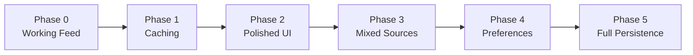

# Developer Broadcast — Implementation Plan

## TL;DR

Build a news aggregation app incrementally through 6 micro-phases. Each phase produces a usable app. Phase 0 delivers a working feed reader with zero infrastructure (no database, no cron, no API routes). Subsequent phases layer in caching, UI polish, mixed sources, channel preferences, and full persistence — only when justified by real usage pain.

## Strategy: Gradual Complexity

The original plan required Postgres + Docker + Prisma + API routes + TanStack Query + cron from the very first step. That is the right architecture for a multi-user product, but overkill for a single-user MVP. This revised plan starts with the simplest possible thing that works and adds infrastructure only when the previous phase creates friction.



## Tech Stack

Introduced incrementally. Only install what you need for the current phase.

| Technology | Phase Introduced | Role |
|-----------|-----------------|------|
| Next.js 16.2.x | 0 | Framework (App Router, RSC, Turbopack) |
| pnpm | 0 | Package manager |
| Tailwind CSS v4 | 0 | Styling |
| shadcn/ui | 0 | Design system |
| rss-parser | 0 | RSS/Atom feed parsing |
| next-themes | 0 | Dark mode |
| Prisma + PostgreSQL | 5 | ORM + database (deferred) |
| TanStack Query v5 | 5 | Client-side caching + infinite scroll (deferred) |
| Docker | 5 | Local Postgres (deferred) |
| Auth.js v5 | Future | Authentication (deferred indefinitely) |
| Resend | Future | Email notifications (deferred indefinitely) |

---

## Phase 0 — Working Feed (~2-3h)

**Goal:** Fetch RSS feeds server-side and display a unified article timeline. No database, no API routes, no client-side fetching.

**What you get:** Open the app, see the latest articles from 11 sources sorted by date.

### Step 0.1: Project Scaffolding

```bash
cd /Users/admin/projects/private/developer-broadcast

pnpm dlx create-next-app@latest . --typescript --tailwind --eslint --app --src-dir --turbopack --use-pnpm

pnpm dlx shadcn@latest init

pnpm dlx shadcn@latest add button card badge separator skeleton

pnpm add rss-parser next-themes
```

Only install what Phase 0 needs. No Prisma, no TanStack Query, no Docker.

### Step 0.2: Channel Configuration

Create `src/config/channels.ts` — a typed array of all 11 channels with their RSS feed URLs. This replaces the database seed for now.

```typescript
export type ChannelType = "RSS" | "API";

export interface Channel {
  name: string;
  slug: string;
  description: string;
  url: string;
  feedUrl: string;
  type: ChannelType;
  category: string;
}

export const channels: Channel[] = [
  {
    name: "TechCrunch",
    slug: "techcrunch",
    description: "Startup and technology news",
    url: "https://techcrunch.com",
    feedUrl: "https://techcrunch.com/feed/",
    type: "RSS",
    category: "Tech News",
  },
  // ... remaining 10 channels
];
```

### Step 0.3: RSS Fetcher

Create `src/lib/fetchers/rss-fetcher.ts`:
- Uses `rss-parser` to fetch and parse any RSS/Atom feed URL
- Normalizes each item into a common `Article` shape: `{ title, summary, url, author, publishedAt, imageUrl, channelSlug }`
- Handles missing fields gracefully (summary fallback from content snippet, date parsing with fallback)
- Returns an empty array on fetch failure (don't let one broken feed break the whole page)

### Step 0.4: Feed Page (RSC)

Create `src/app/feed/page.tsx` as a React Server Component:
- Imports the channel list from `src/config/channels.ts`
- Calls the RSS fetcher for each RSS channel using `Promise.allSettled`
- Merges all articles into a single array, sorts by `publishedAt` descending
- Renders a list of `article-card` components
- No client-side JavaScript needed for the feed itself

### Step 0.5: Article Card Component

Create `src/components/feed/article-card.tsx`:
- Minimal card: article title (external link), channel name, relative time (e.g. "2h ago"), summary (truncated to 2 lines)
- Uses shadcn `Card` and `Badge` components
- Server component (no `"use client"`)

### Step 0.6: Root Layout + Dark Mode

Set up `src/app/layout.tsx`:
- `next-themes` `ThemeProvider` with system default
- Basic metadata (title, description)
- Simple header with app name and theme toggle button
- No sidebar, no mobile nav yet

### Step 0.7: Verification

- Run `pnpm dev`
- Navigate to `/feed`
- Confirm articles from multiple RSS sources appear, sorted by date
- Toggle dark mode
- Check that a failing feed URL doesn't crash the page

### What Phase 0 does NOT include

- No Hacker News (API source, not RSS — added in Phase 3)
- No database or caching (every page load re-fetches all feeds)
- No channels page, no channel detail page
- No landing page
- No sidebar, no mobile nav
- No subscriptions or preferences
- No API routes
- No TanStack Query

---

## Phase 1 — Fast Page Loads (~1-2h)

**Goal:** Cache fetched articles so the feed page loads instantly instead of re-fetching 11 RSS feeds on every request.

**Prerequisite:** Phase 0 complete.

### Step 1.1: Add ISR Caching to Feed Page

Use Next.js `revalidate` on the feed page:

```typescript
export const revalidate = 900; // 15 minutes
```

This caches the entire rendered page for 15 minutes. After expiry, the next visitor triggers a background re-fetch while the stale page is served instantly.

### Step 1.2: Per-Channel Error Isolation

Wrap each channel fetch in a try/catch so one slow or broken feed doesn't block the entire page revalidation. Log errors to the server console.

### Step 1.3: Verification

- First load: slow (fetching all feeds)
- Second load within 15 minutes: instant (served from cache)
- Confirm a broken feed URL doesn't prevent caching

---

## Phase 2 — Polished UI (~3-4h)

**Goal:** Make the app look and feel good enough to use as a daily driver.

**Prerequisite:** Phase 1 complete.

### Step 2.1: Enhanced Article Card

Update `src/components/feed/article-card.tsx`:
- Channel logo/icon (use favicon from channel URL as fallback)
- Summary text (truncated)
- Tag badges (if available from RSS)
- Open-in-new-tab icon on hover

### Step 2.2: Header Component

Create `src/components/layout/header.tsx`:
- App name/logo linked to home
- Navigation links: Feed, Channels
- Theme toggle button
- Mobile-responsive (hamburger menu on small screens)

### Step 2.3: Channels Browse Page

Create `src/app/channels/page.tsx`:
- Import channel list from config
- Group channels by `category`
- Render each channel as a card: name, description, category badge
- Link each card to `/channels/[slug]`

### Step 2.4: Channel Detail Page

Create `src/app/channels/[slug]/page.tsx`:
- Show channel info header (name, description, URL, category)
- Fetch and display only that channel's articles (same RSC pattern as feed page)
- Uses `revalidate` for caching

### Step 2.5: Landing Page

Create `src/app/page.tsx`:
- Hero section: app name, tagline, CTA button to `/feed`
- Featured channels grid (pick 4-6 from the config)
- Link to browse all channels

### Step 2.6: Skeleton Loading States

Add shadcn `Skeleton` components for loading states on the feed and channel pages. Use `loading.tsx` convention in each route folder.

### Step 2.7: Responsive Layout

- Mobile-first design using Tailwind breakpoints
- Stack layout on mobile, wider content area on desktop
- No sidebar yet (added in Phase 4 with preferences)

### Step 2.8: Verification

- All pages render correctly on mobile, tablet, desktop
- Dark mode works on all pages
- Channel detail shows only that channel's articles
- Loading skeletons appear during navigation

---

## Phase 3 — Mixed Sources: Hacker News (~2h)

**Goal:** Add non-RSS sources, starting with Hacker News.

**Prerequisite:** Phase 2 complete.

### Step 3.1: Hacker News Fetcher

Create `src/lib/fetchers/hn-fetcher.ts`:
- Fetch top 30 story IDs from `https://hacker-news.firebaseio.com/v0/topstories.json`
- Fetch each story detail from `/v0/item/{id}.json` (parallelize with `Promise.all`, batch of 10)
- Map to the common `Article` shape
- Handle stories without URLs (self-posts: use HN comment link)

### Step 3.2: Fetch Manager

Create `src/lib/fetchers/fetch-manager.ts`:
- Reads channel list from config
- Dispatches to the correct fetcher based on `channel.type` ("RSS" -> rss-fetcher, "API" -> hn-fetcher)
- Returns merged, deduplicated, sorted article array
- Replaces the inline fetch-all logic in the feed page

### Step 3.3: Update Feed and Channel Pages

- Feed page and channel detail page now call `fetchManager` instead of directly calling the RSS fetcher
- Hacker News channel appears in the channels page and has its own detail page

### Step 3.4: Verification

- `/feed` shows articles from both RSS feeds and Hacker News, interleaved by date
- `/channels/hacker-news` shows only HN stories
- HN stories without URLs link to the HN comments page

---

## Phase 4 — Channel Preferences (~2h)

**Goal:** Let the user show/hide channels from the feed without code changes.

**Prerequisite:** Phase 3 complete.

### Step 4.1: Channel Preferences Hook

Create `src/hooks/use-channel-preferences.ts`:
- Stores a `Set<string>` of enabled channel slugs in `localStorage`
- Default: all channels enabled
- Provides `toggle(slug)`, `isEnabled(slug)`, `enabledSlugs` methods
- `"use client"` hook

### Step 4.2: Toggle UI on Channels Page

Add a toggle/switch button on each channel card:
- Shows enabled/disabled state from `localStorage`
- Clicking toggles the channel preference
- Toast feedback on toggle

### Step 4.3: Filtered Feed

Update the feed page to read preferences:
- The feed page itself stays an RSC (fetches all articles server-side)
- A client wrapper component filters the rendered articles based on `localStorage` preferences
- Or: pass enabled slugs as search params to the feed page

### Step 4.4: Sidebar

Create `src/components/layout/sidebar.tsx`:
- Lists enabled channels with links to their detail pages
- Shows channel count
- Desktop only (hidden on mobile, accessible via mobile nav)

### Step 4.5: Verification

- Disabling a channel removes its articles from the feed
- Preferences persist across page reloads (same browser)
- Sidebar reflects enabled channels
- All channels still accessible via the browse page regardless of preferences

---

## Phase 5 — Full Persistence (~4-6h)

**Goal:** Move from config-driven data to a real database. Required when you want article history, full-text search, or to open the app to other users.

**Prerequisite:** Phase 4 complete. Only proceed if you actually need this.

### Step 5.1: Docker Postgres Setup

Create `docker-compose.yml`:

```yaml
services:
  postgres:
    image: postgres:16-alpine
    ports:
      - "5432:5432"
    environment:
      POSTGRES_USER: broadcast
      POSTGRES_PASSWORD: broadcast
      POSTGRES_DB: developer_broadcast
    volumes:
      - pgdata:/var/lib/postgresql/data
volumes:
  pgdata:
```

Create `.env` and `.env.example`.

### Step 5.2: Prisma Schema

Initialize Prisma and define Channel, Article, Subscription models (see [architecture.md](./architecture.md) for full schema).

Run initial migration: `pnpm prisma migrate dev --name init`

Create Prisma client singleton: `src/lib/prisma.ts`

### Step 5.3: Seed Script

Create `prisma/seed.ts` — insert the 11 channels from the config into the database.

### Step 5.4: Migrate Fetch Manager to Use Database

Update `src/lib/fetchers/fetch-manager.ts`:
- Load channels from database instead of config
- Upsert articles using `prisma.article.upsert({ where: { url } })`
- Update `channel.lastFetchedAt` after fetch

### Step 5.5: Cron API Route

Create `src/app/api/cron/fetch-feeds/route.ts`:
- POST handler protected by `CRON_SECRET`
- Calls fetch manager
- Configure in `vercel.json` for production

### Step 5.6: API Routes

Create REST endpoints for client-side consumption:
- `GET /api/channels` — list channels, filter by category
- `GET /api/articles` — cursor-paginated articles, filter by channel/category
- `GET/POST/DELETE /api/subscriptions` — manage subscriptions by visitorId

### Step 5.7: TanStack Query Integration

Install `@tanstack/react-query` and set up:
- `QueryProvider` in root layout
- `useArticles` hook with `useInfiniteQuery` for infinite scroll
- `useChannels` hook for channel list
- `useSubscriptions` hook with optimistic mutations
- `useVisitorId` hook for anonymous identity

### Step 5.8: Infinite Scroll Feed

Replace the RSC feed page with a client-side infinite scroll implementation:
- Intersection observer for "load more"
- Cursor-based pagination
- Filter by channel, category, date

### Step 5.9: Subscription Management

Replace localStorage preferences with server-side subscriptions:
- `subscribe-button.tsx` with optimistic toggle
- Sidebar shows subscribed channels from database
- `useVisitorId` hook generates anonymous ID in localStorage

### Step 5.10: Verification

- Seed DB, trigger fetch, browse UI, subscribe, view personalized feed
- Infinite scroll loads more articles as you scroll
- Subscribe/unsubscribe is instant (optimistic) and persists
- Cron fetch adds new articles without duplicates

---

## Future Phases (Deferred Indefinitely)

### Authentication (Original Phase 2)

Only needed when opening the app to other users.

1. Install Auth.js v5
2. Add User and Account models
3. GitHub + Google OAuth
4. Migrate visitorId subscriptions to userId
5. Settings page

### Notifications (Original Phase 3)

Only needed when you want proactive alerts.

1. Notification model
2. In-app bell, notification center
3. Web Push + service worker
4. Resend email digest
5. Quiet hours, frequency settings

---

## File Creation Order by Phase

| Phase | Files | Description |
|-------|-------|-------------|
| 0 | `src/config/channels.ts` | Hardcoded channel list |
| 0 | `src/lib/fetchers/rss-fetcher.ts` | RSS parser and normalizer |
| 0 | `src/components/feed/article-card.tsx` | Minimal article card |
| 0 | `src/app/feed/page.tsx` | Feed page (RSC) |
| 0 | `src/app/layout.tsx` | Root layout + theme toggle |
| 1 | (edit `feed/page.tsx`) | Add `revalidate = 900` |
| 2 | `src/components/layout/header.tsx` | Navigation header |
| 2 | `src/app/channels/page.tsx` | Channels browse page |
| 2 | `src/app/channels/[slug]/page.tsx` | Channel detail page |
| 2 | `src/app/page.tsx` | Landing page |
| 3 | `src/lib/fetchers/hn-fetcher.ts` | Hacker News API fetcher |
| 3 | `src/lib/fetchers/fetch-manager.ts` | Source dispatcher |
| 4 | `src/hooks/use-channel-preferences.ts` | localStorage preferences |
| 4 | `src/components/layout/sidebar.tsx` | Channel sidebar |
| 5 | `docker-compose.yml`, `.env` | Database infrastructure |
| 5 | `prisma/schema.prisma`, `prisma/seed.ts` | Schema + seed |
| 5 | `src/lib/prisma.ts` | Prisma client singleton |
| 5 | `src/app/api/**` | All API routes |
| 5 | `src/providers/query-provider.tsx` | TanStack Query setup |
| 5 | `src/hooks/use-*.ts` | All TanStack Query hooks |
